# ImageAndTextLayoutPanel

The purpose of the ImageAndTextLayoutPanel is to arrange an image and a string in a box. The real holder of the image should be an ImagePrimitive and the holder of the string should be a TextPrimitive. When these two primitives are set as Children of the panel, you are able to control their position\visbility by a number of useful properties that the ImageAndTextLayoutPanel provides.

## ImageAndTextLayoutPanel Behavior

ImageAndTextLayoutPanel defines two areas (or boxes) - one for the ImagePrimitive and one for the TextPrimitive. The layout of ImageAndTextLayoutPanel allow you to reposition the ImagePrimitive and the TextPrimitive boxes in relation to each other. At the same time, you can set the position of the image and text within their respective areas.
        

## ImageAndTextLayoutPanel Properties

Let’s assume that we have an ImageAndTextLayoutPanel that holds and ImagePrimitive and a TextPrimitive. The TextPrimitive has its Text property set to "Hard Drive" and the ImagePrimitive has its Image property set to an image of a hard drive. The following properties of the layout panel will allow you to control the position and the visibility of the text and image objects:
        

__DisplayStyle__ – determines which of the objects (image\text) will be visible. You can choose from one of the following values:
        

* *ImageAndText* (default value) – both objects (image and text) are being displayed.
    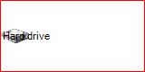

* *Image* – only the image is being displayed.
    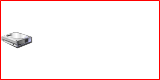

* *Text* – only the text is being displayed.
    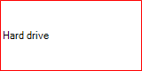

* *None* – none of the objects (image and text) are being displayed.
    

__TextImageRelation__ – determines the way in which the text and the image are positioned in relation to each other. You can choose from one of the following properties:
        

* *Overlay* (default value) – the text and the image are overlapping each other
    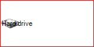

* *ImageAboveText* – the image is positioned above the text.
    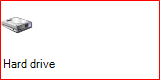

* *ImageBeforeText* – the image is positioned on the left side of the text  (in RightToLeft = No).
    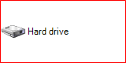

* *TextAboveImage* – the text is positioned on top of the image.
    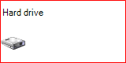

* *TextBeforeImage* – the text is positioned on the left side of the image (in RightToLeft = No).
    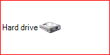

The next two properties also determine the position of the text and image within their respective areas.

__ImageAlignment__ – determines the position of the image. It has the following values:

* *TopCenter* - aligns the image top-center in the image box.
            

* *TopLeft* - aligns the image top-left in the image box.
            

* *TopRight* - aligns the image top-right in the image box.
            

* *MiddleCenter* - aligns the image middle-center in the image box.
            

* *MiddleLeft* (default value) - aligns the image middle-left in the image box.
            

* *MiddleRight* - aligns the image middle-right in the image box.
            

* *BottomCenter* - aligns the image bottom-center in the image box.
            

* *BottomLeft* - aligns the image bottom-left in the image box.
            

* *BottomRight* - aligns the image bottom-right in the image box.

|    |    |    |
|----|----|----|
|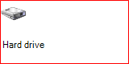 *TopLeft* |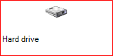 *TopCenter* |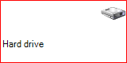 *TopRight* |
|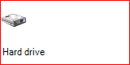 *MiddleLeft* |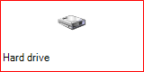 *MiddleCenter* |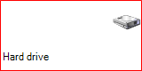 *MiddleRight* |
|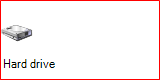 *BottomLeft* | *BottomCenter* |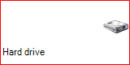 *BottomLeft* |

__TextAlignment__ - determines the position of the text.  It has the following values:

* *TopCenter* - aligns the text top-center in the text box

* *TopLeft* - aligns the text top-left in the text box

* *TopRight* - aligns the text top-right in the text box

* *MiddleCenter* - aligns the text middle-center in the text box

* *MiddleLeft* (default value) - aligns the text middle-left in the text box

* *MiddleRight* - aligns the text middle-right in the text box

* *BottomCenter* - aligns the text bottom-center in the text box

* *BottomLeft* - aligns the text bottom-left in the text box

* *BottomRight* - aligns the text bottom-right in the text box

|    |    |    |
|----|----|----|
|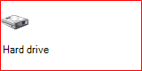 *TopLeft* |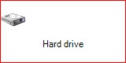 *TopCenter* |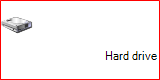 *TopRight* |
| *MiddleLeft* | *MiddleCenter* |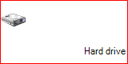 *MiddleRight* |
|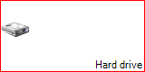 *BottomLeft* |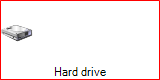 *BottomCenter* | *BottomLeft* |


## Employing ImageAndTextLayoutPanel in RadControl

As mentioned at the beginning of the article, ImageAndTextLayoutPanel defines the layout of an ImagePrimitive (for the image) and TextPrimitive (for the text). However, the layout panel does contain these two primitives by default. Moreover, an ImageAndTextLayoutPanel is usable only when it resides in a RadControl. The purpose of this section is to demonstrate how you can add ImagePrimitive and TextPrimitive to the layout panel and how you can add the panel to your own RadControl.
        
1\. First, we have to create a RadElement descendant and put an ImageAndTextLayoutPanel instance in it.   In addition, we should create one TextPrimitive instance and one ImagePrimitive instance. In order to make  the ImageAndTextLayoutPanel recognize the TextPrimitive and ImagePrimitve as the primitives that it should arrange, we have to call the __SetValue__ method of the primitives, passing *ImageAndTextLayoutPanel.IsImagePrimitiveProperty* and *ImageAndTextLayoutPanel.IsTextPrimitiveProperty* for the ImagePrimitive and TextPrimitive receptively. Finally, the primitives should be added to the ImageAndTextLayoutPanel. All these actions should happen in the CreateChildElements method. (The BorderPrimitive is added just to outline the whole ImageAndTextLayoutPanelElement):

{{source=..\SamplesCS\TPF\Layouts\PredefinedLayoutPanels\ImageAndTextLayoutPanelElement.cs region=imageAndTextElement}} 
{{source=..\SamplesVB\TPF\Layouts\PredefinedLayoutPanels\ImageAndTextLayoutPanelElement.vb region=imageAndTextElement}} 

````C#
public class ImageAndTextLayoutPanelElement : RadElement
{
    TextPrimitive textPrim;
    ImagePrimitive imagePrim;
    ImageAndTextLayoutPanel imgTxtLayoutPanel;
    BorderPrimitive borderPrim;
    protected override void CreateChildElements()
    {
        base.CreateChildElements();
        this.textPrim = new TextPrimitive();
        this.imagePrim = new ImagePrimitive();
        this.imgTxtLayoutPanel = new ImageAndTextLayoutPanel();
        this.imagePrim.SetValue(ImageAndTextLayoutPanel.IsImagePrimitiveProperty, true);
        this.textPrim.SetValue(ImageAndTextLayoutPanel.IsTextPrimitiveProperty, true);
        this.imgTxtLayoutPanel.Children.Add(this.imagePrim);
        this.imgTxtLayoutPanel.Children.Add(this.textPrim);
        this.Children.Add(this.imgTxtLayoutPanel);
        borderPrim = new BorderPrimitive();
        borderPrim.ForeColor = Color.Red;
        this.Children.Add(borderPrim);
    }
    public ImageAndTextLayoutPanel LayoutPanel
    {
        get
        {
            return this.imgTxtLayoutPanel;
        }
    }
    public TextPrimitive TextElement
    {
        get
        {
            return this.textPrim;
        }
    }
    public ImagePrimitive ImageElement
    {
        get
        {
            return this.imagePrim;
        }
    }
}

````
````VB.NET
Public Class ImageAndTextLayoutPanelElement
    Inherits RadElement
    Private textPrim As TextPrimitive
    Private imagePrim As ImagePrimitive
    Private imgTxtLayoutPanel As ImageAndTextLayoutPanel
    Private borderPrim As BorderPrimitive
    Protected Overrides Sub CreateChildElements()
        MyBase.CreateChildElements()
        Me.textPrim = New TextPrimitive()
        Me.imagePrim = New ImagePrimitive()
        Me.imgTxtLayoutPanel = New ImageAndTextLayoutPanel()
        Me.imagePrim.SetValue(ImageAndTextLayoutPanel.IsImagePrimitiveProperty, True)
        Me.textPrim.SetValue(ImageAndTextLayoutPanel.IsTextPrimitiveProperty, True)
        Me.imgTxtLayoutPanel.Children.Add(Me.imagePrim)
        Me.imgTxtLayoutPanel.Children.Add(Me.textPrim)
        Me.Children.Add(Me.imgTxtLayoutPanel)
        borderPrim = New BorderPrimitive()
        borderPrim.ForeColor = Color.Red
        Me.Children.Add(borderPrim)
    End Sub
    Public ReadOnly Property LayoutPanel() As ImageAndTextLayoutPanel
        Get
            Return Me.imgTxtLayoutPanel
        End Get
    End Property
    Public ReadOnly Property TextElement() As TextPrimitive
        Get
            Return Me.textPrim
        End Get
    End Property
    Public ReadOnly Property ImageElement() As ImagePrimitive
        Get
            Return Me.imagePrim
        End Get
    End Property
End Class

````

{{endregion}} 

2\. In order to be able to use our ImageAndTextLayoutPanelElement, we can either add it in an existing RadControl, or encapsulate it in a new RadControl descendant:

{{source=..\SamplesCS\TPF\Layouts\PredefinedLayoutPanels\ImageAndTextLayoutPanelElement.cs region=imageAndTextControl}} 
{{source=..\SamplesVB\TPF\Layouts\PredefinedLayoutPanels\ImageAndTextLayoutPanelElement.vb region=imageAndTextControl}} 

````C#
[ToolboxItem(true)]
public class ImageAndTextLayoutPanelControl : RadControl
{
    private ImageAndTextLayoutPanelElement mainElement;
    public ImageAndTextLayoutPanelControl()
    {
        this.AutoSize = true;
    }
    public ImageAndTextLayoutPanelElement MainElement
    {
        get
        {
            return this.mainElement;
        }
    }
    protected override Size DefaultSize
    {
        get
        {
            return new Size(160, 80);
        }
    }
    protected override void CreateChildItems(RadElement parent)
    {
        this.mainElement = new ImageAndTextLayoutPanelElement();
        this.RootElement.Children.Add(mainElement);
        base.CreateChildItems(parent);
    }
}

````
````VB.NET
<ToolboxItem(True)>
Public Class ImageAndTextLayoutPanelControl
    Inherits RadControl
    Private _mainElement As ImageAndTextLayoutPanelElement
    Public Sub New()
        Me.AutoSize = True
    End Sub
    Public ReadOnly Property MainElement() As ImageAndTextLayoutPanelElement
        Get
            Return Me._mainElement
        End Get
    End Property
    Protected Overrides ReadOnly Property DefaultSize() As Size
        Get
            Return New Size(160, 80)
        End Get
    End Property
    Protected Overrides Sub CreateChildItems(ByVal parent As RadElement)
        Me._mainElement = New ImageAndTextLayoutPanelElement()
        Me.RootElement.Children.Add(_mainElement)
        MyBase.CreateChildItems(parent)
    End Sub
End Class

````

{{endregion}} 

This is it! In addition to the obligatory steps, as you can notice, we have added convenient API that will allow us to easily use the layout features of the ImageAndTextLayoutPanel.
        
