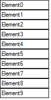

# StackLayoutPanel


StackLayoutPanel is a panel that handles the layout of multiple elements in a vertical or horizontal row.
        The following example demonstrate how you can easily emply this layout to work for you
      

## StackLayoutPanel example

With this example we create a RadElement which contains a StackLayoutPanel. The StackLayoutPanel
          instance is filled with several RadTextBoxElements ordered vertically. The RadElement that we create
          can be hosted in a RadControl as described
          [
            here
          ]().
          

#_[C#] Using StackLayoutPanel_

	


{{source=..\SamplesCS\TPF\Layouts\PredefinedLayoutPanels\MyStackLayoutPanelElement.cs region=myStackLayoutPanelElement}} 
{{source=..\SamplesVB\TPF\Layouts\PredefinedLayoutPanels\MyStackLayoutPanelElement.vb region=myStackLayoutPanelElement}} 

````C#
    public class MyStackLayoutPanelElement : RadElement
    {
        protected override void CreateChildElements()
        {
            StackLayoutPanel layoutPanel = new StackLayoutPanel();
            layoutPanel.Orientation = Orientation.Vertical;
            for (int i = 0; i < 10; i++)
            {
                layoutPanel.Children.Add(GetTextBoxElement(i));
            }
            this.Children.Add(layoutPanel);
            base.CreateChildElements();
        }

        private RadTextBoxElement GetTextBoxElement(int count)
        {
            RadTextBoxElement result = new RadTextBoxElement();
            result.ShowBorder = true;
            result.Text = "Element" + count.ToString();
            result.Class = "MyTextBoxElement";
            result.StretchHorizontally = false;
            result.StretchVertically = false;
            result.MinSize = new Size(100, 17);
            return result;
        }
    }
````
````VB.NET
Public Class MyStackLayoutPanelElement
    Inherits RadElement
    Protected Overrides Sub CreateChildElements()
        Dim layoutPanel As New StackLayoutPanel()
        layoutPanel.Orientation = Orientation.Vertical
        For i As Integer = 0 To 9
            layoutPanel.Children.Add(GetTextBoxElement(i))
        Next i
        Me.Children.Add(layoutPanel)
        MyBase.CreateChildElements()
    End Sub

    Private Function GetTextBoxElement(ByVal count As Integer) As RadTextBoxElement
        Dim result As New RadTextBoxElement()
        result.ShowBorder = True
        result.Text = "Element" & count.ToString()
        result.Class = "MyTextBoxElement"
        result.StretchHorizontally = False
        result.StretchVertically = False
        result.MinSize = New Size(100, 17)
        Return result
    End Function
End Class
'
````

{{endregion}} 


