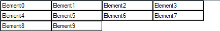

# WrapLayoutPanel

## 

WrapLayoutPanel is a panel that handles the layout of elements in a vertical or horizontal row and wraps to additional lines.



#### Using WrapLayoutPanel

{{source=..\SamplesCS\TPF\Layouts\PredefinedLayoutPanels\MyWrapLayoutPanelElement.cs region=myWrapLayoutPanelElement}} 
{{source=..\SamplesVB\TPF\Layouts\PredefinedLayoutPanels\MyWrapLayoutPanelElement.vb region=myWrapLayoutPanelElement}} 

````C#
public class MyWrapLayoutPanelElement : RadElement
{
    protected override void CreateChildElements()
    {
        WrapLayoutPanel layoutPanel = new WrapLayoutPanel();
        layoutPanel.Orientation = Orientation.Horizontal;
        for (int i = 0; i < 10; i++)
        {
            layoutPanel.Children.Add(GetTextBoxElement(i));
        }
        this.Children.Add(layoutPanel);
        base.CreateChildElements();
    }
    private RadTextBoxElement GetTextBoxElement(int count)
    {
        RadTextBoxElement result = new RadTextBoxElement();
     //   result.ShowBorder = true;
        result.Text = "Element" + count.ToString();
        result.Class = "MyTextBoxElement";
        result.StretchHorizontally = false;
        result.StretchVertically = false;
        result.MinSize = new Size(100, 17);
        return result;
    }
}

````
````VB.NET
Public Class MyWrapLayoutPanelElement
    Inherits RadElement
    Protected Overrides Sub CreateChildElements()
        Dim layoutPanel As New WrapLayoutPanel()
        layoutPanel.Orientation = Orientation.Horizontal
        For i As Integer = 0 To 9
            layoutPanel.Children.Add(GetTextBoxElement(i))
        Next i
        Me.Children.Add(layoutPanel)
        MyBase.CreateChildElements()
    End Sub
    Private Function GetTextBoxElement(ByVal count As Integer) As RadTextBoxElement
        Dim result As New RadTextBoxElement()
        result.ShowBorder = True
        result.Text = "Element" & count.ToString()
        result.Class = "MyTextBoxElement"
        result.StretchHorizontally = False
        result.StretchVertically = False
        result.MinSize = New Size(100, 17)
        Return result
    End Function
End Class

````

{{endregion}}
