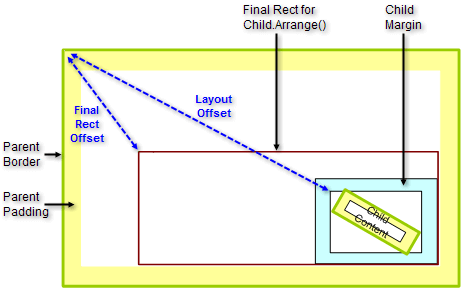
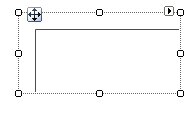

# Element Offset Calculations

## Location Offset Factors

The factors that produce the location offset of an element relative to its parent are:

1. Location of the rectangle fed to the child Arrange() method. 

1. Parent border thickness.

1. Parent padding.

1. Child margin.

1. Child location.

1. Child alignment.

1. Child PositionOffset.

There are multiple properties storing offsets and bounds of an element. The sum of items 1 through 6 produces the __LayoutOffset__.
          The sum of items 1 through 7 inclusive produces the offset as stored in the RadElement __TransformationMatrix__.
        

## LayoutOffset

The RadElement __LayoutOffset__ is the sum of the arrange rectangle offset, parent border, padding, child margin, child location
          and alignment. In the figure below the "Final Rect Offset" illustrates the offset of the arrange rectangle where parent content is rendered. "Layout offset"
          indicates the offset represented by the LayoutOffset property.
        

## PositionOffset

__PositionOffset:__the offset of the origin of the coordinate system used when painting an element and its children. 
          __PositionOffset__ is relative to the parent of an element. Setting __PositionOffset__ has no influence on
          other layout properties and is only used to paint the element using an offset. The area of the element appearing outside of the parent bounds is clipped.
        

The example below shows a FillPrimitive where the PositionOffset if 5 pixels down and 5 pixels in.

#### __[C#] Setting PositionOffset__

{{source=..\SamplesCS\TPF\Layouts\CascadeLayoutPanel.cs region=positionOffset}}
	            FillPrimitive rectanglePrimitive = new FillPrimitive();
	            rectanglePrimitive.ForeColor = Color.Red;
	            rectanglePrimitive.MinSize = new Size(20, 20);
	            rectanglePrimitive.PositionOffset = new SizeF(5, 5);
	{{endregion}}

#### __[VB.NET] Setting PositionOffset__

{{source=..\SamplesVB\TPF\Layouts\CascadeLayoutPanel.vb region=positionOffset}}
	        Dim rectanglePrimitive As New FillPrimitive()
	        rectanglePrimitive.ForeColor = Color.Red
	        rectanglePrimitive.MinSize = New Size(20, 20)
	        rectanglePrimitive.PositionOffset = New SizeF(5, 5)
	{{endregion}}

