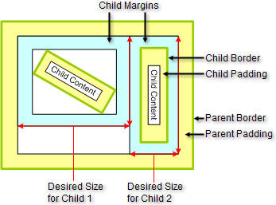
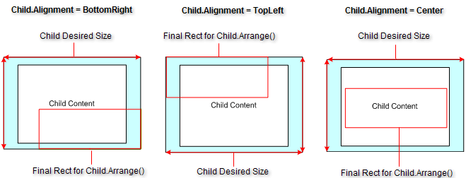
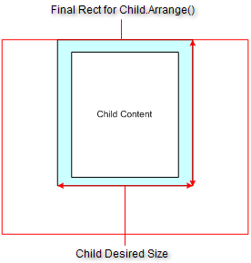

# Sample Arrange Stage Scenarios

Element placement within the area allocated by the parent takes place during the arrange stage. Placement depends on a variety of
      properties including Alignment, StretchHorizontally, StretchVeritically and the ratio of the size allocated by the parent to the DesiredSize of the child.

## Parent Allocates with Requested Size

The layout scenario below shows two children with margins, borders, padding and an angle transformation for Child 1. In this case the parent has arranged 
        the children with exactly the requested *DesiredSize*.

## Parent Allocates Size Greater than Requested Size

In the example below, the child DesiredSize is smaller than the rectangle allocated by the parent. The child StretchVertically and StretchHorizontally
        properties are set to false. The example figures show the effect of the child Alignment property setting on the resulting rectangle produced by the child Arrange() 
        method.

>The area of the child that falls outside of the rectangle allocated by the parent is not clipped, but is shown to the extent it is within the area of
          the parent.  See [Clipping]() for more information.

## Parent Allocates Size Smaller than Requested Size

In the example below, the child DesiredSize is larger than the rectangle allocated by the parent.
