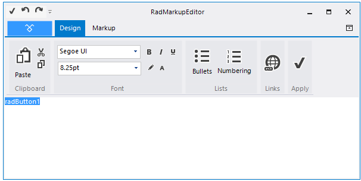
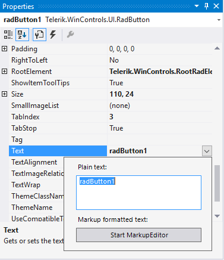
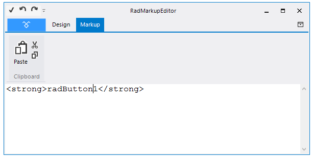

# RadMarkupDialog

RadMarkupEditor is a dialog used at Design time and Run time for creation of the formatted text supported by our WinForms suite. As any other standard dialog in WinForms, this dialog inherits from *CommonDialog* class.

>caption Figure 1: RadMarkupDialog



### Design Time

You can start the editor at Design Time by opening the drop down of some __Text__ property and then clicking on *Start MarkupEditor* button:



Alternatively you can edit the *Plain Text* field if you need not HTML-like text formatting. 

>caution Please note that you can still use the *Plain Text* field to edit HTML tags manually.
>

When started at Design Time, the font *size* and *name* are taken from the edited control or visual element e.g. RibbonTab. No tags are added for this font in the generated markup although the font name or size can be explicitly set as well.

### Run Time

To start the editor at Run Time, create a new instance of the dialog and use *ShowDialog* method:

{{source=..\SamplesCS\TPF\RadMarkupDialogForm.cs region=DialogGetValue}} 
{{source=..\SamplesVB\TPF\RadMarkupDialogForm.vb region=DialogGetValue}} 

````C#
RadMarkupDialog dialog = new RadMarkupDialog();
DialogResult result = dialog.ShowDialog();
if (result == DialogResult.OK)
{
    MessageBox.Show(dialog.Value);
}

````
````VB.NET
Dim dialog As New RadMarkupDialog()
Dim result As DialogResult = dialog.ShowDialog()
If result = DialogResult.OK Then
    MessageBox.Show(dialog.Value)
End If

````

{{endregion}} 


>caution In order to use RadMarkupDialog at RunTime, add reference to __Telerik.WinControls.RadMarkupEditor__.
>

*ShowDialog* returns the *DialogResult* enumeration. The returned value is *DialogResult.OK* if one of the Apply buttons is pressed and *DialogResult.Cancel* if the Close button is pressed. The *Value* property contains the edited HTML as a string. 

The *Value* property can be set to the RadMarkupDialog before it is shown which will be the initial value of the dialog:

{{source=..\SamplesCS\TPF\RadMarkupDialogForm.cs region=DialogSetValue}} 
{{source=..\SamplesVB\TPF\RadMarkupDialogForm.vb region=DialogSetValue}} 

````C#
RadMarkupDialog dialog = new RadMarkupDialog();
dialog.Value = "Initial";
dialog.ShowDialog();

````
````VB.NET
Dim dialog As New RadMarkupDialog()
dialog.Value = "Initial"
dialog.ShowDialog()

````

{{endregion}} 

You can also set the default font size and name before showing the dialog using the __DefaultSize__ property:

{{source=..\SamplesCS\TPF\RadMarkupDialogForm.cs region=DialogSetFont}} 
{{source=..\SamplesVB\TPF\RadMarkupDialogForm.vb region=DialogSetFont}} 

````C#
RadMarkupDialog dialog = new RadMarkupDialog();
dialog.DefaultFont = SystemFonts.DefaultFont;
dialog.ShowDialog();

````
````VB.NET
Dim dialog As New RadMarkupDialog()
dialog.DefaultFont = SystemFonts.DefaultFont
dialog.ShowDialog()

````

{{endregion}} 

>tip RadMarkupDialog depends on Microsoft.mshtml assembly. Please refer to the Deployment section for further details.
>

## RadMarkupDialog user interface

The user interface of RadMarkupDialog should be fairly intuitive. The two tabs - Design and Markup - are used for navigation between design and markup views. 

## Design View 

The first RibbonBar group (Clipboard) contains the Paste, Cut, and Copy commands.

The second RibbonBar group (Font) contains the Font-Family, Font-Size, Bold, Italic, Underline, Highlight, and Font-Color commands.

The third RibbonBar group (Lists) contains the Unordered List, and Ordered List commands.

The fourth RibbonBar group (Link) contains the link command.

The fifth RibbonBar group (Apply) contains the *Apply *command. You should click this button to persist your editing at Design Time or to receive DialogResult.OK at Run Time. Otherwise (pressing the close button of RadMarkupDialog), the change will not be persisted at Design Time or DialogResult.Cancel will be returned at Run Time. 


## Markup View

Markup view contains only the clipboard commands. 



# See Also
* [Animations]()

* [Dependency Properties]()

* [Handling User Input]()

* [HTML-like Text Formatting]()

* [Inherit themes from RadControls derivatives]()


