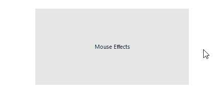

# Highlight and BorderHighlight mouse effects. 

Since R1 2018 RadControls are supporting mouse effects. Each element that inherits __RadItem__ support these effects. The effects are allowing you to change the border and the fill while the mouse is over the element. The following image is showing the effects:

>caption __Highlight__ and __BorderHighlight__ mouse effects. 

    

## Effects Properties

### Highlight Effect:

* __EnableHighlightProperty:__ turns this effect on or off.

* __HighlightColor:__ Gets or Sets the color of the effect.

### BorderHighligh Effect:

* __EnableBorderHighlight:__ turns this effect on or off.

* __BorderHighlightColor:__ Gets or Sets the color of the effect.

* __BorderHighlightThickness:__ Gets or Sets the highlighted border thickness. 

# See Also

* [Custom Fonts]()