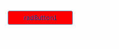
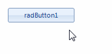
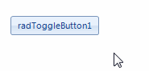

# Override Theme Settings at Run Time


This article demonstrates how to change the style for a specific element state without losing the applied style for the rest of the states. 

## 

By default, when you set a certain __RadProperty__ in code, this setting will have a higher priority, called *Local*, than the setting introduced in the theme, which sets with *Style* priority (see [RadObject]()). As a result, if you set the __BackColor__ of a button’s __FillPrimitive__ in code, even though the theme defines other colors for other states (hover, pressed), these will not be applied, as the *Local* setting has higher priority than the *Style* setting. With the API discussed in this article, you will be able to override the styles defined in the theme, and set the desired property value with priority *Style*.Hence, the rest of the defined styles in the theme will still work as expected.

Here is an example. By default, __RadButton__, like most of the visual items in the UI for WinForms suite has hover state coming from the theme.<br>

Consider the case in which you should change the __BackColor__ for a __RadButton__. To achieve it, you will probably use the following code snippet:

{{source=..\SamplesCS\TPF\OverrideThemeSettings.cs region=ButtonBackColor}} 
{{source=..\SamplesVB\TPF\OverrideThemeSettings.vb region=ButtonBackColor}} 

````C#
            
            this.radButton1.ButtonElement.ButtonFillElement.BackColor = Color.Red;
            this.radButton1.ButtonElement.ButtonFillElement.GradientStyle = GradientStyles.Solid;
````
````VB.NET

        Me.RadButton1.ButtonElement.ButtonFillElement.BackColor = Color.Red
        Me.RadButton1.ButtonElement.ButtonFillElement.GradientStyle = GradientStyles.Solid

        '
````

{{endregion}}

As a result, you will obtain the desired __BackColor__. However, the hover state will be lost.<br>

The local value, applied to the __BackColor__ property, overrides the applied style coming from the theme.

To handle this, you can use the RadItem.__SetThemeValueOverride__ method by specifying the associated state.

{{source=..\SamplesCS\TPF\OverrideThemeSettings.cs region=OverrideBackColor}} 
{{source=..\SamplesVB\TPF\OverrideThemeSettings.vb region=OverrideBackColor}} 

````C#
            
            this.radButton1.ButtonElement.SetThemeValueOverride(Telerik.WinControls.Primitives.FillPrimitive.BackColorProperty,
                Color.Red, "", typeof(Telerik.WinControls.Primitives.FillPrimitive));
            this.radButton1.ButtonElement.SetThemeValueOverride(Telerik.WinControls.Primitives.FillPrimitive.GradientStyleProperty,
                GradientStyles.Solid, "", typeof(Telerik.WinControls.Primitives.FillPrimitive));
````
````VB.NET

        Me.RadButton1.ButtonElement.SetThemeValueOverride(Telerik.WinControls.Primitives.FillPrimitive.BackColorProperty, _
                                                          Color.Red, "", GetType(Telerik.WinControls.Primitives.FillPrimitive))
        Me.RadButton1.ButtonElement.SetThemeValueOverride(Telerik.WinControls.Primitives.FillPrimitive.GradientStyleProperty, _
                                                          GradientStyles.Solid, "", GetType(Telerik.WinControls.Primitives.FillPrimitive))

        '
````

{{endregion}} 


The __GetAvailableVisualStates__ method returns a list of the string representation of the applicable states for this element. These can be used as separate states or combined. When combining, use the dot notation e.g. *IsDefault.MouseOver*.

{{source=..\SamplesCS\TPF\OverrideThemeSettings.cs region=GetAvailableVisualStates}} 
{{source=..\SamplesVB\TPF\OverrideThemeSettings.vb region=GetAvailableVisualStates}} 

````C#
            
            List<string> visualStates = this.radButton1.ButtonElement.GetAvailableVisualStates();
````
````VB.NET

        Dim visualStates As List(Of String) = Me.RadButton1.ButtonElement.GetAvailableVisualStates()

        '
````

{{endregion}}

>note Note that the normal state is represented by an empty string.
>

In case you need to change the hover color, you can use a similar approach:

{{source=..\SamplesCS\TPF\OverrideThemeSettings.cs region=MouseOver}} 
{{source=..\SamplesVB\TPF\OverrideThemeSettings.vb region=MouseOver}} 

````C#            
this.radButton1.ButtonElement.SetThemeValueOverride(Telerik.WinControls.Primitives.FillPrimitive.BackColorProperty,
    Color.Yellow, "MouseOver", typeof(Telerik.WinControls.Primitives.FillPrimitive));
this.radButton1.ButtonElement.SetThemeValueOverride(Telerik.WinControls.Primitives.FillPrimitive.GradientStyleProperty,
    GradientStyles.Solid, "MouseOver", typeof(Telerik.WinControls.Primitives.FillPrimitive));

````
````VB.NET
Me.RadButton1.ButtonElement.SetThemeValueOverride(Telerik.WinControls.Primitives.FillPrimitive.BackColorProperty, _
                                                  Color.Yellow, "MouseOver", GetType(Telerik.WinControls.Primitives.FillPrimitive))
Me.RadButton1.ButtonElement.SetThemeValueOverride(Telerik.WinControls.Primitives.FillPrimitive.GradientStyleProperty, _
                                                  GradientStyles.Solid, "MouseOver", GetType(Telerik.WinControls.Primitives.FillPrimitive))


````

{{endregion}} 



Here is an example how to combine states for __RadToggleButton__

{{source=..\SamplesCS\TPF\OverrideThemeSettings.cs region=CombineStates}} 
{{source=..\SamplesVB\TPF\OverrideThemeSettings.vb region=CombineStates}} 

````C#
this.radToggleButton1.ButtonElement.SetThemeValueOverride(Telerik.WinControls.Primitives.FillPrimitive.BackColorProperty,
    Color.Aqua, "ToggleState=On.MouseOver", typeof(Telerik.WinControls.Primitives.FillPrimitive));
this.radToggleButton1.ButtonElement.SetThemeValueOverride(Telerik.WinControls.Primitives.FillPrimitive.GradientStyleProperty,
    GradientStyles.Solid, "ToggleState=On.MouseOver", typeof(Telerik.WinControls.Primitives.FillPrimitive));

````
````VB.NET
Me.RadToggleButton1.ButtonElement.SetThemeValueOverride(Telerik.WinControls.Primitives.FillPrimitive.BackColorProperty, _
                                                        Color.Aqua, "ToggleState=On.MouseOver", GetType(Telerik.WinControls.Primitives.FillPrimitive))
Me.RadToggleButton1.ButtonElement.SetThemeValueOverride(Telerik.WinControls.Primitives.FillPrimitive.GradientStyleProperty, _
                                                        GradientStyles.Solid, "ToggleState=On.MouseOver", GetType(Telerik.WinControls.Primitives.FillPrimitive))


````

{{endregion}} 


