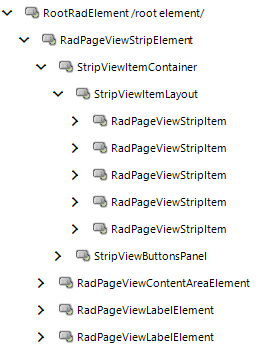

# Introducing the Telerik Presentation Framework

Controls in the Telerik UI for WinForms suite have both a general shared architecture and a specific internal structure.

## Shared Control Architecture

Every control in the Telerik UI for WinForms suite is derived from the __RadControl__ class, which in turn descends from __System.Windows.Forms.ScrollableControl__. This relationship ties the controls into the main Windows Forms architecture, and allows you to place them on forms, participate in drag-and-drop operations, and so on. The controls are simple wrappers and do not implement detailed functionality. Rather, each control has as a direct descendant an instance of the __RootRadElement__ class. This __RootRadElement__ wraps the actual functionality of the control and acts to transfer events to and from the __RadControl__ class. In turn, the __RootRadElement__ has a descendant tree of __RadElement__ classes that implement the actual logic required by the control. In most cases the __RootRadElement__ has a single descendant, though some complex controls such as the Telerik RadRibbonBar require more than one child for the __RootRadElement__. See the [Class Hierarchy Overview]() for more information.
        

For example, schematically, the overall architecture for a RadTabStrip looks as follows:

```
RadTabStrip
    RootRadElement
        RadTabStripElement
            tree of RadElement instances
```


## Specific Internal Structure

Any control in the Telerik UI for WinForms suite is composed of __RadElement__ instances arranged in a logical tree. You can inspect this tree using the VisualStyleBuilder or the Control Spy. For example, the screenshot below shows the internal structure of a  RadTabStrip control as displayed by the Control Spy. In this case, you can see the __RootRadElement__ with the  __RadTabStripElement__ as its only child. The __RadTabStripElement__ in turn contains a  __DockLayoutPanel__ which in turn holds the elements that make up each tab. At the leaf level of the tree, various [primitives]() are the atomic pieces that make up the element. For example, button contains a fill, text and border primitives.


