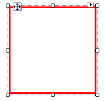
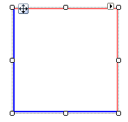

# BorderPrimitive

The __BorderPrimitive__ class is responsible for drawing the border around an area on the screen. __BorderPrimitive__ is automatically sized to the inner edges of the parent element. The __BoxStyle__ property controls display characteristics and can be set to __SingleBorder, FourBorders__ and __OuterInnerBorders__.

## SingleBorder



All four sides of the border are drawn with the same properties except color. Color is controlled by the __GradientStyles__ property. To get all colors in the border to display the same, use the __GrandientStyles.Solid__ enumeration member. The example below displays a red, 3 pixel border box.

#### Creating a BorderPrimitive with SingleBorder

{{source=..\SamplesCS\TPF\Primitives\BorderPrimitive1\MyBorderPrimitiveSElement.cs region=myBorderPrimitiveSElement}} 
{{source=..\SamplesVB\TPF\Primitives\BorderPrimitive1\MyBorderPrimitiveSElement.vb region=myBorderPrimitiveSElement}} 

````C#
public class MyBorderPrimitiveSElement : RadElement
{
    protected override void CreateChildElements()
    {
        BorderPrimitive borderPrimitive = new BorderPrimitive();
        borderPrimitive.Class = "MyBorderPrimtiveClass";
        borderPrimitive.BoxStyle = BorderBoxStyle.SingleBorder;
        borderPrimitive.Width = 3;
        borderPrimitive.ForeColor = Color.Red;
        borderPrimitive.GradientStyle = GradientStyles.Solid;
        this.Children.Add(borderPrimitive);
        base.CreateChildElements();
    }
}

````
````VB.NET
Public Class MyBorderPrimitiveSElement
    Inherits RadElement
    Protected Overrides Sub CreateChildElements()
        Dim borderPrimitive As New BorderPrimitive()
        borderPrimitive.Class = "MyBorderPrimtiveClass"
        borderPrimitive.BoxStyle = BorderBoxStyle.SingleBorder
        borderPrimitive.Width = 3
        borderPrimitive.ForeColor = Color.Red
        borderPrimitive.GradientStyle = GradientStyles.Solid
        Me.Children.Add(borderPrimitive)
        MyBase.CreateChildElements()
    End Sub
End Class

````

{{endregion}} 

## FourBorders



Each side of the border can be tailored individually. __ForeColor__ , __Width__ and __GradientStyle__ properties are ignored in favor of width and color properties for each side. The example code below describes a box with the left and bottom sides displaying a 3 pixel blue line and the upper and right hand sides displaying a 1 pixel red border.

#### Creating a BorderPrimitive with FourBorders

{{source=..\SamplesCS\TPF\Primitives\BorderPrimitive1\MyBorderPrimitiveFBElement.cs region=myBorderPrimitiveFBElement}} 
{{source=..\SamplesVB\TPF\Primitives\BorderPrimitive1\MyBorderPrimitiveFBElement.vb region=myBorderPrimitiveFBElement}} 

````C#
public class MyBorderPrimitiveFBElement : RadElement
{
    protected override void CreateChildElements()
    {
        BorderPrimitive borderPrimitive = new BorderPrimitive();
        borderPrimitive.Class = "MyBorderPrimtiveClass";
        borderPrimitive.BoxStyle = BorderBoxStyle.FourBorders;
        borderPrimitive.LeftWidth = 3;
        borderPrimitive.LeftColor = Color.Blue;
        borderPrimitive.BottomWidth = 3;
        borderPrimitive.BottomColor = Color.Blue;
        borderPrimitive.RightWidth = 1;
        borderPrimitive.RightColor = Color.Red;
        borderPrimitive.TopWidth = 1;
        borderPrimitive.TopColor = Color.Red;
        this.Children.Add(borderPrimitive);
        base.CreateChildElements();
    }
}

````
````VB.NET
Public Class MyBorderPrimitiveFBElement
    Inherits RadElement
    Protected Overrides Sub CreateChildElements()
        Dim borderPrimitive As New BorderPrimitive()
        borderPrimitive.Class = "MyBorderPrimtiveClass"
        borderPrimitive.BoxStyle = BorderBoxStyle.FourBorders
        borderPrimitive.LeftWidth = 3
        borderPrimitive.LeftColor = Color.Blue
        borderPrimitive.BottomWidth = 3
        borderPrimitive.BottomColor = Color.Blue
        borderPrimitive.RightWidth = 1
        borderPrimitive.RightColor = Color.Red
        borderPrimitive.TopWidth = 1
        borderPrimitive.TopColor = Color.Red
        Me.Children.Add(borderPrimitive)
        MyBase.CreateChildElements()
    End Sub
End Class

````

{{endregion}} 

## OuterInnerBorders


Inner and outer colors can be specified using the __ForeColor__ and __InnerColor__ property families. The __GradientStyle__ property determines how the primitive colors are displayed. A Solid __GradientStyle__ will only take the __ForeColor__ and __InnerColor__ properties into account. The code example below sets a 1 pixel width, sets the __GradientStyle__ to *Linear*, sets the __ForeColor__ related properties to blue and green colors. The InnerColor related properties are set to light blue and green colors.

#### Creating a BorderPrimitive with OuterInnerBorders

{{source=..\SamplesCS\TPF\Primitives\BorderPrimitive1\MyBorderPrimitiveOIElement.cs region=myBorderPrimitiveOIElement}} 
{{source=..\SamplesVB\TPF\Primitives\BorderPrimitive1\MyBorderPrimitiveOIElement.vb region=myBorderPrimitiveOIElement}} 

````C#
public class MyBorderPrimitiveOIElement : RadElement
{
    protected override void CreateChildElements()
    {
        BorderPrimitive borderPrimitive = new BorderPrimitive();
        borderPrimitive.Class = "MyBorderPrimtiveClass";
        borderPrimitive.BoxStyle = BorderBoxStyle.OuterInnerBorders;
        borderPrimitive.Width = 1;
        borderPrimitive.GradientStyle = GradientStyles.Linear;
        borderPrimitive.ForeColor = Color.DarkBlue;
        borderPrimitive.ForeColor2 = Color.Blue;
        borderPrimitive.ForeColor3 = Color.Green;
        borderPrimitive.ForeColor4 = Color.DarkGreen;
        borderPrimitive.InnerColor = Color.LightBlue;
        borderPrimitive.InnerColor2 = Color.SkyBlue;
        borderPrimitive.InnerColor3 = Color.LightGreen;
        borderPrimitive.InnerColor4 = Color.LightSkyBlue;
        this.Children.Add(borderPrimitive);
        base.CreateChildElements();
    }
}

````
````VB.NET
Public Class MyBorderPrimitiveOIElement
    Inherits RadElement
    Protected Overrides Sub CreateChildElements()
        Dim borderPrimitive As New BorderPrimitive()
        borderPrimitive.Class = "MyBorderPrimtiveClass"
        borderPrimitive.BoxStyle = BorderBoxStyle.OuterInnerBorders
        borderPrimitive.Width = 1
        borderPrimitive.GradientStyle = GradientStyles.Linear
        borderPrimitive.ForeColor = Color.DarkBlue
        borderPrimitive.ForeColor2 = Color.Blue
        borderPrimitive.ForeColor3 = Color.Green
        borderPrimitive.ForeColor4 = Color.DarkGreen
        borderPrimitive.InnerColor = Color.LightBlue
        borderPrimitive.InnerColor2 = Color.SkyBlue
        borderPrimitive.InnerColor3 = Color.LightGreen
        borderPrimitive.InnerColor4 = Color.LightSkyBlue
        Me.Children.Add(borderPrimitive)
        MyBase.CreateChildElements()
    End Sub
End Class

````

{{endregion}}

# See Also
* [ArrowPrimitive]()

* [CheckPrimitive]()

* [FillPrimitive]()

* [FocusPrimitive]()

* [GripPrimitive]()

* [ImagePrimitive]()

* [ImageShape]()

* [LightVisualElement]()

* [How to Achieve Rounded Shape and Rounded Border for RadTextBox]()

