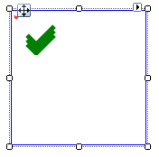

# CheckPrimitive

## 

The __CheckPrimitive__ is painted as three sets of angled lines and is colored using the __ForeColor__ property. The three sets of lines are easier to see when the primitive is scaled up. The example below creates two CheckPrimitives, one at the default size and the second scaled up by a factor of 5.



#### Creating a CheckPrimitive

{{source=..\SamplesCS\TPF\Primitives\CheckPrimitive1\MyCheckPrimitiveElement.cs region=myCheckPrimitiveElement}} 
{{source=..\SamplesVB\TPF\Primitives\CheckPrimitive1\MyCheckPrimitiveElement.vb region=myCheckPrimitiveElement}} 

````C#
    public class MyCheckPrimitiveElement : RadElement
    {
        protected override void CreateChildElements()
        {
            BorderPrimitive borderPrimitive = new BorderPrimitive();
            borderPrimitive.BoxStyle = BorderBoxStyle.SingleBorder;
            borderPrimitive.Width = 1;
            borderPrimitive.GradientStyle = GradientStyles.Solid;
            borderPrimitive.MinSize = new Size(100, 100);
            borderPrimitive.ForeColor = Color.Blue;
            CheckPrimitive checkPrimitive = new CheckPrimitive();
            checkPrimitive.ForeColor = Color.Red;
            CheckPrimitive checkPrimitive2 = new CheckPrimitive();
            checkPrimitive2.ForeColor = Color.Green;
            checkPrimitive2.ScaleTransform = new SizeF(5F, 5F);
            this.Children.Add(borderPrimitive);
            this.Children.Add(checkPrimitive);
            this.Children.Add(checkPrimitive2);

            base.CreateChildElements();
        }
    }
````
````VB.NET
Public Class MyCheckPrimitiveElement
    Inherits RadElement
    Protected Overrides Sub CreateChildElements()
        Dim borderPrimitive As New BorderPrimitive()
        borderPrimitive.BoxStyle = BorderBoxStyle.SingleBorder
        borderPrimitive.Width = 1
        borderPrimitive.GradientStyle = GradientStyles.Solid
        borderPrimitive.MinSize = New Size(100, 100)
        borderPrimitive.ForeColor = Color.Blue
        Dim checkPrimitive As New CheckPrimitive()
        checkPrimitive.ForeColor = Color.Red
        Dim checkPrimitive2 As New CheckPrimitive()
        checkPrimitive2.ForeColor = Color.Green
        checkPrimitive2.ScaleTransform = New SizeF(5.0F, 5.0F)
        Me.Children.Add(borderPrimitive)
        Me.Children.Add(checkPrimitive)
        Me.Children.Add(checkPrimitive2)

        MyBase.CreateChildElements()
    End Sub
End Class
'
````

{{endregion}}
