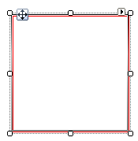

# FocusPrimitive

FocusPrimitive supplies user interface cues that an element has received focus. The constructor for FocusPrimitive takes a BorderPrimitive that provides the basic dimensions. Fore colors and inner colors may be set explicitly or default control colors are used.



#### Creating a FocusPrimitive

{{source=..\SamplesCS\TPF\Primitives\FocusPrimitive1\MyFocusPrimitiveElement.cs region=myFocusPrimitiveElement}} 
{{source=..\SamplesVB\TPF\Primitives\FocusPrimitive1\MyFocusPrimitiveElement.vb region=myFocusPrimitiveElement}} 

````C#
public class MyFocusPrimitiveElement : RadElement
{
    protected override void CreateChildElements()
    {
        BorderPrimitive borderPrimitive = new BorderPrimitive();
        borderPrimitive.Class = "MyBorderPrimtiveClass";
        borderPrimitive.BoxStyle = BorderBoxStyle.SingleBorder;
        borderPrimitive.Width = 3;
        borderPrimitive.ForeColor = Color.Red;
        borderPrimitive.GradientStyle = GradientStyles.Solid;
        FocusPrimitive focusPrimitive = new FocusPrimitive(borderPrimitive);
        this.Children.Add(borderPrimitive);
        this.Children.Add(focusPrimitive);
        base.CreateChildElements();
    }
}

````
````VB.NET
Public Class MyFocusPrimitiveElement
    Inherits RadElement
    Protected Overrides Sub CreateChildElements()
        Dim borderPrimitive As New BorderPrimitive()
        borderPrimitive.Class = "MyBorderPrimtiveClass"
        borderPrimitive.BoxStyle = BorderBoxStyle.SingleBorder
        borderPrimitive.Width = 3
        borderPrimitive.ForeColor = Color.Red
        borderPrimitive.GradientStyle = GradientStyles.Solid
        Dim focusPrimitive As New FocusPrimitive(borderPrimitive)
        Me.Children.Add(borderPrimitive)
        Me.Children.Add(focusPrimitive)
        MyBase.CreateChildElements()
    End Sub
End Class

````

{{endregion}}

# See Also
* [ArrowPrimitive]()

* [BorderPrimitive]()

* [CheckPrimitive]()

* [FillPrimitive]()

* [GripPrimitive]()

* [ImagePrimitive]()

* [ImageShape]()

* [LightVisualElement]()

