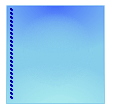

# GripPrimitive

GripPrimitive displays a vertical row of dots as a visual cue to users that this is an area that can be gripped and dragged. Grip dots are displayed using __BackColor__ and __BackColor2__ colors. __BackColor2__ represents a shadow to set the dots off the background, particularly when the dots and the background contain some of the same colors.



#### Creating a GripPrimitive

{{source=..\SamplesCS\TPF\Primitives\GripPrimitive1\MyGripPrimitiveElement.cs region=myGripPrimitiveElement}} 
{{source=..\SamplesVB\TPF\Primitives\GripPrimitive1\MyGripPrimitiveElement.vb region=myGripPrimitiveElement}} 

````C#
public class MyGripPrimitiveElement : RadElement
{
    protected override void CreateChildElements()
    {
        FillPrimitive fillPrimitive = new FillPrimitive();
        fillPrimitive.GradientStyle = GradientStyles.OfficeGlassRect;
        fillPrimitive.NumberOfColors = 4;
        fillPrimitive.BackColor = Color.Blue;
        fillPrimitive.BackColor2 = Color.LightBlue;
        fillPrimitive.BackColor3 = Color.SkyBlue;
        fillPrimitive.BackColor4 = Color.PaleTurquoise;
        GripPrimitive gripPrimitive = new GripPrimitive();
        gripPrimitive.MinSize = new Size(100, 100);
        gripPrimitive.PositionOffset = new SizeF(5, 0);
        gripPrimitive.BackColor = Color.DarkBlue;
        gripPrimitive.BackColor2 = Color.Blue;
        this.Children.Add(fillPrimitive);
        this.Children.Add(gripPrimitive);
        base.CreateChildElements();
    }
}

````
````VB.NET
Public Class MyGripPrimitiveElement
    Inherits RadElement
    Protected Overrides Sub CreateChildElements()
        Dim fillPrimitive As New FillPrimitive()
        fillPrimitive.GradientStyle = GradientStyles.OfficeGlassRect
        fillPrimitive.NumberOfColors = 4
        fillPrimitive.BackColor = Color.Blue
        fillPrimitive.BackColor2 = Color.LightBlue
        fillPrimitive.BackColor3 = Color.SkyBlue
        fillPrimitive.BackColor4 = Color.PaleTurquoise
        Dim gripPrimitive As New GripPrimitive()
        gripPrimitive.MinSize = New Size(100, 100)
        gripPrimitive.PositionOffset = New SizeF(5, 0)
        gripPrimitive.BackColor = Color.DarkBlue
        gripPrimitive.BackColor2 = Color.Blue
        Me.Children.Add(fillPrimitive)
        Me.Children.Add(gripPrimitive)
        MyBase.CreateChildElements()
    End Sub
End Class

````

{{endregion}} 
