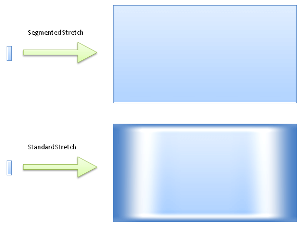
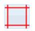
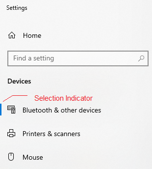
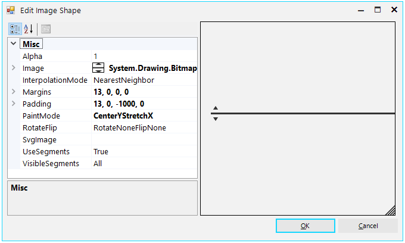

# ImageShape

__RadImageShape__ implements the so called "Segmented Image" semantic, which in general allows a small image (pattern) to be stretched to larger bounds without quality loss. This effect is achieved by dividing the image into 9 logical parts (segments) and providing advanced paint logic for each part.

__RadImageShape.Margins__

__RadImageShape__          

Using the __Margins__ property, an image is divided into 9 segments. Following is a brief overview of each segment and how it is stretched:

1. TopLeft – not stretched

1. Top – stretched horizontally

1. TopRight – not stretched

1. Right – stretched vertically

1. BottomRight – not stretched

1. Bottom – stretched horizontally

1. BottomLeft – not stretched

1. Left – stretched vertically

1. Inner – stretched horizontally and vertically

__Advanced Settings__

RadImageShape exposes some advanced settings that allow any complex rendering logic to be easily described. Such settings are:

* **PaintMode** – available are 14 different modes, where each one defines custom paint logic of the 9 segments.

*PaintMode.StretchYTileX*

* **InterpolationMode** – defines the interpolation passed to the underlying GDI+ Graphics used to paint the each image part.

* **RotateFlip** – additional option, which allows the source image to be rotated/flipped before segmentation.

* **BackgroundShapePaintMode** - determines when the BackgroundShape will be painted. The following options are available:
	* **PrePaint**: The BackgroundShape will be painted in the PrePaintElement method(before fill, border, text, image etc.). Suitable when you use the BackgroundShape instead of Fill and/or Border.
	
	* **PostPaint**: The BackgroundShape will be painted on top of all other elements(fill, border, text, image). Here it is not suitable to use a big BackgroundShape, because it will cover everything else painted before. But it is suitable to add some minor indications, for example, the little selection indicator in Windows 10:

	

__Editing RadImageShape in Visual Style Builder__

Each RadElement exposes a property named __BackgroundShape__ which is of type __RadImageShape__. Complete __Visual Style Builder__ support is provided and you can either create a __RadImageShape__ repository item or edit the __BackgroundShape__ property directly in the advanced view of each element.

# See Also
* [ArrowPrimitive]()

* [BorderPrimitive]()

* [CheckPrimitive]()

* [FillPrimitive]()

* [FocusPrimitive]()

* [GripPrimitive]()

* [ImagePrimitive]()

* [LightVisualElement]()
