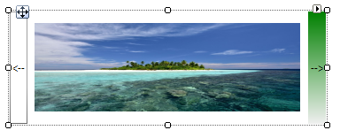

# LightVisualElement

__LightVisualElement__ is a lightweight element which is capable of displaying Text, Border and Image and can be easily customized. Here is a list of its properties allowing for fine tuning the element:


* __ShouldPaint:__ Indicates whether the element should be painted. Children visibility would not be affected.
          

* __CanFocus:__ Gets or sets value indicating whether an element can receive input focus.
          

* __DrawText__, __DrawFill__, __DrawBorder__ Gets or sets value indicating whether an element can receive input focus.
          

* __BorderBoxStyle:__ Defines the border rendering style – *SingleBorder*, *FourBorders*, *OuterInnerBorders*

* __BorderDrawMode:__ Defines drawing border corners – *HorizontalOverVertical*, *LeftOverTop*, *RightOverTop*, *RightOverBotton*, *LeftOverBottom* etc.
          

* __BorderWidth:__ Defines the width the border on each side
          

* __BorderLeftWidth__, __BorderLeftWidth__, __BorderRightWidth__, __BorderBottomWidth__  Defines the width of the border on each side independently
          

* __BorderGradientAngle:__ Defines the angle of the gradient the border uses as background.
          

* __BorderGradientStyle:__ Defines the gradient effects: *Solid*, *Linear*, *Radial*, *Glass*, *OfficeGlass*, *Gel*, and *Vista*.
          

* __BorderColor__, __BorderColor2__, __BorderColor3__, __BorderColor4__ Defines the four colors used for making gradient border background
          

* __BorderInnerColor__, __BorderInnerColor2__, __BorderInnerColor3__, __BorderInnerColor4__ Defines the four colors used for making the inner gradient border background
          

* __BackColor__, __BackColor2__, __BackColor3__, __BackColor4__ Defines the four colors used the element’s gradient background
          

* __NumberOfColors:__ Defines how many colors will be used to make the background color. If the value is ‘1’ the other three colors are ignored
          

* __GradientStyle:__ Defines the gradient effects: *Solid*, *Linear*, *Radial*, *Glass*, *OfficeGlass*, *Gel*, and *Vista*.
          

* __GradientAngle:__ Gets or sets the angle of the background gradient
          

* __GradientPercentage:__ Defines how much of the available space the first gradient color will take
          

* __GradientPercentage2:__ Defines the space available for the the second gradient color
          

* __BackgroundImage:__ Gets or sets the BackgroundImage. This image fills up the entire element’s background
          

* __Image:__ Gets or sets the element’s image, the image can be resized inside the element.
  
* __SvgImage:__ Gets or sets the SVG image.
          
* __ImageLayout:__ Specifies the position of the image on the control. *None*, *Tile*, *Center*, *Stretch*, *Zoom*

* __BackgroundImageLayout:__ Specifies the position of the BackgroundImage on the control. *None*, *Tile*, *Center*, *Stretch*, *Zoom*

* __ImageOpacity:__ Specifies the opacity of the set image
          

* __ImageAlignment__, __TextAlignment__ Specifies alignment of content on the drawing surface. *TopLeft*, *TopCenter*, *TopRight*, *MiddleLeft*, *MiddleCenter*, *MiddleRight*, *BottomLeft*, *BottomCenter*, *BottomRight*

* __TextImageRelation:__ Specifies the position of the text and image relative to each other on a control. *Overlay*, *ImageBeforeText*, *TextBeforeImage*, *ImageAboveText*, *TextAboveImage*

* __ShowHorizontalLine__, __ShowHorizontalLineColor__, __ShowHorizontalLineWidth__ These properties allow you to modify a horizontal line over the element
          

* __PaintTextFormat:__ An object which Encapsulates text layout information (such as alignment, orientation and tab stops) display manipulations (such as ellipsis insertion and national digit substitution) and OpenType features
          

* __DisableHTMLRendering:__ Gets or sets the value indicating whether html tags will be rendered.
          

* __TextBlock:__ An object which contains the text and its styling.
          

* __BorderLeftColor__, __BorderTopColor__, __BorderRightColor__, __BorderBottomColor__, __BorderLeftShadowColor__, __BorderTopShadowColor__, __BorderRightShadowColor__, __BorderBottomShadowColor__ Defines border colors and shadows
          

* __ClipText:__ Determines whether text will be clipped within the calculated text paint rectangle.
          

* __Layout:__ Gets the LayoutManagerPart which is responsible for the layout. Use this property to set the margins of left, right parts separately.
          

* __ImageTransparentColor:__ Transparent color to be used for the image.
          

* __BorderDashStyle:__ Specifies the style of dashed lines drawn with a border
          

* __EnableImageTransparency:__ Gets or sets a value indicating whether image transparency is supported.
          

* __Shadow:__ Gets or Sets the *ShadowSettings*

* __AutoEllipsis:__ Determines whether character trimming will be automatically applied to the element if text cannot be fitted within the available space.
          

* __UseMnemonic:__ Determines whether ampersand character will be treated as mnemonic or not.
          

* __TextWrap:__ Determines whether text wrap is enabled.
          

* __MeasureTrailingSpaces:__ Indicates whether the trailing white spaces will be calculated by the layout logic
          

* __TextParams:__ Gets the *TextParams* object which defines some text settings

The following example will show you how to make a simple image gallery with three LightVisualElements inside a DockLayoutPanel.



#### Creating a simple control with LightVisualElements

{{source=..\SamplesCS\TPF\Primitives\LightVisualElement1\MyLightVisualElement.cs region=MyLightVisualElement}} 
{{source=..\SamplesVB\TPF\Primitives\LightVisualElement1\MyLightVisualElement.vb region=MyLightVisualElement}} 

````C#
public class MyLightVisualElement : RadElement
{
    private DockLayoutPanel mainPanel;
    private LightVisualElement leftButtonElement;
    private LightVisualElement rightButtonElement;
    private LightVisualElement currentImageElement;
    private Image[] images;
    protected override void CreateChildElements()
    {
        this.mainPanel = new DockLayoutPanel();
        this.mainPanel.LastChildFill = true;
        this.Children.Add(this.mainPanel);
        this.leftButtonElement = new LightVisualElement();
        this.leftButtonElement.Text = "<--";
        this.leftButtonElement.DrawBorder = true;
        this.mainPanel.Children.Add(this.leftButtonElement);
        DockLayoutPanel.SetDock(this.leftButtonElement, Telerik.WinControls.Layouts.Dock.Left);
        this.leftButtonElement.Click += leftButtonElement_Click;
        this.rightButtonElement = new LightVisualElement();
        this.rightButtonElement.Text = "-->";
        this.rightButtonElement.DrawFill = true;
        this.rightButtonElement.BackColor = Color.Green;
        this.mainPanel.Children.Add(this.rightButtonElement);
        DockLayoutPanel.SetDock(this.rightButtonElement, Telerik.WinControls.Layouts.Dock.Right);
        this.rightButtonElement.Click += rightButtonElement_Click;
        this.currentImageElement = new LightVisualElement();
        this.mainPanel.Children.Add(this.currentImageElement);
        string imageFilesDirectory = Environment.GetFolderPath(Environment.SpecialFolder.MyPictures);
        string[] imageFiles = Directory.GetFiles(imageFilesDirectory, "*.jpg");
        this.images = new Image[imageFiles.Length];
        for (int i = 0; i < imageFiles.Length; i++)
        {
            this.images[i] = new Bitmap(Image.FromFile(imageFiles[i]), new Size(300, 100));
        }
        if (this.images.Length >= 0)
        {
            this.currentImageElement.Image = this.images[0];
        }
        base.CreateChildElements();
    }
    private void rightButtonElement_Click(object sender, EventArgs e)
    {
        int currentImageIndex = Array.IndexOf(this.images, this.currentImageElement.Image);
        if (++currentImageIndex <= this.images.Length - 1)
        {
            this.currentImageElement.Image = this.images[currentImageIndex];
        }
    }
    private void leftButtonElement_Click(object sender, EventArgs e)
    {
        int currentImageIndex = Array.IndexOf(this.images, this.currentImageElement.Image);
        if (--currentImageIndex >= 0)
        {
            this.currentImageElement.Image = this.images[currentImageIndex];
        }
    }
}

````
````VB.NET
Public Class MyLightVisualElement
    Inherits RadElement
    Private mainPanel As DockLayoutPanel
    Private leftButtonElement As LightVisualElement
    Private rightButtonElement As LightVisualElement
    Private currentImageElement As LightVisualElement
    Private images() As System.Drawing.Image
    Protected Overrides Sub CreateChildElements()
        Me.mainPanel = New DockLayoutPanel()
        Me.mainPanel.LastChildFill = True
        Me.Children.Add(Me.mainPanel)
        Me.leftButtonElement = New LightVisualElement()
        Me.leftButtonElement.Text = "<--"
        Me.leftButtonElement.DrawBorder = True
        Me.mainPanel.Children.Add(Me.leftButtonElement)
        DockLayoutPanel.SetDock(Me.leftButtonElement, Telerik.WinControls.Layouts.Dock.Left)
        AddHandler Me.leftButtonElement.Click, AddressOf leftButtonElement_Click
        Me.rightButtonElement = New LightVisualElement()
        Me.rightButtonElement.Text = "-->"
        Me.rightButtonElement.DrawFill = True
        Me.rightButtonElement.BackColor = System.Drawing.Color.Green
        Me.mainPanel.Children.Add(Me.rightButtonElement)
        DockLayoutPanel.SetDock(Me.rightButtonElement, Telerik.WinControls.Layouts.Dock.Right)
        AddHandler Me.rightButtonElement.Click, AddressOf rightButtonElement_Click
        Me.currentImageElement = New LightVisualElement()
        Me.mainPanel.Children.Add(Me.currentImageElement)
        Dim imageFilesDirectory As String = Environment.GetFolderPath(Environment.SpecialFolder.MyPictures)
        Dim imageFiles As String() = Directory.GetFiles(imageFilesDirectory, "*.jpg")
        ReDim images(imageFiles.Length - 1)
        For i As Integer = 0 To imageFiles.Length - 1
            Me.images(i) = New System.Drawing.Bitmap(System.Drawing.Image.FromFile(imageFiles(i)), New System.Drawing.Size(300, 100))
        Next
        If Me.images.Length >= 0 Then
            Me.currentImageElement.Image = Me.images(0)
        End If
        MyBase.CreateChildElements()
    End Sub
    Private Sub rightButtonElement_Click(sender As Object, e As EventArgs)
        Dim currentImageIndex As Integer = Array.IndexOf(Me.images, Me.currentImageElement.Image)
        If System.Threading.Interlocked.Increment(currentImageIndex) <= Me.images.Length - 1 Then
            Me.currentImageElement.Image = Me.images(currentImageIndex)
        End If
    End Sub
    Private Sub leftButtonElement_Click(sender As Object, e As EventArgs)
        Dim currentImageIndex As Integer = Array.IndexOf(Me.images, Me.currentImageElement.Image)
        If System.Threading.Interlocked.Decrement(currentImageIndex) >= 0 Then
            Me.currentImageElement.Image = Me.images(currentImageIndex)
        End If
    End Sub
End Class

````

{{endregion}}

# See Also
* [ArrowPrimitive]()

* [BorderPrimitive]()

* [CheckPrimitive]()

* [FillPrimitive]()

* [FocusPrimitive]()

* [GripPrimitive]()

* [ImagePrimitive]()

* [ImageShape]()

