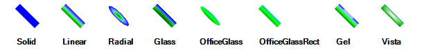

# LinePrimitive


__LinePrimitive__ is actually a variation of a filled rectangle. The shadow of the fill is set by the __BackColor__, __BackColor2__, __BackColor3__ and __BackColor4__ properties. The way these four colors are used is determined by the __GradientStyle__ and __GradientAngle__ properties. LineWidth sets the thickness of the line. Some __GradientStyle__ settings will not be visible if the __LineWidth__ is too narrow. The example below iterates the possible __GradientStyle__ values and creates a __LinePrimitive__ for each. The __LinePrimitives__ each have a __LineWidth__ of 10, making it easier to see the __GradientStyle__ effect. The __AngleTransform__ property is used to spin the line 30 degrees.



#### Creating a LinePrimitive


{{source=..\SamplesCS\TPF\Primitives\LinePrimitive1\MyLinePrimitiveElement.cs region=myLinePrimitiveElement}} 
{{source=..\SamplesVB\TPF\Primitives\LinePrimitive1\MyLinePrimitiveElement.vb region=myLinePrimitiveElement}} 

````C#
    public class MyLinePrimitiveElement : RadElement
    {
        protected override void CreateChildElements()
        {
            StackLayoutPanel layoutPanel = new StackLayoutPanel();
            layoutPanel.Orientation = System.Windows.Forms.Orientation.Horizontal;
            Array gradientStyleValues = Enum.GetValues(typeof(GradientStyles));
            foreach (GradientStyles gradientStyle in gradientStyleValues)
            {
                StackLayoutPanel panel = new StackLayoutPanel();
                panel.Orientation = System.Windows.Forms.Orientation.Vertical;
                panel.Margin = new System.Windows.Forms.Padding(3);
                panel.MinSize = new Size(60, 0);
                LinePrimitive linePrimitive = new LinePrimitive();
                linePrimitive.NumberOfColors = 4;
                linePrimitive.GradientStyle = gradientStyle;
                linePrimitive.BackColor = Color.Blue;
                linePrimitive.BackColor2 = Color.SkyBlue;
                linePrimitive.BackColor3 = Color.Lime;
                linePrimitive.BackColor4 = Color.Green;
                linePrimitive.LineWidth = 10;
                linePrimitive.AngleTransform = 45;
                linePrimitive.MinSize = new Size(40, 30);
                panel.Children.Add(linePrimitive);
                TextPrimitive textPrimitive = new TextPrimitive();
                textPrimitive.Text = gradientStyle.ToString("g");
                textPrimitive.Font = new Font(textPrimitive.Font, FontStyle.Bold);
                textPrimitive.ForeColor = Color.Black;
                textPrimitive.Margin = new System.Windows.Forms.Padding(15, 0, 0, 0);
                panel.Children.Add(textPrimitive);
                layoutPanel.Children.Add(panel);
            }
            this.Children.Add(layoutPanel);
            base.CreateChildElements();
        }
    }
````
````VB.NET
Public Class MyLinePrimitiveElement
    Inherits RadElement
    Protected Overrides Sub CreateChildElements()
        Dim layoutPanel As New StackLayoutPanel()
        layoutPanel.Orientation = System.Windows.Forms.Orientation.Horizontal
        Dim gradientStyleValues As Array = System.Enum.GetValues(GetType(GradientStyles))
        For Each gradientStyle As GradientStyles In gradientStyleValues
            Dim panel As New StackLayoutPanel()
            panel.Orientation = System.Windows.Forms.Orientation.Vertical
            panel.Margin = New System.Windows.Forms.Padding(3)
            panel.MinSize = New Size(60, 0)
            Dim linePrimitive As New LinePrimitive()
            linePrimitive.NumberOfColors = 4
            linePrimitive.GradientStyle = gradientStyle
            linePrimitive.BackColor = Color.Blue
            linePrimitive.BackColor2 = Color.SkyBlue
            linePrimitive.BackColor3 = Color.Lime
            linePrimitive.BackColor4 = Color.Green
            linePrimitive.LineWidth = 10
            linePrimitive.AngleTransform = 45
            linePrimitive.MinSize = New Size(40, 30)
            panel.Children.Add(linePrimitive)
            Dim textPrimitive As New TextPrimitive()
            textPrimitive.Text = gradientStyle.ToString("g")
            textPrimitive.Font = New Font(textPrimitive.Font, FontStyle.Bold)
            textPrimitive.ForeColor = Color.Black
            textPrimitive.Margin = New System.Windows.Forms.Padding(15, 0, 0, 0)
            panel.Children.Add(textPrimitive)
            layoutPanel.Children.Add(panel)
        Next gradientStyle
        Me.Children.Add(layoutPanel)
        MyBase.CreateChildElements()
    End Sub
End Class
'
````

{{endregion}}
