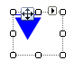

# OverflowPrimitive

The OverflowPrimitive is a visual indicator and button that more choices are available. The OverflowPrimitive consists of a triangle and a line just under the base of the triangle. The triangle and line are colored using the __ForeColor__ property. Depending on the __Direction__ property of the arrow, __BackColor__ and __ShadowColor__ may be used.



#### Creating an OverflowPrimitive

{{source=..\SamplesCS\TPF\Primitives\OverflowPrimitive1\MyOverflowPrimitiveElement.cs region=myOverflowPrimitiveElement}} 
{{source=..\SamplesVB\TPF\Primitives\OverflowPrimitive1\MyOverflowPrimitiveElement.vb region=myOverflowPrimitiveElement}} 

````C#
public class MyOverflowPrimitiveElement : RadElement
{
    protected override void CreateChildElements()
    {
        OverflowPrimitive overflowPrimitive = new OverflowPrimitive(ArrowDirection.Down);
        overflowPrimitive.MinSize = new Size(30, 30);
        overflowPrimitive.ForeColor = Color.Blue;
        this.Children.Add(overflowPrimitive);
        base.CreateChildElements();
    }
}

````
````VB.NET
Public Class MyOverflowPrimitiveElement
    Inherits RadElement
    Protected Overrides Sub CreateChildElements()
        Dim overflowPrimitive As New OverflowPrimitive(ArrowDirection.Down)
        overflowPrimitive.MinSize = New Size(30, 30)
        overflowPrimitive.ForeColor = Color.Blue
        Me.Children.Add(overflowPrimitive)
        MyBase.CreateChildElements()
    End Sub
End Class

````

{{endregion}}
