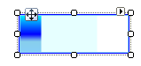

# ProgressBarPrimitive

## 

ProgressBarPrimitive is a specialized descendant of [FillPrimitive]() that  indicates the state of progress in a long running process. The fill area is controlled by the __GradientStyle__ and the __BackColor..BackColor4__ properties. The fill covers the percentage area between __Minimum__ and __Maximum__ specified by the __Value1__ property. __Value1__ is rendered using up to all four colors. __Value2__ displays in the __BackColor__ at 25% opacity. __Orientation__ controls the starting point of the fill and can originate from __Left__,  __Right__, __Top__ or __Bottom__. The example below shows a Linear fill for  __Value1__(set to 20), and a pale Aqua for __Value2__(set to 70).



#### Creating a ProgressBarPrimitive

{{source=..\SamplesCS\TPF\Primitives\ProgressBarPrimitive1\MyProgressBarPrimitiveElement.cs region=myProgressBarPrimitiveElement}} 
{{source=..\SamplesVB\TPF\Primitives\ProgressBarPrimitive1\MyProgressBarPrimitiveElement.vb region=myProgressBarPrimitiveElement}} 

````C#
    public class MyProgressBarPrimitiveElement : RadElement
    {
        protected override void CreateChildElements()
        {
            BorderPrimitive borderPrimitive = new BorderPrimitive();
            borderPrimitive.BoxStyle = BorderBoxStyle.OuterInnerBorders;
            borderPrimitive.GradientStyle = GradientStyles.Solid;
            borderPrimitive.ForeColor = Color.Blue;
            borderPrimitive.InnerColor = Color.LightSkyBlue;  
            ProgressBarPrimitive progressBarPrimitive = new ProgressBarPrimitive();
            progressBarPrimitive.GradientStyle = GradientStyles.Linear;
            progressBarPrimitive.NumberOfColors = 4;
            progressBarPrimitive.Orientation = ProgressOrientation.Left;
            progressBarPrimitive.Value1 = 20;
            progressBarPrimitive.Value2 = 70;
            progressBarPrimitive.Minimum = 1;
            progressBarPrimitive.Maximum = 100;
            progressBarPrimitive.BackColor = Color.Aqua;
            progressBarPrimitive.BackColor2 = Color.Blue;
            progressBarPrimitive.BackColor3 = Color.SkyBlue;
            progressBarPrimitive.BackColor4 = Color.LightSkyBlue;
            borderPrimitive.ZIndex = 1;
            this.Children.Add(borderPrimitive);
            this.Children.Add(progressBarPrimitive);
            base.CreateChildElements();
        }
    }
````
````VB.NET
Public Class MyProgressBarPrimitiveElement
    Inherits RadElement
    Protected Overrides Sub CreateChildElements()
        Dim borderPrimitive As New BorderPrimitive()
        borderPrimitive.BoxStyle = BorderBoxStyle.OuterInnerBorders
        borderPrimitive.GradientStyle = GradientStyles.Solid
        borderPrimitive.ForeColor = Color.Blue
        borderPrimitive.InnerColor = Color.LightSkyBlue
        Dim progressBarPrimitive As New ProgressBarPrimitive()
        progressBarPrimitive.GradientStyle = GradientStyles.Linear
        progressBarPrimitive.NumberOfColors = 4
        progressBarPrimitive.Orientation = ProgressOrientation.Left
        progressBarPrimitive.Value1 = 20
        progressBarPrimitive.Value2 = 70
        progressBarPrimitive.Minimum = 1
        progressBarPrimitive.Maximum = 100
        progressBarPrimitive.BackColor = Color.Aqua
        progressBarPrimitive.BackColor2 = Color.Blue
        progressBarPrimitive.BackColor3 = Color.SkyBlue
        progressBarPrimitive.BackColor4 = Color.LightSkyBlue
        borderPrimitive.ZIndex = 1
        Me.Children.Add(borderPrimitive)
        Me.Children.Add(progressBarPrimitive)
        MyBase.CreateChildElements()
    End Sub
End Class
'
````

{{endregion}}
