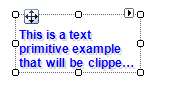

# TextPrimitive

Use the __TextPrimitive__ class whenever you need to display text as part of rendering a control. Color for the font in the primitive is set by the __ForeColor__ property. TextPrimitive also supplies other properties specific to displaying text, including:        

* __Text:__ The actual text to display.

* __TextAlignment:__ An enumeration that controls the alignment of the text in the primitive.

* __TextFormatFlags:__ An enumeration that specifies special formatting such as trimming text and replacing long text with an ellipsis.

* __TextOrientation:__ An enumeration that specifies vertical or horizontal orientation relative to the primitive's baseline.

* __Shadow:__ An object that lets you set shadowing color, depth, and thickness.

* __TextRenderingHint:__ An enumeration defining the text antialiasing.



#### Creating a TextPrimitive

{{source=..\SamplesCS\TPF\Primitives\TextPrimitive1\MyTextPrimitiveElement.cs region=myTextPrimitiveElement}} 
{{source=..\SamplesVB\TPF\Primitives\TextPrimitive1\MyTextPrimitiveElement.vb region=myTextPrimitiveElement}} 

````C#
public class MyTextPrimitiveElement : RadElement
{
    protected override void CreateChildElements()
    {
        TextPrimitive textPrimitive = new TextPrimitive();
        textPrimitive.Class = "MyTextPrimtiveClass";
        textPrimitive.Font = new Font("Arial", 9F, FontStyle.Bold);
        textPrimitive.ForeColor = Color.Blue;
        textPrimitive.TextAlignment = ContentAlignment.BottomLeft;
        textPrimitive.TextWrap = true;
        textPrimitive.Shadow =
            new Telerik.WinControls.Paint.ShadowSettings(new Point(2, 2), Color.LightGray);
        textPrimitive.Text = "This is a text primitive example that will be clipped " +
            "according to the TextFormatFlags settings and MaxSize";
        this.Children.Add(textPrimitive);
        base.CreateChildElements();
    }
}

````
````VB.NET
Public Class MyTextPrimitiveElement
    Inherits RadElement
    Protected Overrides Sub CreateChildElements()
        Dim textPrimitive As New TextPrimitive()
        textPrimitive.Class = "MyTextPrimtiveClass"
        textPrimitive.Font = New Font("Arial", 9.0F, FontStyle.Bold)
        textPrimitive.ForeColor = Color.Blue
        textPrimitive.TextAlignment = ContentAlignment.BottomLeft
        textPrimitive.TextWrap = True
        textPrimitive.Shadow = New Telerik.WinControls.Paint.ShadowSettings(New Point(2, 2), Color.LightGray)
        textPrimitive.Text = "This is a text primitive example that will be clipped " & "according to the TextFormatFlags settings and MaxSize"
        Me.Children.Add(textPrimitive)
        MyBase.CreateChildElements()
    End Sub
End Class

````

{{endregion}}

# See Also
* [ArrowPrimitive]()

* [BorderPrimitive]()

* [CheckPrimitive]()

* [FillPrimitive]()

* [FocusPrimitive]()

* [GripPrimitive]()

* [ImagePrimitive]()

* [ImageShape]()

