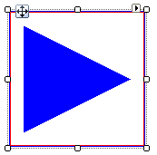

# ArrowPrimitive

## 

The __ArrowPrimitive__ draws a filled triangular polygon. Orientation is controlled by the 
          __Direction__ property with possible __ArrowDirection__ enumeration values of
          __Up__, __Down__, __Left__ or __Right__.
          The arrow is filled with the __ForeColor__ property value. The example below draws a border primitive and
          an ArrowPrimitive.
        

#### __[C#] Creating an ArrowPrimitive__

{{source=..\SamplesCS\TPF\Primitives\ArrowPrimitive1\MyArrowPrimitiveElement.cs region=myArrowPrimitiveElement}}
	    public class MyArrowPrimitiveElement : RadElement
	    {
	        protected override void CreateChildElements()
	        {
	            BorderPrimitive borderPrimitive = new BorderPrimitive();
	            borderPrimitive.BoxStyle = BorderBoxStyle.OuterInnerBorders;
	            borderPrimitive.Width = 1;
	            borderPrimitive.GradientStyle = GradientStyles.Solid;
	            borderPrimitive.ForeColor = Color.Blue;
	            borderPrimitive.InnerColor = Color.Red;
	            borderPrimitive.ZIndex = 1;
	            ArrowPrimitive arrowPrimitive = new ArrowPrimitive();
	            arrowPrimitive.Margin = new System.Windows.Forms.Padding(15);
	            arrowPrimitive.StretchHorizontally = true;
	            arrowPrimitive.StretchVertically = true;
	            arrowPrimitive.Direction = ArrowDirection.Right;
	            arrowPrimitive.ForeColor = Color.Blue;
	            this.Children.Add(borderPrimitive);
	            this.Children.Add(arrowPrimitive);
	            base.CreateChildElements();
	        }
	    }
	{{endregion}}

#### __[VB.NET] Creating an ArrowPrimitive__

{{source=..\SamplesVB\TPF\Primitives\ArrowPrimitive1\MyArrowPrimitiveElement.vb region=myArrowPrimitiveElement}}
	Public Class MyArrowPrimitiveElement
	    Inherits RadElement
	    Protected Overrides Sub CreateChildElements()
	        Dim borderPrimitive As New BorderPrimitive()
	        borderPrimitive.BoxStyle = BorderBoxStyle.OuterInnerBorders
	        borderPrimitive.Width = 1
	        borderPrimitive.GradientStyle = GradientStyles.Solid
	        borderPrimitive.ForeColor = Color.Blue
	        borderPrimitive.InnerColor = Color.Red
	        borderPrimitive.ZIndex = 1
	        Dim arrowPrimitive As New ArrowPrimitive()
	        arrowPrimitive.Margin = New System.Windows.Forms.Padding(15)
	        arrowPrimitive.StretchHorizontally = True
	        arrowPrimitive.StretchVertically = True
	        arrowPrimitive.Direction = ArrowDirection.Right
	        arrowPrimitive.ForeColor = Color.Blue
	        Me.Children.Add(borderPrimitive)
	        Me.Children.Add(arrowPrimitive)
	        MyBase.CreateChildElements()
	    End Sub
	End Class
	{{endregion}}

