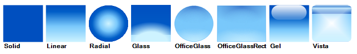

# FillPrimitive

## 

The __FillPrimitive__ class is responsible for filling in an area on the screen. It has a variety of
          properties that allow you to control the style of the fill:
        

* __GradientStyle__allows you to select from solid, linear, radial, glass, office glass, office glass
            rectangle, gel, and vista styles.
          

* __Solid__: The color of the fill is set by the __BackColor__ property.
          

* __Linear__: The shading of the fill is set by the __BackColor__, 
            __BackColor2__, __BackColor3__, and __BackColor4__ properties. 
            The angle of the shading is set by the __GradientAngle__ property.
          

* __Radial__: The shading of the fill is set by the __BackColor__, 
            __BackColor2__, and __BackColor3__ properties. The 
            __GradientPercentage__ property controls the width of the outer color band and the
            __GradientPercentage2__ property controls the width of the middle color band.
          

* __Glass:__The shading of the fill is set by the __BackColor__, 
            __BackColor2__, __BackColor3__, and __BackColor4__ 
            properties. The __GradientPercentage__ property controls the position of the horizontal dividing line in the fill.
          

* __OfficeGlass__: The shading of the fill is set by the __BackColor__, 
            __BackColor2__, __BackColor3__, and __BackColor4__
            properties. The __GradientPercentage__ and __GradientPercentage2__ properties 
            control the relative amounts of the different colors in the fill.
          

* __OfficeGlassRect:__The shading of the fill is set by the __BackColor__, 
            __BackColor2__, __BackColor3__, and __BackColor4__ 
            properties. The __GradientPercentage__ and __GradientPercentage2__ properties 
            control the relative amounts of the different colors in the fill.
          

* __Gel__: The shading of the fill is set by the __BackColor__ and 
            __BackColor2__ properties. The __GradientPercentage__ property controls the height of the highlight bubble.
          

* __Vista__: The shading of the fill is set by the __BackColor__, 
            __BackColor2__, __BackColor3__, and __BackColor4__ 
            properties. The __GradientPercentage__ and __GradientPercentage2__ properties
            control the position of the horizontal lines in the fill.
          

* __BackColor__, __BackColor2__, __BackColor3__, and 
            __BackColor4__ are combined in various ways depending on the gradient style that you have selected.
          

* __GradientAngle__sets the angle of the linear gradient.
          

* __GradientPercentage__ and __GradientPercentage2__adjust drawing parameters for the various styles.
          

The example below iterates the GradientStyles enumeration and creates a FillPrimitive sample for each value.

#### __[C#] Creating a FillPrimitive__

{{region myFillPrimitiveElement}}
	    public class MyFillPrimitiveElement : RadElement
	    {
	        protected override void CreateChildElements()
	        {
	            Array gradientStyleValues = Enum.GetValues(typeof(GradientStyles));
	            StackLayoutPanel layoutPanel = new StackLayoutPanel();
	            layoutPanel.Orientation = System.Windows.Forms.Orientation.Horizontal;
	
	            foreach (GradientStyles gradientStyle in gradientStyleValues)
	            {
	                StackLayoutPanel panel = new StackLayoutPanel();
	                panel.Orientation = System.Windows.Forms.Orientation.Vertical;
	                panel.MinSize = new Size(80, 80);
	                panel.Margin = new System.Windows.Forms.Padding(3);
	                FillPrimitive fillPrimitive = new FillPrimitive();
	                fillPrimitive.NumberOfColors = 4;
	                fillPrimitive.GradientStyle = gradientStyle;
	                fillPrimitive.GradientAngle = 90;
	                fillPrimitive.GradientPercentage = 0.18F;
	                fillPrimitive.GradientPercentage2 = 0.57F;
	                fillPrimitive.BackColor = Color.FromArgb(0, 79, 191);
	                fillPrimitive.BackColor2 = Color.FromArgb(0, 94, 199);
	                fillPrimitive.BackColor3 = Color.FromArgb(121, 200, 251);
	                fillPrimitive.BackColor4 = Color.FromArgb(206, 243, 255);
	                fillPrimitive.MinSize = new Size(75, 75);
	                panel.Children.Add(fillPrimitive);
	                TextPrimitive textPrimitive = new TextPrimitive();
	                textPrimitive.Text = gradientStyle.ToString("g");
	                textPrimitive.ForeColor = Color.Black;
	                textPrimitive.Font = new Font(textPrimitive.Font.FontFamily, 9.25f, FontStyle.Bold);
	                panel.Children.Add(textPrimitive);
	                layoutPanel.Children.Add(panel);
	            }
	            this.Children.Add(layoutPanel);
	            base.CreateChildElements();
	        }
	    }
	{{endregion}}

#### __[VB.NET] Creating a FillPrimitive__

{{region myFillPrimitiveElement}}
	Public Class MyFillPrimitiveElement
	    Inherits RadElement
	    Protected Overrides Sub CreateChildElements()
	        Dim gradientStyleValues As Array = System.Enum.GetValues(GetType(GradientStyles))
	        Dim layoutPanel As New StackLayoutPanel()
	        layoutPanel.Orientation = System.Windows.Forms.Orientation.Horizontal
	
	        For Each gradientStyle As GradientStyles In gradientStyleValues
	            Dim panel As New StackLayoutPanel()
	            panel.Orientation = System.Windows.Forms.Orientation.Vertical
	            panel.MinSize = New Size(80, 80)
	            panel.Margin = New System.Windows.Forms.Padding(3)
	            Dim fillPrimitive As New FillPrimitive()
	            fillPrimitive.NumberOfColors = 4
	            fillPrimitive.GradientStyle = gradientStyle
	            fillPrimitive.GradientAngle = 90
	            fillPrimitive.GradientPercentage = 0.18F
	            fillPrimitive.GradientPercentage2 = 0.57F
	            fillPrimitive.BackColor = Color.FromArgb(0, 79, 191)
	            fillPrimitive.BackColor2 = Color.FromArgb(0, 94, 199)
	            fillPrimitive.BackColor3 = Color.FromArgb(121, 200, 251)
	            fillPrimitive.BackColor4 = Color.FromArgb(206, 243, 255)
	            fillPrimitive.MinSize = New Size(75, 75)
	            panel.Children.Add(fillPrimitive)
	            Dim textPrimitive As New TextPrimitive()
	            textPrimitive.Text = gradientStyle.ToString("g")
	            textPrimitive.ForeColor = Color.Black
	            textPrimitive.Font = New Font(textPrimitive.Font.FontFamily, 9.25F, FontStyle.Bold)
	            panel.Children.Add(textPrimitive)
	            layoutPanel.Children.Add(panel)
	        Next gradientStyle
	        Me.Children.Add(layoutPanel)
	        MyBase.CreateChildElements()
	    End Sub
	End Class
	{{endregion}}

