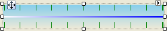

# TrackBarPrimitive

## 

TrackBarPrimitive provides the basic visual layout of a trackbar background. 
        Typically you would use a higher level object, i.e. the 
        [RadTrackBarElement]() to include in your control.
        [RadTrackBarElement]() handles the position of the track
        bar thumb and the various events that go into making the track bar useful.

#### __[C#] Creating a TrackBarPrimitive__

{{source=..\SamplesCS\TPF\Primitives\TrackBarPrimitive1\MyTrackBarPrimitiveElement.cs region=myTrackBarPrimitiveElement}}
	    public class MyTrackBarPrimitiveElement : RadElement
	    {
	        protected override void CreateChildElements()
	        {        
	            TrackBarPrimitive trackBarPrimitive = new TrackBarPrimitive();
	            trackBarPrimitive.ForeColor = Color.Blue;
	            trackBarPrimitive.BackColor = Color.SkyBlue;
	            trackBarPrimitive.TickColor = Color.Green;
	            trackBarPrimitive.ThumbWidth = 5;
	            trackBarPrimitive.ShowSlideArea = true;
	            trackBarPrimitive.TickStyle = Telerik.WinControls.Enumerations.TickStyles.Both;
	            trackBarPrimitive.TrackBarOrientation = Orientation.Horizontal;
	            this.Children.Add(trackBarPrimitive);
	            base.CreateChildElements();
	        }
	    }
	{{endregion}}

#### __[VB.NET] Creating a TrackBarPrimitive__

{{source=..\SamplesVB\TPF\Primitives\TrackBarPrimitive1\MyTrackBarPrimitiveElement.vb region=myTrackBarPrimitiveElement}}
	Public Class MyTrackBarPrimitiveElement
	    Inherits RadElement
	    Protected Overrides Sub CreateChildElements()
	        Dim trackBarPrimitive As New TrackBarPrimitive()
	        trackBarPrimitive.ForeColor = Color.Blue
	        trackBarPrimitive.BackColor = Color.SkyBlue
	        trackBarPrimitive.TickColor = Color.Green
	        trackBarPrimitive.ThumbWidth = 5
	        trackBarPrimitive.ShowSlideArea = True
	        trackBarPrimitive.TickStyle = Telerik.WinControls.Enumerations.TickStyles.Both
	        trackBarPrimitive.TrackBarOrientation = Orientation.Horizontal
	        Me.Children.Add(trackBarPrimitive)
	        MyBase.CreateChildElements()
	    End Sub
	End Class
	{{endregion}}

