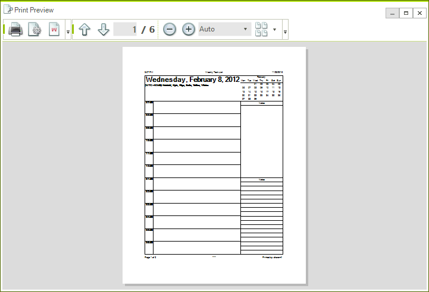
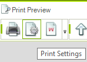
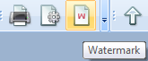

# Print Preview Dialog



By using RadPrintPreviewDialog you can preview how the RadPrintDocument will appear when printed. 

#### Show RadPrintPreviewDialog

{{source=..\SamplesCS\TPF\Printing support\End-user functionality\RadPrintPreviewDialog1.cs region=CreateAndShow1}} 
{{source=..\SamplesVB\TPF\Printing support\End-user functionality\RadPrintPreviewDialog1.vb region=CreateAndShow1}} 

````C#
RadPrintPreviewDialog dialog = new RadPrintPreviewDialog();
dialog.Document = this.radPrintDocument1;
dialog.ShowDialog();

````
````VB.NET
Dim dialog As New RadPrintPreviewDialog
dialog.Document = Me.RadPrintDocument1
dialog.ShowDialog()

````

{{endregion}} 

You can also pass the RadPrintDocument to the RadPrintPreviewDialog via its constructor:

{{source=..\SamplesCS\TPF\Printing support\End-user functionality\RadPrintPreviewDialog1.cs region=CreateAndShow2}} 
{{source=..\SamplesVB\TPF\Printing support\End-user functionality\RadPrintPreviewDialog1.vb region=CreateAndShow2}} 

````C#
RadPrintPreviewDialog printPreviewDialog = new RadPrintPreviewDialog(this.radPrintDocument1);
printPreviewDialog.ShowDialog();

````
````VB.NET
Dim printPreviewDialog As New RadPrintPreviewDialog(Me.RadPrintDocument1)
printPreviewDialog.ShowDialog()

````

{{endregion}} 

The User Interface of RadPrintPreviewDialog is built on top of RadMenu and RadCommandBar. By default the menu is hidden and the command bar is enabled. You can access and customize both controls from the ToolMenu and ToolCommandBar properties. Here is a sample demonstrating how to show the menu and hide the command bar:

{{source=..\SamplesCS\TPF\Printing support\End-user functionality\RadPrintPreviewDialog1.cs region=ShowHideMenuAndCommandBar}} 
{{source=..\SamplesVB\TPF\Printing support\End-user functionality\RadPrintPreviewDialog1.vb region=ShowHideMenuAndCommandBar}} 

````C#
dialog.ToolMenu.Visible = true;
dialog.ToolCommandBar.Visible = false;

````
````VB.NET
dialog.ToolMenu.Visible = True
dialog.ToolCommandBar.Visible = False

````

{{endregion}} 


RadPrintPreviewDialog allows zooming and navigating through the pages via the menu and the tool strips. In addition, the end user can use mouse drag to scroll through the current view and __Ctrl + Mouse Wheel__ to zoom in or out.

The RadPrintPreviewDialog can also be used for editing the print document. When the __Print Settings__ button is clicked, [RadPrintSettingsDialog]() is opened, allowing the end user to edit a variety of settings related to the printed object. Also, when the __Watermark__ button is clicked, the end user can place a watermark on some of the pages by using the [WatermarkSettingsDialog]().





>note The RadPrintPreviewDialog is also used at design time to edit and serialize the properties of	RadPrintDocument. For more information refer to the[RadPrintDocument article.]()
>


# See Also
* [Print Settings Dialog]()

* [Watermark Dialog]()

