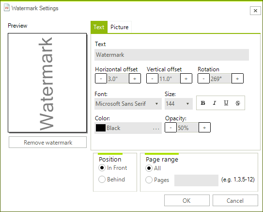

# Watermark Dialog

The watermark preview dialog allows the user to set up the watermark of the associated RadPrintDocument. The dialog consist of one preview control, two groups of common settings and two pages with settings for the text and image watermark settings. To use the Watermark preview dialog you have to create a new instance of the __WatermarkPreviewDialog__ by pass RadPrintDocument instance to the constructor and call the __ShowDialog__ method:

{{source=..\SamplesCS\TPF\Printing support\End-user functionality\WatermarkPreviewDialog1.cs region=WaterMark}} 
{{source=..\SamplesVB\TPF\Printing support\End-user functionality\WatermarkPreviewDialog1.vb region=WaterMark}} 

````C#
RadPrintDocument document = new RadPrintDocument();
document.AssociatedObject = this.radGridView1;
WatermarkPreviewDialog dialog = new WatermarkPreviewDialog(document);
dialog.ShowDialog();

````
````VB.NET
Dim document As New RadPrintDocument()
document.AssociatedObject = Me.RadGridView1
Dim dialog As New WatermarkPreviewDialog(document)
dialog.ShowDialog()

````

{{endregion}} 



The available common settings are placed in the two group boxes on the bottom part of the dialog. The position options determine whether the watermark will be drawn before the content of the page or over it. The second group determines the pages on which the watermark will be printed.
  		

# See Also
* [Print Preview Dialog]()

* [Print Settings Dialog]()

