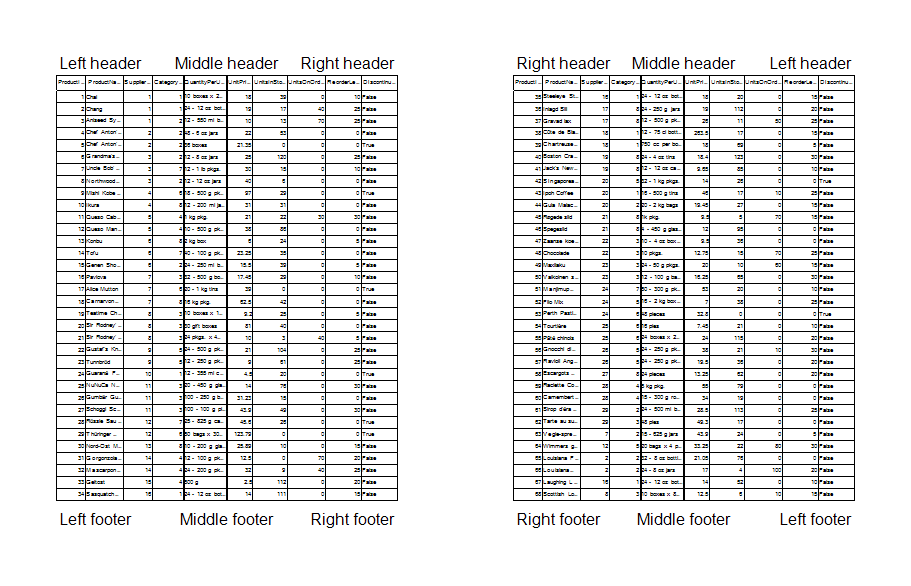
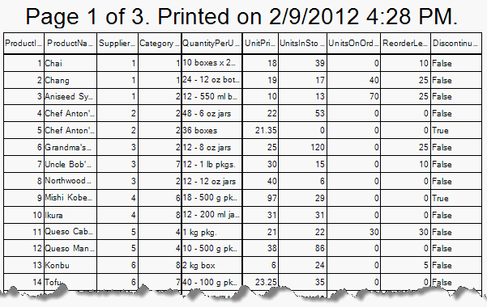

# Header and Footer


## 

The RadPrintDocument has a build in header and footer print capabilities. Here is a list of the available properties which allow you to customize the header and footer:
        

* __HeaderHeight__ – the height of the header in pixels
            

* __HeaderFont__ – the font of the header text
            

* __LeftHeader__ – the text in the left part of the header
            

* __MiddleHeader__ – the text in the middle of the header
            

* __RightHeader__ – the text in the right part of the header
            

* __ReverseHeaderOnEvenPages__ – swaps the places of the left and right header texts on even pages
            

* __FooterHeight__ – the height of the footer in pixels
            

* __FooterFont__ – the font of the footer text
            

* __LeftFooter__ – the text in the left part of the footer
            

* __MiddleFooter__ – the text in the middle of the footer
            

* __RightFooter__ – the text in the right part of the footer
            

* __ReverseFooterOnEvenPages__ - swaps the places of the left and right footer texts on even pages
            

* __Logo__ - allows you to add logo to the header or footer. Please note that the header/footer text should contain __"[Logo]"__ in its text in order the logo to appear.
            

Is an example demonstrating how to customize the header and footer:

{{source=..\SamplesCS\TPF\Printing support\RadPrintDocument1.cs region=HeaderAndFooter}} 
{{source=..\SamplesVB\TPF\Printing support\RadPrintDocument1.vb region=HeaderAndFooter}} 

````C#
RadPrintDocument document = new RadPrintDocument();
document.HeaderHeight = 30;
document.HeaderFont = new Font("Arial", 22);
document.Logo = System.Drawing.Image.FromFile(@"C:\MyLogo.png");
document.LeftHeader = "[Logo]";
document.MiddleHeader = "Middle header";
document.RightHeader = "Right header";
document.ReverseHeaderOnEvenPages = true;
document.FooterHeight = 30;
document.FooterFont = new Font("Arial", 22);
document.LeftFooter = "Left footer";
document.MiddleFooter = "Middle footer";
document.RightFooter = "Right footer";
document.ReverseFooterOnEvenPages = true;
document.AssociatedObject = this.radGridView1;
RadPrintPreviewDialog dialog = new RadPrintPreviewDialog(document);
dialog.Show();

````
````VB.NET
Dim document As New RadPrintDocument()
document.HeaderHeight = 30
document.HeaderFont = New Drawing.Font("Arial", 22)
document.Logo = System.Drawing.Image.FromFile("C:\MyLogo.png")
document.LeftHeader = "[Logo]"
document.MiddleHeader = "Middle header"
document.RightHeader = "Right header"
document.ReverseHeaderOnEvenPages = True
document.FooterHeight = 30
document.FooterFont = New Drawing.Font("Arial", 22)
document.LeftFooter = "Left footer"
document.MiddleFooter = "Middle footer"
document.RightFooter = "Right footer"
document.ReverseFooterOnEvenPages = True
document.AssociatedObject = Me.RadGridView1
Dim dialog As New RadPrintPreviewDialog(document)
dialog.Show()

````

{{endregion}} 




The header and footer have some predefined special strings which can be set to any part of it and/or to make combinations of them.
        

* __[Page #]__ – Prints the number of the current page
            

* __[Total Pages]__ – Prints the total number of pages
            

* __[Date Printed]__ – Prints the date when the printing was started.
            

* __[Time Printed]__ – Prints the time when the printing was started.
            

* __[User Name]__ – Prints the username associated with the current thread (the current Windows login))
            

Here is a sample:

{{source=..\SamplesCS\TPF\Printing support\RadPrintDocument1.cs region=SpecialStrings}} 
{{source=..\SamplesVB\TPF\Printing support\RadPrintDocument1.vb region=SpecialStrings}} 

````C#
RadPrintDocument document = new RadPrintDocument();
document.MiddleHeader = "Page [Page #] of [Total Pages]. Printed on [Date Printed] [Time Printed].";

````
````VB.NET
Dim document As New RadPrintDocument()
document.MiddleHeader = "Page [Page #] of [Total Pages]. Printed on [Date Printed] [Time Printed]."

````

{{endregion}} 



