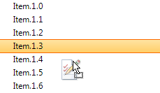

# RadDragDropService

**RadDragDropService** represents a service that manages drag and drop actions if the **AllowDragDrop** property for the respective control is set to *true*. It exposes the following properties:

* **ValidCursor**: Gets or sets the cursor to be used when a valid drop target is hit-tested.

* **InvalidCursor**: Gets or sets the cursor to be used when a valid drop target is hit-tested.

* **UseDefaultPreview**: Determines whether a default preview is generated for a **ISupportDrag** instance if its **GetPreview** method returns null.

* **DropTarget**: Gets current drop target, where the mouse cursor points.

* **DropLocation**: Gets the current drop location in the context of the current target.

There are several events that control the whole drag and drop operation:

* **PreviewDragStart**: Fires when the drag and drop operation is about to be started. In the **PreviewDragStartEventArgs** you have access to the **DragInstance**. You can control whether the service should be started by the **CanStart** argument.

* **Starting**: Fires when the drag and drop service is being started. You can cancel it by setting the **Cancel** argument to **true**.

* **Started**: Fires when the drag and drop service is started.

* **PreviewDragHint**: Fires when the drag and drop operation is successfully started and the drag hint is going to be created. The PreviewDragHintEventArgs.**UseDefaultHint** property controls whether the default hint will be displayed. If you set this argument to *false* you can specify the drag hint by setting the **DragHint** property to the desired image. You have access to the **DragInstance** as well.

>caption Figure 1: Custom DragHint

* **PreviewDropTarget**: Fires when you have a drop target. In the **PreviewDropTargetEventArgs** you have access to the **DragInstance** and **HitTarget**. It is possible to change the drop target by the PreviewDropTargetEventArgs.**DropTarget** property. This target will be used for the **PreviewDragOver** event.

* **PreviewDragOver**:  It allows you to control on what targets the item being dragged can be dropped on by the RadDragOverEventArgs.**CanDrop**. The **RadDragOverEventArgs** gives you access to the dragged  and the target item.

* **PreviewDragDrop**: Fires when the user releases the mouse in order to end the drag and drop operation. It allows you to get a handle on all the aspects of the drag and drop operation, the source (drag) control, the destination (target) control, as well as the item being dragged. This is where we will initiate the actual physical move of the item(s) from one control to the target control. 

* **Stopping**: Fires when the drag and drop service is being stopped. You can cancel it by setting the **Cancel** argument to **true**.

* **Stopped**: Fires when the drag and drop service is stopped.

You can find in the table below the **RadDragDropService**'s derivatives and the respective **RadControl** for which each service is applicable:

|RadControl|RadDragDropService|
|----|----|
|**RadScheduler**|[AppointmentDraggingBehavior]()|
|**RadListView**|[ListViewDragDropService]()|
|**RadListView** in DetailsView|DetailListViewDragDropService|
|**RadGanttView**|GanttViewDragDropService|
|**RadLayoutControl**|LayoutControlDragDropService|
|**RadListControl**|[ListControlDragDropService]()|
|**RadPivotFieldList**|PivotFieldListDragDropService|
|**RadPivotGrid**|PivotGridDragDropService|
|**RadGridView**|[RadGridViewDragDropService]()|
|**RadPageView**|RadPageViewDragDropService|
|**RadPanorama**|TileDragDropService|
|**RadTreeView**|TreeViewDragDropService|
