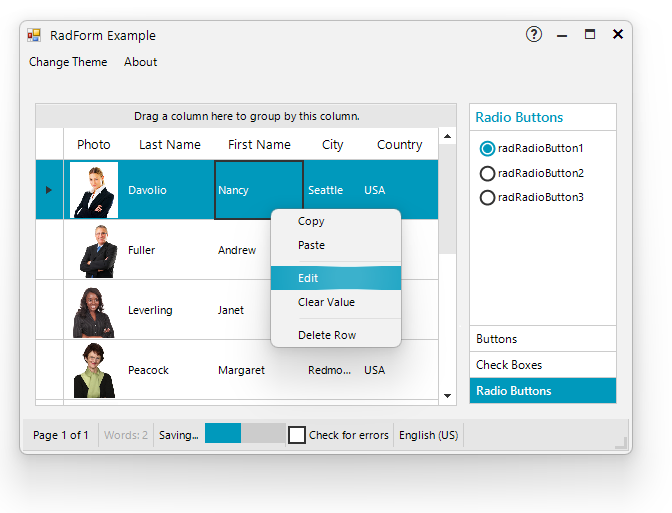

# Rounded Corners

The newest Windows OS 11 brings plenty of great features where the rounded corners are just a piece of the improved design. It would bring a more elegant experience to your forms in desktop applications: 

  

The rounded corners are enabled by default when the operating system is Windows 11. This functionality can be controlled by the Telerik.WinControls.WindowsSettings.**EnableRoundedCornersDefaultValue** property. 

## Requirements

In order to benefit the rounded corners in forms, popups, menus coming with Windows 11, please ensure that the following requirements are fulfilled:

* Use Telerik UI for WinForms suite version **R3 2021 SP1** or **newer**.

* Make sure that Windows 10 version is defined in the app.manifest file: 

````XML
  <compatibility xmlns="urn:schemas-microsoft-com:compatibility.v1">
    <application>
      <!-- A list of all Windows versions that this application is designed to work with. 
      Windows will automatically select the most compatible environment.-->
      <!-- Windows 10 -->
      <supportedOS Id="{8e0f7a12-bfb3-4fe8-b9a5-48fd50a15a9a}"/>

    </application>
  </compatibility>

````

* Ensure that the Telerik.WinControls.WindowsSettings.**EnableRoundedCornersDefaultValue** is enabled. By default, it is set to true.

## RoundedCornersStyle

The public static **WindowsSettings** class defines windows settings related to RadForm and RadControl. It offers the **RoundedCornersStyle** property which determines how two corners will be rounded base on the RoundedCornersStyle enum. If no style is defined, the WindowsSettings.**RoundedCornersStyleDefaultValue** is considered which value is RoundedCornersStyle.**Round**. The available options are:

* **Default** - Let the system decide whether or not to round window corners.

* **None** - Never round window corners.

* **Round** - Round the corners if appropriate.

* **RoundSmall** - Round the corners if appropriate, with a small radius.

#### Disable rounded corners globally

{{source=..\SamplesCS\TPF\Shadows.cs region=DisableRoundedCorners}} 
{{source=..\SamplesVB\TPF\Shadows.vb region=DisableRoundedCorners}}

````C#

Telerik.WinControls.WindowsSettings.EnableRoundedCornersDefaultValue = false;

````
````VB.NET
Telerik.WinControls.WindowsSettings.EnableRoundedCornersDefaultValue = False

````

{{endregion}}

Each RadForm and popup instance (RadPopupControlBase) offers **WindowsSettings** property which contains two main properties:

* **EnableRoundedCorners** - can be set to each form instance. If this property is set on the form instance, the global static **EnableRoundedCornersDefaultValue** property is ignored.

* **RoundedCornersStyle** - can be set to each form instance. If this property is set on the form instance, the global **RoundedCornersStyleDefaultValue** property value is ignored.

#### Specify rounded corners individually

{{source=..\SamplesCS\TPF\Shadows.cs region=LocalRoundedCorners}} 
{{source=..\SamplesVB\TPF\Shadows.vb region=LocalRoundedCorners}}

````C#

RadForm form = new RadForm();
form.WindowsSettings.EnableRoundedCorners = true;
form.WindowsSettings.RoundedCornersStyle = RoundedCornersStyle.RoundSmall;
form.Show();

````
````VB.NET

Dim form As RadForm = New RadForm()
form.WindowsSettings.EnableRoundedCorners = True
form.WindowsSettings.RoundedCornersStyle = RoundedCornersStyle.RoundSmall
form.Show()

````

{{endregion}}

## NativeMethods

Telerik.WinControls.NativeMethods contains method that allows to apply rounded corners style to each form:

{{source=..\SamplesCS\TPF\Shadows.cs region=NaviteRoundedCorners}} 
{{source=..\SamplesVB\TPF\Shadows.vb region=NaviteRoundedCorners}}

````C#

Telerik.WinControls.NativeMethods.ApplyRoundedCorners(form.Handle, 2); 

````
````VB.NET

Telerik.WinControls.NativeMethods.ApplyRoundedCorners(form.Handle, 2)

````

{{endregion}}

