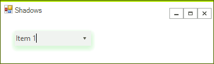

# Shadows

Since R2 2017 RadControls are supporting shadows. Each element that inherits __RadItem__ can paint a shadow. __RadItem__ paints the shadow of each of its children before the painting the child element itself, and then paints the fill, border and text().

On a control level the magic happens in RootRadElement, where we are subscribing to the __Paint__ event of the current control parent and call __PaintShadowCore__ method. When the size, location, bounds or visibility of the control are changed we need to invalidate a region in parent control where the shadow is painted.


>note Even if an item has transparent background its shadow will be painted.


The following properties can used for enabling the shadows and controlling their appearance:

* __EnableElementShadow:__ Enables the shadow for specific control or element.

* __ShadowColor:__ Gets or Sets the color of the shadow.

* __ShadowDepth:__ Use it so set the dept of the shadow. Values can from 0 to 5.


The following example demonstrates how one can enable the shadow of a RadDropDownList using the TelerikMetro theme.

{{source=..\SamplesCS\TPF\Shadows.cs region=EnableShadows}} 
{{source=..\SamplesVB\TPF\Shadows.vb region=EnableShadows}}
````C#
raddropDownList1.RootElement.EnableElementShadow = true;
raddropDownList1.RootElement.ShadowColor = Color.LightGreen;
raddropDownList1.DropDownListElement.ShadowDepth = 3;

````
````VB.NET
raddropDownList1.RootElement.EnableElementShadow = True
raddropDownList1.RootElement.ShadowColor = Color.LightGreen
raddropDownList1.DropDownListElement.ShadowDepth = 3

````


{{endregion}} 


The below image shows the result:

    

# See Also

* [Custom Fonts]()
