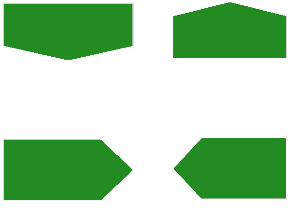

# TrackBar Thumb Shapes

There are four different trackbar thumb shapes.

The following image shows the TrackBar Thumb Shapes applied to a RadPanel:



The following code shows how you can create and apply a __TrackBarThumb Shapes__:


{{source=..\SamplesCS\TPF\Shapes\ShapesCode.cs region=TrackBarThumbShapes}}  
{{source=..\SamplesVB\TPF\Shapes\ShapesCode.vb region=TrackBarThumbShapes}}
````C#
TrackBarDThumbShape trackBarDThumbShape = new TrackBarDThumbShape();
radPanel1.BackColor = Color.ForestGreen;
this.radPanel1.RootElement.Shape = trackBarDThumbShape;
this.radPanel1.RootElement.ApplyShapeToControl = true;

TrackBarUThumbShape trackBarUThumbShape = new TrackBarUThumbShape();
radPanel2.BackColor = Color.ForestGreen;
this.radPanel2.RootElement.Shape = trackBarUThumbShape;
this.radPanel2.RootElement.ApplyShapeToControl = true;

TrackBarRThumbShape trackBarRThumbShape = new TrackBarRThumbShape();
radPanel3.BackColor = Color.ForestGreen;
this.radPanel3.RootElement.Shape = trackBarRThumbShape;
this.radPanel3.RootElement.ApplyShapeToControl = true;

TrackBarLThumbShape trackBarLThumbShape = new TrackBarLThumbShape();
radPanel4.BackColor = Color.ForestGreen;
this.radPanel4.RootElement.Shape = trackBarLThumbShape;
this.radPanel4.RootElement.ApplyShapeToControl = true;

````
````VB.NET
Dim trackBarDThumbShape As TrackBarDThumbShape = New TrackBarDThumbShape()
radPanel1.BackColor = Color.ForestGreen
Me.radPanel1.RootElement.Shape = trackBarDThumbShape
Me.radPanel1.RootElement.ApplyShapeToControl = True

Dim trackBarUThumbShape As TrackBarUThumbShape = New TrackBarUThumbShape()
radPanel2.BackColor = Color.ForestGreen
Me.radPanel2.RootElement.Shape = trackBarUThumbShape
Me.radPanel2.RootElement.ApplyShapeToControl = True

Dim trackBarRThumbShape As TrackBarRThumbShape = New TrackBarRThumbShape()
radPanel3.BackColor = Color.ForestGreen
Me.radPanel3.RootElement.Shape = trackBarRThumbShape
Me.radPanel3.RootElement.ApplyShapeToControl = True

Dim trackBarLThumbShape As TrackBarLThumbShape = New TrackBarLThumbShape()
radPanel4.BackColor = Color.ForestGreen
Me.radPanel4.RootElement.Shape = trackBarLThumbShape
Me.radPanel4.RootElement.ApplyShapeToControl = True

````  
 
{{endregion}} 

# See Also
* [Custom Shapes]()

* [Diamond Shape]()

* [Donut Shape]()

* [Ellipse Shape]()

* [Heart Shape]()

* [Media Shape]()

* [Overview]()

* [RoundRect Shape]()

