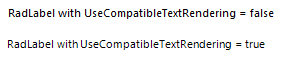

# Text Rendering

By default, Telerik Presentation Framework uses GDI+ to measure and render the text. You can easily switch to GDI instead by setting the **UseCompatibleTextRendering** property to *false* for the respective control. In R2 2017 we introduced the static property RadControl.**UseCompatibleTextRenderingDefaultValue** which allows the user to globally control the default value for **UseCompatibleTextRendering** property. It is recommended to set it before calling **InitializeComponent**.  

>caption Figure 1: UseCompatibleTextRendering.

All controls that contain a **TextPrimitive** in its internal structure can specify what graphics text-rendering mode to be used for painting text of the element by the TextPrimitive.**TextRenderingHint**.  The **DisabledTextRenderingHint** property controls the graphics text-rendering mode to be used for painting text of the element when in disabled mode. The available options are:

* **SystemDefault**: Each character is drawn using its glyph bitmap, with the system default rendering hint. The text will be drawn using whatever font-smoothing settings the user has selected for the system.
* **SingleBitPerPixelGridFit**: Each character is drawn using its glyph bitmap. Hinting is used to improve character appearance on stems and curvature.
* **SingleBitPerPixel**: Each character is drawn using its glyph bitmap. Hinting is not used.
* **AntiAliasGridFit**: Each character is drawn using its anti-aliased glyph bitmap with hinting. Much better quality due to anti-aliasing, but at a higher performance cost.
* **AntiAlias**: Each character is drawn using its anti-aliased glyph bitmap without hinting. Better quality due to anti-aliasing. Stem width differences may be noticeable because hinting is turned off.
* **ClearTypeGridFit**: Each character is drawn using its glyph ClearType bitmap with hinting. The highest quality setting. Used to take advantage of ClearType font features.

>note [HTML-like text formatting]() functionality is supported only when using GDI+.

# See Also

* [GDI+](https://msdn.microsoft.com/en-us/library/windows/desktop/ms533798(v=vs.85).aspx)
* [GDI](https://msdn.microsoft.com/en-us/library/windows/desktop/dd145203(v=vs.85).aspx)
* [How to Change the Font of Telerik RadControls]()
* [How to Measure Text]()