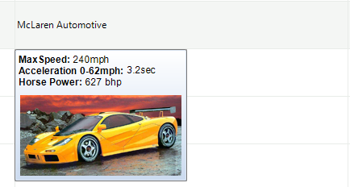
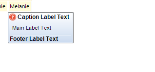
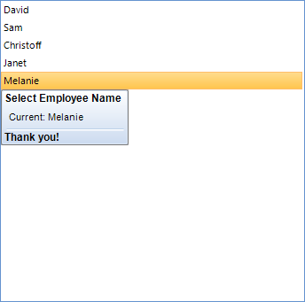

# Screen Tips

__Screen Tip__ is a UI feature which consists of a small window that appears when the mouse cursor is hovered over a particular element. By default each control has a __ScreenTipNeeded__ event which is fired when the mouse hovers over the various elements inside the control. The screen tip extends the tooltips functionality because it can show many different elements including images. 

>caption Figure 1: A ScreenTip in RadGridView. 

The __RadOffice2007ScreenTipElement__ is the screen tip that is currently available in the Telerik UI for WinForms suite.This screen tip contains 3 labels and a line which is used to separate the footer. Each label element can display an image as well. The following image shows the elements that are used inside this screen tip.

>caption Figure 2: RadOffice2007ScreenTipElement.

The following example demonstrates how you can show a tooltip when a `RadListView` item is hovered. Please note that the __Item__ property contains the currently hovered element. 

{{source=..\SamplesCS\TPF\RadToolTip\RadToolTipExample.cs region=screenTips}} 
{{source=..\SamplesVB\TPF\RadToolTip\RadToolTipExample.vb region=screenTips}} 

{{endregion}} 

>caption Figure 3: Screen tip in RadListView

>tip To determine which are the exact elements types, just add the following statement to the `ScreenTipNeeded` event: `Console.WriteLine(e.Item)`, this way when you are hovering the elements, their types will be displayed in the console.
>

## Custom Tooltips

To create custom tooltips you need to create a class that inherits __RadScreenTipElement__. You can add any elements to this class. The following code shows how you can add a simple element which only shows image and text:

#### Create custom screen tip

{{source=..\SamplesCS\TPF\RadToolTip\RadToolTipExample.cs region=customTip}} 
{{source=..\SamplesVB\TPF\RadToolTip\RadToolTipExample.vb region=customTip}} 

{{endregion}} 

You can use this element as the default screen tips. 

#### Use the custom screen tip

{{source=..\SamplesCS\TPF\RadToolTip\RadToolTipExample.cs region=useCustom}} 
{{source=..\SamplesVB\TPF\RadToolTip\RadToolTipExample.vb region=useCustom}} 

{{endregion}} 

# See Also
* [RadToolTip]()

* [ToolTips]()

