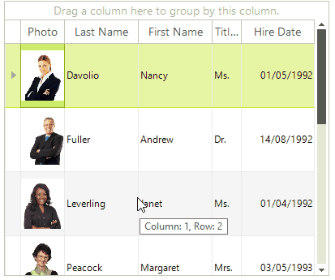
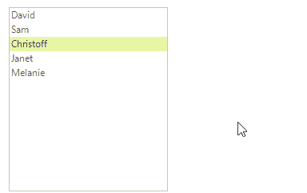

# ToolTips

The Tooltip represents a small rectangular window that displays a brief description when the user hovers over control or an element. All controls have the __ToolTipTextNeeded__ event which can be used for dynamically setting the text of the tooltips.

>caption Figure 1: Tooltip on a grid cells.

### Using the __ToolTipTextNeeded__ event. 

The following example shows how you can use the __ToolTipTextNeeded__ event to show a tooltip on a RadListView item. In addition the __ToolTipTextNeededEventArgs__ object gives you access to the tooltip instance.

#### Setting the tooltip text in the ToolTipTextNeeded event handler.

{{source=..\SamplesCS\TPF\RadToolTip\RadToolTipExample.cs region=LitsViewToolTips}} 
{{source=..\SamplesVB\TPF\RadToolTip\RadToolTipExample.vb region=LitsViewToolTips}} 

{{endregion}} 

>caption Figure 2: The result from the above code.

