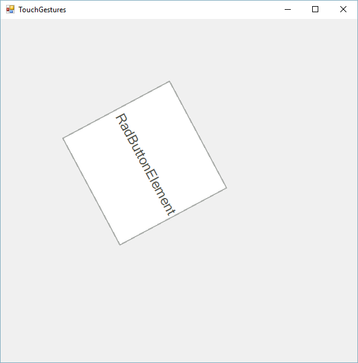

# Touch Support

The Telerik UI for WinForms suite provides full multi-touch support. All controls in the suite are exposing several events which grant the developer the ability to easily handle gestures on a touch devices. This functionality is currently supported under Windows7 or newer. Some of the controls in our suite have built-in functionality that responds to touch gestures. For example, you can use the __Pan__ gesture to scroll through the RadGridView’s rows, group by a column or change the order of its columns. Similar functionality is available out-of-the-box for RadTreeView, RadListView, RadPropertyGrid, RadListControl, RadCarousel and RadCommandBar. Additionally, the developer can use the gesture events to implement his custom logic.

## Touch Events in RadControls

To enable or disable a gesture,use the __EnableGesture__ and __DisableGesture__ functions passing a member of the __GestureType__ enumerator. This method should be executed in the constructor of a new control:
        
* All

* Pan

* Rotate

* Zoom

* TwoFingerTap

* PressAndTap

#### Cascade layout example

{{source=..\SamplesCS\TPF\Touch\TouchGesturesForm.cs region=callingMethods}} 
{{source=..\SamplesVB\TPF\Touch\TouchGesturesForm.vb region=callingMethods}}
````C#
public class MyButton : RadButton
{
   
    public MyButton()
    {
      
        this.EnableGesture(GestureType.All);
        this.DisableGesture(GestureType.Zoom);
      
    }
}

````
````VB.NET
Public Class MyButton
    Inherits RadButton
    Public Sub New()
        Me.EnableGesture(GestureType.All)
        Me.DisableGesture(GestureType.Zoom)
    End Sub
End Class

```` 

{{endregion}} 

>note An explanation of the different gestures can be found in [this MSDN article](http://msdn.microsoft.com/en-us/library/windows/desktop/dd940543(v=vs.85).aspx).
>


You can use the following events to handle gesture events:

* __PanGesture__: Fires when the user slides with his finger across the area of the control.
            

* __ZoomGesture__: Fires when the user slides with his two fingers in opposite directions.
            

* __RotateGesture__: Fires when the user slides with his two fingers in a circular direction.
            

* __TwoFingerTapGesture__: Fires when the user taps the screen with his two fingers at the same time.
            

* __PressAndTapGesture__: Fires when the user has pressed the screen with a finger and taps with a second finger.
            

All these events provide event arguments that inherit from the GestureEventArgs type, hence the share the following properties:
        

* __IsBegin__: Indicates that the gesture is starting.
            

* __IsEnd__: Indicates that the gesture is ending.
            

* __IsInertia__: Indicates that the event is caused by inertia.
            

* __Location__:  Indicates the location in control coordinates at which the gesture has occurred.
            

* __Handled__: Indicates if the event has already been handled by some of the elements in the control.

The inheritors of this type also provide gesture-specific arguments like Offset, ZoomFactor, Angle etc.
        

## Touch Events in RadItems

All the above mentioned events are also valid for all RadItems. This means you can use them for different items in RadRibbonBar, RadCommandBar, RadMenu, etc.
        

## Example of Using Touch Events

The following example will demonstrate how we can use this functionality to drag, rotate and resize RadButtonElement within a simple panel:

{{source=..\SamplesCS\TPF\Touch\CustomPanel.cs region=touchPanel}} 
{{source=..\SamplesVB\TPF\Touch\CustomPanel.vb region=touchPanel}} 

````C#
public class CustomPanel : RadControl
{
    public class CustomPanelLayout : Telerik.WinControls.Layouts.LayoutPanel
    {
    }
    public CustomPanel()
    {
        this.EnableGesture(GestureType.All);
    }
    CustomPanelLayout m_layout;
    RadButtonElement button;
    protected override void CreateChildItems(RadElement parent)
    {
        base.CreateChildItems(parent);
        m_layout = new CustomPanelLayout();
        parent.Children.Add(m_layout);
        button = new RadButtonElement();
        button.AutoSize = false;
        button.Size = new Size(100, 100);
        button.Location = new Point(100, 100);
        button.Text = "RadButtonElement";
        this.m_layout.Children.Add(button);
        button.PanGesture += new PanGestureEventHandler(button_PanGesture);
        button.ZoomGesture += new ZoomGestureEventHandler(button_ZoomGesture);
        button.RotateGesture += new RotateGestureEventHandler(button_RotateGesture);
    }
    void button_RotateGesture(object sender, RotateGestureEventArgs e)
    {
        button.AngleTransform -= (float)(e.Angle * 180D / Math.PI);
    }
    void button_ZoomGesture(object sender, ZoomGestureEventArgs e)
    {
        button.ScaleTransform = new SizeF(
            (float)(button.ScaleTransform.Width * e.ZoomFactor),
            (float)(button.ScaleTransform.Height * e.ZoomFactor));
    }
    void button_PanGesture(object sender, PanGestureEventArgs e)
    {
        button.Location = new Point(button.Location.X + e.Offset.Width, button.Location.Y + e.Offset.Height);
    }
}

````
````VB.NET
Public Class CustomPanel
    Inherits RadControl
    Public Class CustomPanelLayout
        Inherits Telerik.WinControls.Layouts.LayoutPanel
    End Class
    Public Sub New()
        Me.EnableGesture(GestureType.All)
    End Sub
    Private m_layout As CustomPanelLayout
    Private button As RadButtonElement
    Protected Overrides Sub CreateChildItems(ByVal parent As RadElement)
        MyBase.CreateChildItems(parent)
        m_layout = New CustomPanelLayout()
        parent.Children.Add(m_layout)
        button = New RadButtonElement()
        button.AutoSize = False
        button.Size = New Size(100, 100)
        button.Location = New Point(100, 100)
        button.Text = "RadButtonElement"
        Me.m_layout.Children.Add(button)
        AddHandler button.PanGesture, AddressOf button_PanGesture
        AddHandler button.ZoomGesture, AddressOf button_ZoomGesture
        AddHandler button.RotateGesture, AddressOf button_RotateGesture
    End Sub
    Private Sub button_RotateGesture(ByVal sender As Object, ByVal e As RotateGestureEventArgs)
        button.AngleTransform -= CSng(e.Angle * 180.0R / Math.PI)
    End Sub
    Private Sub button_ZoomGesture(ByVal sender As Object, ByVal e As ZoomGestureEventArgs)
        button.ScaleTransform = New SizeF(CSng(button.ScaleTransform.Width * e.ZoomFactor), CSng(button.ScaleTransform.Height * e.ZoomFactor))
    End Sub
    Private Sub button_PanGesture(ByVal sender As Object, ByVal e As PanGestureEventArgs)
        button.Location = New Point(button.Location.X + e.Offset.Width, button.Location.Y + e.Offset.Height)
    End Sub
End Class

````

{{endregion}} 

Thanks to the code above, the end-user will be able to do the following operations with his/her fingers:

>note Similar functionality is also used in the PhotoAlbum demo application
>


# See Also
* [Animations]()

* [Dependency Properties]()

* [Handling User Input]()

* [HTML-like Text Formatting]()

* [Inherit themes from RadControls derivatives]()


