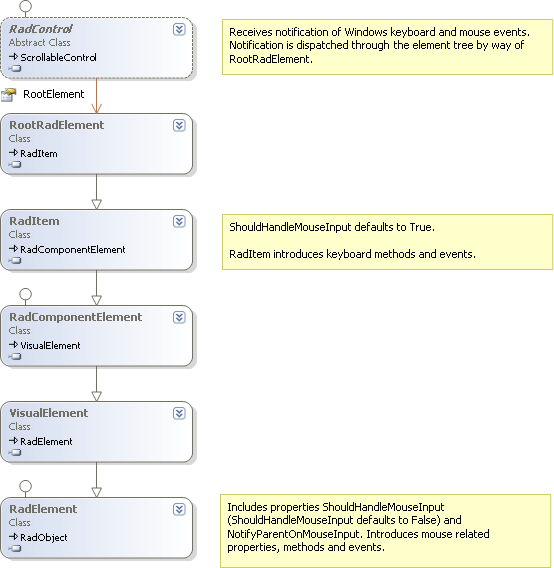

# Handling User Input

## 

Mouse and keyboard user input is accepted from Windows event notification in __RadControl__, but actually handled in __RadElement__ and __RadItem__objects.
        

* __RadControl__is the object that is first notified of Windows events, i.e. mouse over, keypress, etc., and calls corresponding methods of RadElement through the RadControl __RadRootElement__property.
          

* __RadElement__introduces methods for dispatching user input information. This information is acted on if the RadElement __ShouldHandleMouseInput__ property is true. By default, __ShouldHandleMouseInput__ is set false and must be turned on explicitly. The __NotifyParentOnMouseInput__ property is introduced in RadElement to control the [bubbling]() of mouse events to parent elements. By default __NotifyParentOnMouseInput__ is false.
          

* __RadItem__ __ShouldHandleMouseInput__ is true by default. RadItem also introduces keyboard methods and events including KeyDown, KeyPress and KeyUp events.
          

The diagram below shows the inheritance tree where the RadControl RootRadElement descends from RadItem, and where RadItem ultimately descends from RadElement:

