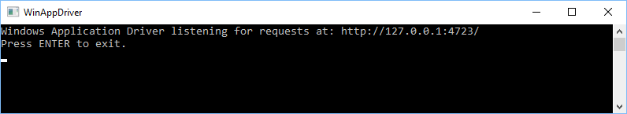
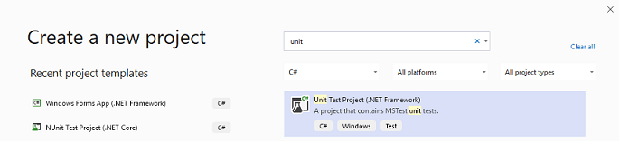
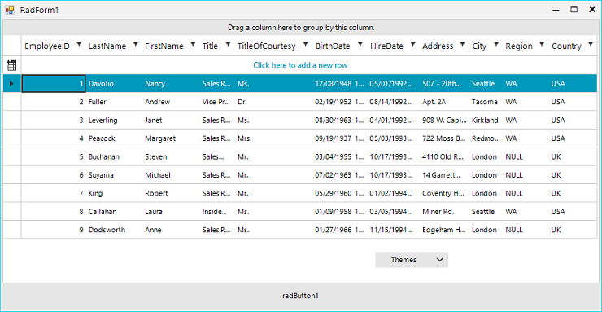
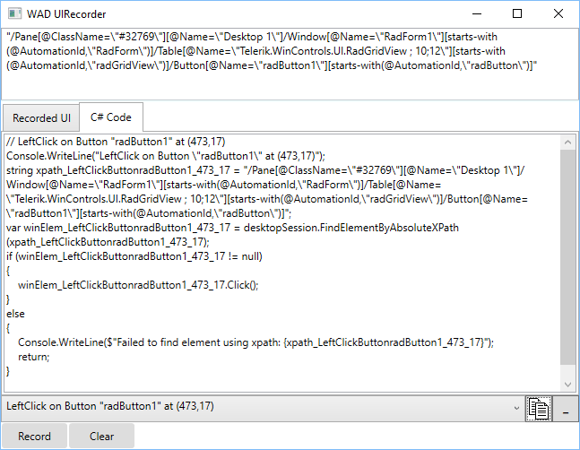
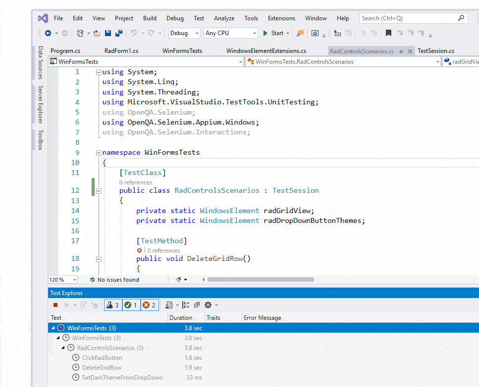

# Getting Started 

Here are the steps to write a **WinAppDriver** test:

1\. Run **WinAppDriver.exe** as an administrator and leave it running. Note the address the application is listening to, you will need it later.



2\. Add UnitTest project to the solution of your test application or create a separate solution.



3\. Right-click the Unit Test project in **Solution Explorer** and select “**Manage NuGet Packages…**”. Install the latest stable Appium.WebDriver package.

4\. Create “**TestSession**” class where you set the **AppiumOptions** as follows:

````C#

public class TestSession
    {
        private const string WindowsApplicationDriverUrl = "http://127.0.0.1:4723";
        private const string TestApp = @"D:\WinAppDriver_WinForms_Tests\RadControlsTest\RadControlsTest\bin\Debug\RadControlsTest.exe”;
     
        protected static WindowsDriver<WindowsElement> session;
        public static WindowsDriver<WindowsElement> desktopSession;
     
        public static void Setup(TestContext context)
        {
            // Launch RadGridView test application if it is not yet launched
            if (session == null || desktopSession == null)
            {
                TearDown();
     
                // Create a new session to bring up the test application
                AppiumOptions options = new AppiumOptions();
                options.AddAdditionalCapability("app", TestApp);
                options.AddAdditionalCapability("deviceName", "WindowsPC");
                options.AddAdditionalCapability("platformName", "Windows");
     
                session = new WindowsDriver<WindowsElement>(new Uri(WindowsApplicationDriverUrl), options);
                Assert.IsNotNull(session);
                Assert.IsNotNull(session.SessionId);
     
                // Set implicit timeout to 1.5 seconds to make element search to retry every 500 ms for at most three times
                session.Manage().Timeouts().ImplicitWait = TimeSpan.FromSeconds(1.5);
     
                AppiumOptions optionsDesktop = new AppiumOptions();
                optionsDesktop.AddAdditionalCapability("app", "Root");
                optionsDesktop.AddAdditionalCapability("deviceName", "WindowsPC");
                optionsDesktop.AddAdditionalCapability("ms:experimental-webdriver", true);
                desktopSession = new WindowsDriver<WindowsElement>(new Uri(WindowsApplicationDriverUrl), optionsDesktop);
            }
        }
     
        public static void TearDown()
        {
            if (session != null)
            {
                session.Quit();
                session = null;
            }
     
            if (desktopSession != null)
            {
                desktopSession.Quit();
                desktopSession = null;
            }
        }
    }

````

5\. Rename the auto generated “**UnitTest1**” class to “**RadControlsScenarios**” which should inherit “**TestSession**”. Here is the place to mention that our sample test application consists of **RadGridView**, **RadButton** and **RadDropDownButton** controls.



6\. Next, we should create “**ClassInitialize**” and “**ClassCleanup**” methods.

````C#

[ClassInitialize]
public static void ClassInitialize(TestContext context)
{
    Setup(context);
 
    radGridView = session.FindElementByAccessibilityId("radGridView1");
    radDropDownButtonThemes = session.FindElementByAccessibilityId("radDropDownButton1");
}
 
[ClassCleanup]
public static void ClassCleanup()
{
    TearDown();
}

````

There are two general ways to write tests: Using **WinAppDriver UI Recorder** tool to record tests at runtime and writing tests from scratch using inspect.exe tool for locating elements in your application.

7\. Launch the **WinAppDriver UI Recorder** and click “**Record**.” Hover over the “**radButton1**” and wait until it starts flashing blue. The Recorder’s status bar will change its text from “**Active**” to “**XPath Ready**”. Once you have recorded a sequence of steps you wish to reproduce, click “**Pause**” within the recorder. You can open the actions selector to make certain that all UI actions have been recorded.



All you need to do now is to click the “**Generate and copy C# code to Clipboard**” button to copy the code for all recorded actions. Paste this code into the **TestMethod**.

````C#

[TestMethod]
public void ClickRadButton()
{
    // LeftClick on Button "radButton1" at (473,17)
    Console.WriteLine("LeftClick on Button \"radButton1\" at (473,17)");
    string xpath_LeftClickButtonradButton1_473_17 = "/Pane[@ClassName=\"#32769\"][@Name=\"Desktop 1\"]/Window[@Name=\"RadForm1\"][starts-with(@AutomationId,\"RadForm\")]/Table[@Name=\"Telerik.WinControls.UI.RadGridView ; 10;12\"][starts-with(@AutomationId,\"radGridView\")]/Button[@Name=\"radButton1\"][starts-with(@AutomationId,\"radButton\")]";
    var winElem_LeftClickButtonradButton1_473_17 = desktopSession.FindElementByAbsoluteXPath(xpath_LeftClickButtonradButton1_473_17);
    if (winElem_LeftClickButtonradButton1_473_17 != null)
    {
        winElem_LeftClickButtonradButton1_473_17.Click();
    }
    else
    {
        Console.WriteLine($"Failed to find element using xpath: {xpath_LeftClickButtonradButton1_473_17}");
        return;
    }
 
    var button = desktopSession.FindElementByName("clicked");
    Assert.IsTrue(button != null);
}

````

8\. Now, lets write two more tests from scratch. The first scenario is deleting a row from RadGridView's Context Menu and verifying the RadGridView rows count.

````C#

private static WindowsElement radGridView;
[TestMethod]
public void DeleteGridRow()
{
     var gridRowElements = radGridView.FindElementsByXPath(@"//*").Where(i => i.TagName == "ControlType.Custom").ToList();
     Assert.IsTrue(gridRowElements.Count == 9, "Expected rows: 9, Actual rows: " + gridRowElements.Count);
 
     radGridView.Click();
     radGridView.RightClick();
 
     desktopSession.FindElementByName("Delete Row").Click();
 
     gridRowElements = radGridView.FindElementsByXPath(@"//*").Where(i => i.TagName == "ControlType.Custom").ToList();
     Assert.IsTrue(gridRowElements.Count == 8, "Expected rows: 8, Actual rows: " + gridRowElements.Count);
}

````

9\. Let’s continue with a scenario where we click a **RadDropDownButton**, followed by **RadMenuItem** in order to change the **ApplicationThemeName**.

````C#
private static WindowsElement radDropDownButtonThemes;
[TestMethod]
public void SetDarkThemeFromDropDown()
{
    radDropDownButtonThemes.Click();
    desktopSession.FindElementByName("FluentDark").Click();
    Thread.Sleep(3000);
}

````

10\. Create a public static class **WindowsElementExtensions**.cs and define the **FindElementByAbsoluteXPath** method. You will need that if you use the **UI Recorder** tool for your tests.

````C#
public static WindowsElement FindElementByAbsoluteXPath(this WindowsDriver<WindowsElement> desktopSession, string xPath, int nTryCount = 3)
{
    WindowsElement uiTarget = null;
    while (nTryCount-- > 0)
    {
        try
        {
            uiTarget = desktopSession.FindElementByXPath(xPath);
        }
        catch
        {
        }
        if (uiTarget != null)
        {
            break;
        }
        else
        {
            System.Threading.Thread.Sleep(400);
        }
    }
    return uiTarget;
}
````

Additionally, here you can write helper methods such as **DoubleClick**, **RightClick** or **Click** with a **X** and **Y** offset in order to test different scenarios.

````C#
public static void DoubleClick(this WindowsElement element, int offsetX = 0, int offsetY = 0
{
    Actions actions = new Actions(element.WrappedDriver);
    actions.Build();
    actions.MoveToElement(element);
    actions.MoveByOffset(offsetX, offsetY);
    actions.DoubleClick();
    actions.Perform();
}
 
public static void Click(this WindowsElement element, int offsetX = 0, int offsetY = 0)
{
    Actions actions = new Actions(element.WrappedDriver);
    actions.Build();
    actions.MoveToElement(element);
    actions.MoveByOffset(offsetX, offsetY);
    actions.Click();
    actions.Perform();
}
 
public static void RightClick(this WindowsElement element, int offsetX = 0, int offsetY = 0)
{
    Actions actions = new Actions(element.WrappedDriver);
    actions.Build();
    actions.MoveToElement(element);
    actions.MoveByOffset(offsetX, offsetY);
    actions.ContextClick();
    actions.Perform();
}

````

11\. Right-click the Unit Test project in Visual Studio and click “**Run Tests**”. The test will launch your application, repeat all recorded steps, and close the application afterwards. All test activity is logged in the WinAppDriver console.

