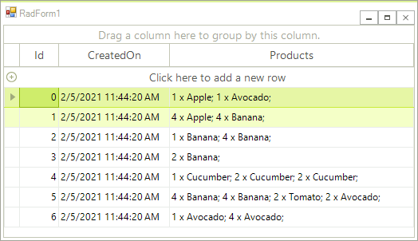
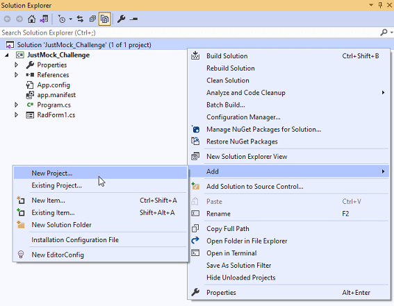
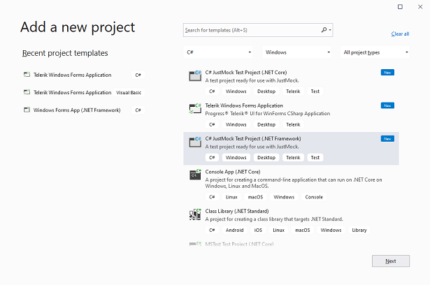
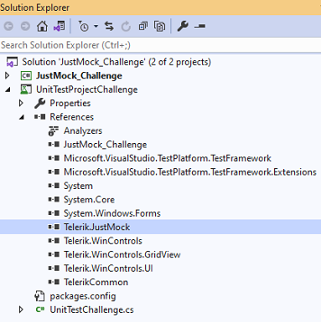
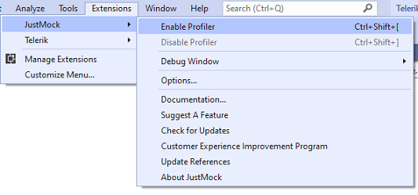

# Unit Testing Tutorial with JustMock  

Quite often, software depends on third-party libraries, e.g. Telerik UI for WinForms suite. Having a complete set of unit tests allows you to upgrade any third-party library without worrying that they will break due to a defect outside of your control. Updating third-party technology is particularly important when new features, significant improvements and bug fixes are released that will benefit your project. The more often you do it, the easier it will be to manage the updates.

In addition to this, if a unit test has to read a database each time it is run and expects a specific value to be present in the database, we directly depend on the database. What happens if another developer is expecting a different value in that database? What happens if another developer is running a test that changes that value? Suddenly, this test becomes unpredictable, passing one moment and then suddenly failing the next despite the fact that the code has not changed. A common requirement is not only to keep a test isolated to the code under test to help track down where the defect is, but to isolate it to keep the tests consistent so you are not directly dependent on the actual data.

Code that has to interact with an external resource like a database or a web service will run slower due to the latency in the communication with these external resources. The mocks of these external resources respond much faster than the actual external resources, meaning that the entire suite of unit test can run in seconds, not minutes.

This tutorial will walk you through the process of creating unit tests with [JustMock](https://www.telerik.com/products/mocking.aspx) for a project that uses the most commonly used control from the Telerik UI for WinForms suite, a.k.a. **RadGridView**.

Let's start with details about the project's setup and what we have implemented:

#### Sample Form's Setup

````C#

public partial class JMRadForm : Telerik.WinControls.UI.RadForm
{
    public RadGridView Grid { get { return this.radGridView1; } }

    public JMRadForm()
    {
        InitializeComponent();
		this.radGridView1.DataSource = GetData();
		this.radGridView1.MultiSelect = true;
		SelectOrdersByProduct("Apple");
    }  
    
    public void SelectOrdersByProduct(string productName)
    {
        foreach (GridViewRowInfo row in this.radGridView1.Rows)
        {
            Order order = row.DataBoundItem as Order;
            if (order.ContainsProduct(productName))
            {
                row.IsSelected = true;
            }
        }
    }

    public List<Order> GetData()
    { 
        List<string> productNames = new List<string>() { "Apple", "Banana", "Avocado", "Cucumber", "Tomato", "Orange" };
        List<float> productPrices = new List<float>() { 1.45f, 3.15f, 2.30f, 2.80f, 1.20f, 4.30f };
        List<Order> orders = new List<Order>();
        Random rand = new Random();

        int ordersCount = rand.Next(1, 10);
        int productsCount = 0;
        int productIndex = -1;
        for (int i = 0; i < ordersCount; i++)
        {
            List<Product> orderProducts = new List<Product>();
            productsCount = rand.Next(1, 5);
            for (int j = 0; j < productsCount; j++)
            {
                productIndex = rand.Next(0, productsCount + 1);
                orderProducts.Add(new Product(productNames[productIndex], productPrices[productIndex], rand.Next(1, 5)));
            }
            orders.Add(new Order(i, DateTime.Now, orderProducts));
        }
        return orders;
    }
     
    public class Order
    {
        public int Id { get; set; }

        public DateTime CreatedOn { get; set; }

        [TypeConverter(typeof(MyConverter))]
        public List<Product> Products { get; set; }

        public Order(int id, DateTime createdOn, List<Product> products)
            {
                this.Id = id;
                this.CreatedOn = createdOn;
                this.Products = products;
            }

        private float GetTotalAmount()
        {
            float sum = 0;
            foreach (Product p in this.Products)
            {
                sum += (p.Price * p.Quantity);
            }
            return sum;
        }

        public bool ContainsProduct(string name)
        {
            foreach (Product p in this.Products)
            {
                if (p.Name==name)
                {
                    return true;
                }
            }
            return false;
        }
    }

    public class MyConverter : TypeConverter
    {
        public override bool CanConvertTo(ITypeDescriptorContext context, Type destinationType)
            {
                if (destinationType == typeof(string))
                {
                    return true;
                }
                return base.CanConvertTo(context, destinationType);
            }

        public override object ConvertTo(ITypeDescriptorContext context, 
            System.Globalization.CultureInfo culture, object value, Type destinationType)
            {
                List<Product> products = value as List<Product>;
                if (destinationType == typeof(string) && products != null)
                {
                    StringBuilder sb = new StringBuilder();
                    foreach (Product p in products)
                    {
                        sb.Append(p.Quantity + " x " + p.Name + "; ");
                    }
                    return sb.ToString();
                }
                return base.ConvertTo(context, culture, value, destinationType);
            }
    }

    public class Product
    { 
        public string Name { get; set; }

        public float Price { get; set; }

        public int Quantity { get; set; }
         
        public Product( string name, float price, int quantity)
        { 
            this.Name = name;
            this.Price = price;
            this.Quantity = quantity;
        }
    } 
}
 

````

If you run the project, you are expected to obtain the following result:

>caption Sample WinForms Project to Test



The above code includes the **Order** and **Product** classes' implementation and two public methods of the form, **GetData** and **SelectOrdersByProduct**. The main purpose of the **GetData** method is to produce any random Orders data that will be used for RadGridView.**DataSource**. It is not important what is the actual implementation of the method itself and how the data is obtained. It can connect to a database, selects a query, fill a DataTable or read a file to populate a list. On the other hand, the **SelectOrdersByProduct** method accepts a string parameter representing a product name and selects all rows in the grid where the Order contains the specific product.

For the purpose of the unit testing, you don't want to bother about the data and consume time for preparing appropriate dummy data. You just need a grid filled with data and focus on the logic you have to test, e.g. check whether the correct rows will be selected after calling the **SelectOrdersByProduct** method. Here comes the benefit of [JustMock](https://www.telerik.com/products/mocking.aspx).

## JustMock Integration in your WinForms Project

It is possible either to create a brand new JustMock Test Project or add a reference of Telerik.JustMock.Dll to an existing unit test project: [Add Telerik JustMock to Your Test Project](https://docs.telerik.com/devtools/justmock/getting-started/using-telerik-justmock-in-your-test-project)

>caption Add a JustMock Test Project





>caption Add a reference of Telerik.JustMock.Dll to the existing unit test project



Then, make sure that the profiler is enabled:

>caption JustMock Profiler



[Arrange/Act/Assert](https://docs.telerik.com/devtools/justmock/basic-usage/arrange-act-assert) (AAA) is a pattern for arranging and formatting code in Unit Test methods. We will follow it in this tutorial as well.

## DataSource Collection Mocking

The **GetData** method returns random data representing Orders collection where each order contains one or multiple products. We want to test whether the **SelectOrdersByProduct** method will select the correct number of rows in **RadGridView** passing a product name, e.g. select all orders that contain "Apple" product. Since we don't know what data will be returned from the **GetData** method, we don't know how many orders will have apples. So we are dependent on the collection. This dependency can be eliminated by forcing the **GetData** method to return a predefined collection where you will know how many apples exactly we have. 

````C#

[TestMethod]
public void TestMethodSelectRows()
{
    //Arrange 
    List<Order> myCollection = new List<Order>();
    myCollection.Add(new Order(1, DateTime.Now, new List<Product>()
    {
        new Product("Apple",1.45f ,3),
        new Product("Banana",3.15f ,2),
        new Product("Avocado",2.30f ,1),
        new Product("Cucumber",2.80f ,2)
    }));

    myCollection.Add(new Order(2, DateTime.Now, new List<Product>()
    {
        new Product( "Tomato",1.20f ,4),
        new Product( "Cucumber",2.80f ,2),
        new Product( "Orange",4.30f ,3)
    }));

    myCollection.Add(new Order(3, DateTime.Now, new List<Product>()
    {
        new Product( "Apple",1.45f ,4),
        new Product( "Avocado",2.30f ,2)
    }));

    myCollection.Add(new Order(4, DateTime.Now, new List<Product>()
    {
        new Product( "Banana",3.15f,4),
        new Product( "Mango",6.80f ,2)
    }));

    using (JMRadForm form = new JMRadForm())
    { 
        Mock.Arrange(() => form.GetData()).ReturnsCollection(myCollection);

        //Act 
        List<Order> orders = form.GetData();
        form.Grid.DataSource = orders;
        form.Grid.ClearSelection();
        form.Grid.MultiSelect = true;
        string productName = "Apple";
        form.SelectOrdersByProduct(productName); 

        //Assert            
        Assert.IsTrue(form.Grid.SelectedRows.Count == 2);
    }
}

````

Pay attention to the Mock.**Arrange** method call which will force the **GetData** method calls later in the unit test (Act section) to return a predefined collection where two orders contains apples. It is achieved with the help of the [ReturnsCollection](https://docs.telerik.com/devtools/justmock/advanced-usage/mocking-linq-queries) method. Then, we have full control on the data and we can expect two rows to be selected in the grid after calling the **SelectOrdersByProduct** method. 

## Future Mocking of Methods that Depend on Other Methods

In the above example, the **SelectOrdersByProduct** method internally calls the **ContainsProduct** method of the **Order** class which returns a boolean result indicating whether a product name is contained in an order or not. In other words, we are dependent on the retured result of another method. In order to control our unit test to follow a strict path in its execution, we can mock the result to be always **false** so no rows will be selected in the grid. Thus, we can again test the quality of our **SelectOrdersByProduct** method but eliminate the dependency to the **ContainsProduct** method result.    

````C#
[TestMethod]
public void TestMethodNoSelection()
{ 
    //Arrange
    using (JMRadForm form = new JMRadForm())
    { 

        var order = Mock.Create<Order>();
        Mock.Arrange(() => order.ContainsProduct(Arg.AnyString)).IgnoreInstance().Returns(false);

        //Act 
        List<Order> orders = form.GetData();
        form.Grid.DataSource = orders;
        form.Grid.MultiSelect = true;
        string productName = "Apple";
        form.SelectOrdersByProduct(productName);

        //Assert            
        Assert.IsTrue(form.Grid.SelectedRows.Count == 0);
    }
} 

````

In the Arrange section of our unit test we benefit the power of [Future Mocking](https://docs.telerik.com/devtools/justmock/advanced-usage/future-mocking) ensuring that the next **ContainsProduct** method calls will always return **false** no matter what data is actually contained in **RadGridView**. 

## Raising Mocked Events

Very often a unit test may expect a certain event to be raised in order to validate any piece of code that is being executed in the event handler. We don't have to bother about the setup of this part of the test and prepare the precise steps that leads to firing this event. JustMock allows you to raise events with predefined event arguments so you can simulate the event firing without bothering about how to lead my code in the unit test to this. 

Let's consider the example in which we need to test that a certain variable has an assigned value only when the middle row in **RadGridView** becomes current. If the middle row doesn't get current, this variable remains null.

````C#

 [TestMethod]
public void TestMethodRaiseEvent()
{
    //Arrange
    using (JMRadForm form = new JMRadForm())
    {
        List<Order> orders = form.GetData();
        form.Grid.DataSource = orders;
        form.Grid.ClearSelection();
        form.Grid.MultiSelect = false;
        form.Grid.CurrentRow = null;
        form.Grid.LoadElementTree();

        string actual = null;
        string expected = form.Grid.Rows[orders.Count / 2].Cells["Id"].Value+"";


        var executor = Mock.Create<RadGridView>();
        executor.CurrentRowChanged += delegate (object sender, CurrentRowChangedEventArgs args)
        {
            if (args.CurrentRow!=null && args.CurrentRow.DataBoundItem == orders[orders.Count / 2])
            {
                actual = args.CurrentRow.Cells["Id"].Value + "";
            }                   
        };

        // Act 

        CurrentRowChangedEventArgs eventArguments = new CurrentRowChangedEventArgs(null, form.Grid.Rows[orders.Count / 2]);
        Mock.Raise(() => executor.CurrentRowChanged += null, eventArguments);

        // Assert 
        Assert.AreEqual(expected, actual); 
         
    }
}

````
We use [Raise](https://docs.telerik.com/devtools/justmock/basic-usage/mock/raise.html) method in the Act section to raise the RadGridView.**CurrentRowChanged** event and pass a specific row to it. Before acting we have attached a delegate to the event. Executing the delegate will result in assigning the respective value to actual. Finally, we verify that expected and actual have the same value.

## Mock Private Methods

In case of dependencies on private methods in our unit tests, we can benefit the [PrivateAccessor](https://docs.telerik.com/devtools/justmock/advanced-usage/private-accessor.html) that JustMock offers for such scenarios. Thus, we can craft the unit test logic calling a non-public method, forcing it to return e predefined value and then using its returned result.

In our **Order** class implementation, we have a private **GetTotalAmount** method. Usually, you are not allowed to call it in the unit tests project. However, with JustMock it is possible:


````C#
[TestMethod]
public void TestPrivateMethodGetTotalAmount()
{
    //Arrange
    using (JMRadForm form = new JMRadForm())
    {
        List<Order> orders = form.GetData();
        form.Grid.DataSource = orders;

        //Create a mocked instance of your class under test 
        var orderMock = Mock.Create<Order>();
        //Arrange your expectations
        Mock.NonPublic.Arrange<float>(orderMock, "GetTotalAmount").Returns(5f);

        // Act 
        //Create new PrivateAccessor with the mocked instance as an argument
        var inst = new PrivateAccessor(orderMock);

        //Call the non-public method by giving its exact name
        var actual = inst.CallMethod("GetTotalAmount");

        // Assert 
        //Finally, you can assert against its expected return value
        Assert.AreEqual(5f, actual);

    }
}


```` 

## Mock Mouse Position

Let's finish this tutorial with a more advanced mocking example. Imagine that you want to simulate a user clicks a specific row in **RadGridView** and selects it. This can be easily achieved in the unit test by simply calling the public BaseGridBehavior.**OnMouseDown(MouseEventArgs e)** method. However, this action directly depends on the mouse position and the passed X,Y coordinates. Depending on the current monitor's resolution, columns' sizes, rows' height, you don't know what row exactly will be selected. You are not even sure that any row will be selected at all because it is unpredictable what element will be under the mouse coordinates, e.g. it can be the header row, filtering row, the new row, etc.

Since **RadGridView** manages user mouse and keyboard input over its rows by a [row behavior](), it introduces different behaviors depending on the row type. Hence, **RadGridView** internally detects what type of visual row element is located under the mouse and the mouse handling of the respective row behavior is being performent. This makes the unit test setup more complex because you have to ensure that a specific data row is clicked and selected and then your unit of code is executed. Thus, you won't be mainly focused on the unit of code to test but also on the setup that a specific data row is clicked, not the header or filtering row. 

The following schema shows the different paths that may occur in the unit test execution depending on the coordinates that are passed in the MouseEventArgs. However, we want to strictly control that the marked path will be followed no matter what X,Y coordinates are passed:


Here we will combine private methods mocking, future mocking, mocking of returned results:

````C#
[TestMethod]
public void TestMethodSelectionChanged()
{
    //Arrange
    using (JMRadForm form = new JMRadForm())
    {
        List<Order> orders = form.GetData();
        form.Grid.DataSource = orders;
        form.Grid.ClearSelection();
        form.Grid.CurrentRow = null;
        form.Grid.MultiSelect = false;
        form.Grid.LoadElementTree();
   
        //get the middle visual row element
        GridRowElement visualRowElement = form.Grid.TableElement.GetRowElement(form.Grid.Rows[orders.Count / 2]);
        var rowBehaviorMock = Mock.Create<GridRowBehavior>(Behavior.CallOriginal);

        Mock.NonPublic.Arrange<IGridBehavior>((BaseGridBehavior)form.Grid.GridBehavior, "GetRowBehaviorAtPoint", 
            Arg.Expr.IsAny<Point>()).Returns(((BaseGridBehavior)form.Grid.GridBehavior).GetBehavior(visualRowElement.RowInfo.GetType()));
        Mock.NonPublic.Arrange<GridCellElement>(rowBehaviorMock, "GetCellAtPoint", Arg.Expr.IsAny<Point>()).IgnoreInstance().Returns(visualRowElement.VisualCells[1]);
        Mock.NonPublic.Arrange<GridRowElement>(rowBehaviorMock, "GetRowAtPoint", Arg.Expr.IsAny<Point>()).IgnoreInstance().Returns(visualRowElement);

        string middleRowText = visualRowElement.VisualCells[1].Text;
        string actual = string.Empty;
        form.Grid.SelectionChanged += (o, e) =>
        {
            actual = form.Grid.SelectedRows[0].Cells["Id"].Value.ToString();
        };

        //Act
        MouseEventArgs emptyMouseEventArgs = new MouseEventArgs(MouseButtons.Left, 1, 0, 0, 0);
        ((BaseGridBehavior)form.Grid.GridBehavior).OnMouseDown(emptyMouseEventArgs);
         
        //Assert            
        Assert.AreEqual(middleRowText, actual);
    }
}


````

The **visualRowElement** variable represents the visual element for the middle row in **RadGridView**. We don't want to bother at what coordinates it is located exactly according to the current resolution, row's height, records count, etc. We just want to ensure that when the grid is clicked, the middle row gets selected and the **actual** variable is assigned with a value. If you click the header row or the new row, the **actual** variable will remain empty. Hence, we should eliminate this path of execution in the test. The BaseGridBehavior.**OnMouseDown** method may fork its execution path according to the coordinates as it was illustrated in the above schema. That is why we will future mock the GridRowBehavior.**GetBehavior** method to always return the data GridRowBehavior. Thus, we make the first direction in the test path. We will control the path as if a data row is clicked no matter the passed X,Y. Then, the mouse input will be handled by the **GridRowBehavior** and its internal methods **GetCellAtPoint** and  **GetRowAtPoint** will detect what visual elements are placed under the mouse location. This is also a dependency on the coordinates. That is why we will mock them to always return the middle row element. As a result, when in the Act section the BaseGridBehavior.**OnMouseDown** method is called, you will ensure that the middle row get selected and the **actual** value has a value. Thus, with a few lines of code, you have controlled the path of your unit test without bothering about coordinates, resolution and other settings that may vary on different machines.

With all this demonstrated in this tutorial we only hint at the possibilities that [JustMock](https://www.telerik.com/products/mocking.aspx) offers. It definitely can add a value to any testing project. Happy Mocking!


