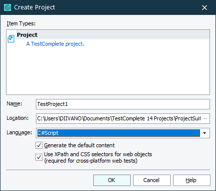
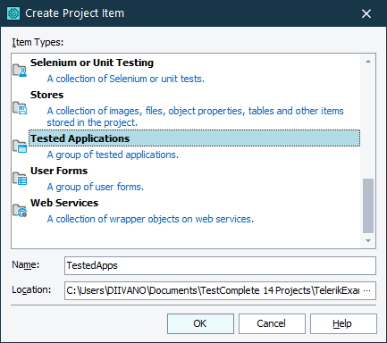

# Create a Project

1\. Let’s start by creating a New Project Suite in Test Complete.

2\. After your project suite is created you can Right click it and select **"Add -> New Item…"** option. This will open a window where you can set a name for your project and select between few different Script languages. For this tutorial select **"C#Script"**.

3\. In your Project Explorer you will see that you have few different collections and groups (such as Script units under the name **"Script"**).

You will need another group that is not yet present in your project - **"Tested Applications"**. To add this group, right click your TestProject and select **"Add -> New Item…"** option. Scroll down in the newly opened **"Create Project Item"** window and select **Tested Applications** option.

4\. Now that you have **"Tested Applications"** group you can add new item to the group. Select **"Generic Windows application"** option and browse to TelerikExamples.exe in Telerik UI for WinForms installation folder:

C:\Program Files (x86)\Progress\Telerik UI for WinForms [version]\Examples\QuickStart\Bin\TelerikExamples.exe

In the next articles you will find out how to:
* [Prepare a HelpFunctions script]()
* [Write a test script]()