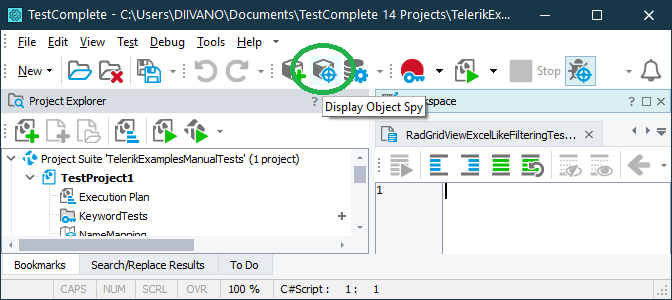
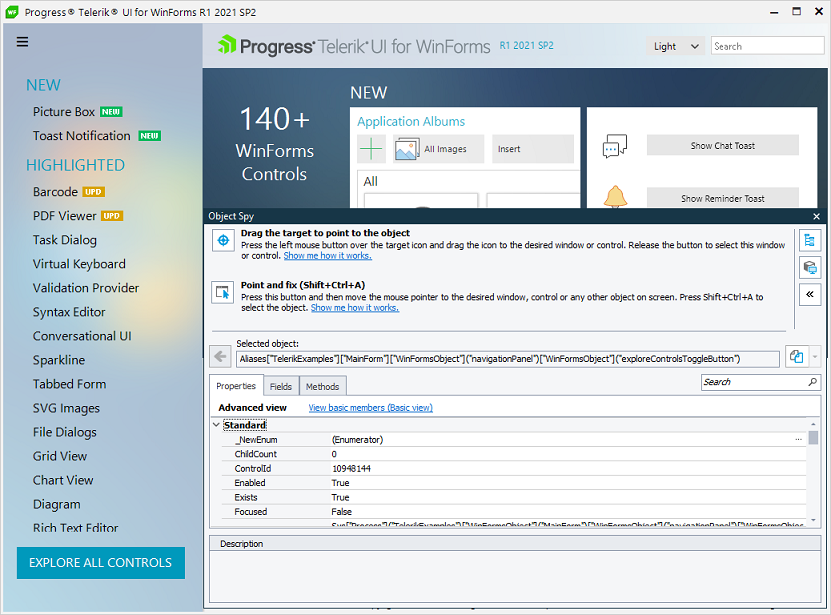
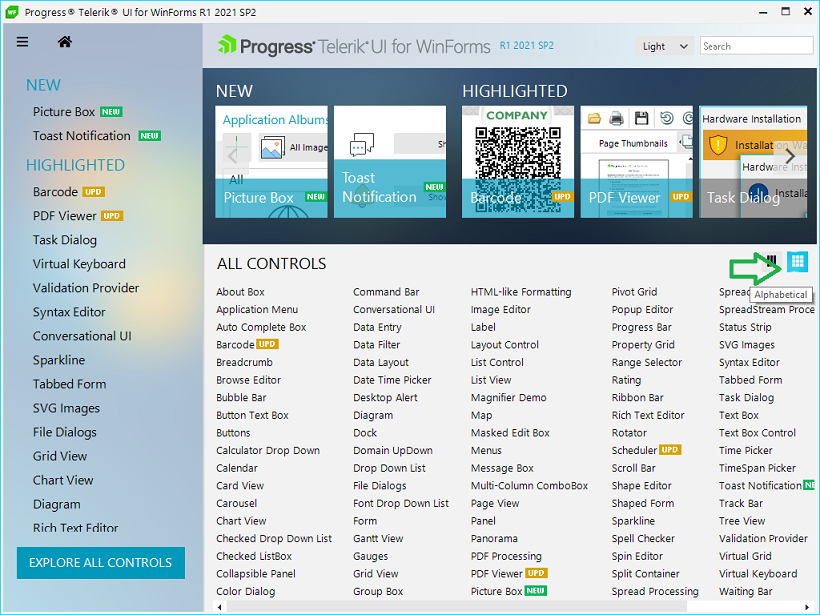
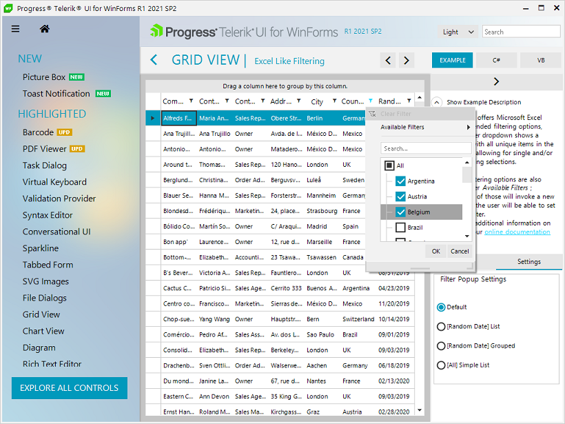
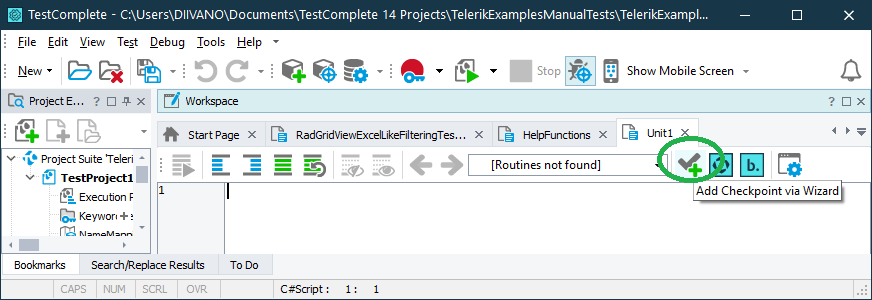

# Write a Test Script

When writing a manual test you should know the names of your application objects and classes that you want to work with. The TestComplete **"Object Spy"** tool lets you select an object from screen to view its properties, methods, fields and events. 

To do that simply click **"Display Object Spy"** button in TestComplete and drag the spy over an object in your test application. This will show the hiearchy path of the selected object and it will allow you to find its location. Once you have the object location you can perform different operations with it. You will see how this work in a short while.



1\.	Run the tested application and create a variable called process that is mapped to the process **"TelerikExamples"** as described in the [Prepare a HelpFunctions script]() article.

````C#
//USEUNIT HelpFunctions
function RadGridViewExcelLikeFilteringTest()
{
  RunApplicationTelerikExamples()
  process = Sys["Process"]("TelerikExamples")

}
````

2\.	Navigate to All Controls section by clicking **"EXPLORE ALL CONTROLS"** Demo Application button.

Start by finding the location of **"EXPLORE ALL CONTROLS"** object. To do that click **"Display Object Spy"** button in Test Complete and drag the spy over the **"EXPLORE ALL CONTROLS"** object. This will show you the selected object location.



Now that you have have the object location you can store it in a variable.

````C#
buttonExploreControls = process["WinFormsObject"]("MainForm")["WinFormsObject"]("navigationPanel")["WinFormsObject"]("exploreControlsToggleButton")
````

This object have different methods visible in the "Methods" Object Spy tab. There you will find that it has a **"Click"** method which can be called in your test. 

````C#
buttonExploreControls["Click"]()
````

3\.	Order the controls list alphabetically by pressing the **"Alphabetical"** toggle button. 



In the same manner as before use the Object Spy to get the button location. Then store to "Alphabetical" object location in a variable and click it.

````C#
layoutPanelAllControls = process["WinFormsObject"]("MainForm")["WinFormsObject"]("AllControlsScreen")["WinFormsObject"]("doubleBufferedTableLayoutPanel1")
toggleButtonAlphabetically = layoutPanelAllControls["WinFormsObject"]("radToggleButtonAlphabetical")
toggleButtonAlphabetically["Click"]()
````
4\.	Click **"Grid View"** from the controls list in order to open **RadGridView** examples.

Now that All Controls are sorted alphabetically you can get the location of the **"ALL CONTROLS"** ListView object and think of an approach to click a specific item - **"Grid View"**.

````C#
listViewAllControls = layoutPanelAllControls["WinFormsObject"]("allControlsListView")
````

One approach is to write a **"ClickListViewItem"** function in **"HelpFunctions"** TestComplete class. The idea is to write a function that clicks specific ListView item based on a given index. The function will accept 2 arguments: **ListView object** and **int itemIndex**. Using the Object Spy you can navigate through the ListView elements until you find a specific ListView item. Then you will need the X and Y coordinates in pixels in order to call listView[“Click”](x, y) method. Your function will look like this:

````C#
function ClickListViewItem(listView, itemIndex)
{ 
  listViewElement = listView["ListViewElement"]
  viewElement = listViewElement["ViewElement"]["ViewElement"]
  listItem = viewElement["Children"]["Item"](itemIndex)
  location = listItem["ControlBoundingRectangle"]["Location"]
  x = location["X"] + 20
  y = location["Y"] + 5
  listView["Click"](x, y)
}
````

Once this is done you can call this function in the test script and pass it a **listView** variable and a **"Grid View"** index.

````C#
//Grid View index in the "All Controls" ListView is 34
ClickListViewItem(listViewAllControls, 34)
````

5\.	Scroll to the right and click "Excel Like Filtering" example tile.


In order to click **"Excel Like Filtering"** example in the **radPanorama** object, first you should scroll to the right until the example tile is visible on the screen. In order to do this you should get the location of **scrollbar element** inside **radPanorama** object and set an appropriate value to the scroll bar corresponding to the **"Excel Like Filtering"** example position. 

You can find the scrollbar value that you need by scrolling manually to **"Excel Like Filtering"** example and using the Object Spy to get the scrollbar value. Once you have the value, you can set it to the scrollbar in your test script.

````C#
panoramaGridViewExamples = process["WinFormsObject"]("MainForm")["WinFormsObject"]("SelectedControlScreen")["WinFormsObject"]("doubleBufferedTableLayoutPanel1")["WinFormsObject"]("radPanorama1")
  
//Scroll the panorama to the right until Filtering examples group is visible. Scrollbar value - 2272
panoramaScrollBar = panoramaGridViewExamples["PanoramaElement"]["Children"]["Item"](0)
panoramaScrollBar["set_Value"](2272)
````

The next step is to get the location of **"Filtering"** tile group.

````C#
//TileGroupElement - Filtering (contains filtering examples for RadGridView)
tileGroupFiltering = panoramaGridViewExamples["PanoramaElement"]["Children"]["Item"](2)["Children"]["Item"](7)
````

Once we have the **"Filtering"** tile group location, we can proceed by finding the X, Y coordinates for **"Excel Like Filtering example"** and click the tile in order to open the example.

````C#
//Click ExcelLikeFiltering tile in order to open the example
tileExcelLikeFilteringExample = tileGroupFiltering["Items"]["Item"](1)  
x = tileExcelLikeFilteringExample["ControlBoundingRectangle"]["X"] + 5
y = tileExcelLikeFilteringExample["ControlBoundingRectangle"]["Y"] + 5
panoramaGridViewExamples["Click"](x, y)
````

6\.	Click the filter button in **"Country"** column, uncheck all countries and check only the first three countries ("Argentina", "Austria", "Belgium") and click **"OK"** button.



You will get **RadGridView** location by spying it with the Object Spy.

````C#
//Locate RadGridView control in the element hierarchy
  gridView = process["WinFormsObject"]("MainForm")["WinFormsObject"]("ExampleScreen")["WinFormsObject"]("examplePanel")["WinFormsObject"]("Form1")["WinFormsObject"]("ScrollableArea")["WinFormsObject"]("RadScrollablePanelContainer", "")["WinFormsObject"]("radGridView1")
````

In order to click the **Filter button** in a specific column you can write another function in **"HelpFunctions"** class. The function will accept 2 arguments: **GridView object** and **int visualCellIndex**. By navigating through the Object Spy element hierarchy you can get the location of a visual cell for a specific column. Then you can locate the **Filter button** and click it in order to open the filter popup.

````C#
function ClickExcelLikeFilteringButton(gridView, visualCellIndex)
{
  gridTableHeaderRowElement = gridView["TableElement"]["VisualRows"]["Item"](0)
  visualCell = gridTableHeaderRowElement["VisualCells"]["Item"](visualCellIndex)
  location = visualCell["FilterButton"]["ControlBoundingRectangle"]["Location"]
  x = location["X"] + 4
  y = location["Y"] + 4
  gridView["Click"](x, y) 
}
````

Call this function in the test script and pass the gridView variable and **"Country"** visual cell index.

````C#
//"Country" visual cell index is 6
ClickExcelLikeFilteringButton(gridView, 6)
````

After the Filter popup is displayed, now you can get the **RadListFilterPopup** object location.

````C#
radListFilterPopup = process["WinFormsObject"]("RadListFilterPopup", "")
````

In order to check/uncheck specific filter nodes you can write another function in the **"HelpFunctions"** class. This function will accept 3 arguments: **radListFilterPopup object, int nodeIndex, bool isChecked**.

````C#
function RadListFilterPopup_SetFilterNode(radListFilterPopup, nodeIndex, isChecked)
{
  treeView = radListFilterPopup["WinFormsObject"]("RadTreeView", "", 2)
  allFilterNode = treeView["Nodes"]["Item"](2)
  filterNode = allFilterNode["Nodes"]["Item"](nodeIndex)
  filterNode["set_Checked"](isChecked) 
}
````

You will need to add a separate function to check/uncheck "All" filter nodes in the filter because the "All" node object location differs from the rest. This function will accept 2 arguments: **radListFilterPopup object** and **bool isChecked**.

````C#
function RadListFilterPopup_SetAllFilterNode(radListFilterPopup, isChecked)
{
  treeView = radListFilterPopup["WinFormsObject"]("RadTreeView", "", 2)
  allFilterNode = treeView["Nodes"]["Item"](2)
  allFilterNode["set_Checked"](isChecked) 
}
````

First call **"SetAllFilterNode"** function in order to unselect all nodes, then call **"SetFilterNode"** for the first 3 nodes.

````C#
//Set all filter node to false
RadListFilterPopup_SetAllFilterNode(radListFilterPopup, false)

//Set the first 3 rows to true
RadListFilterPopup_SetFilterNode(radListFilterPopup, 0, true)
RadListFilterPopup_SetFilterNode(radListFilterPopup, 1, true)
RadListFilterPopup_SetFilterNode(radListFilterPopup, 2, true)
````

All you have to do now is click **"OK"** button in order to apply the excel like filtering operation. You guessed it – you will need to add one more function in the **"HelpFunctions"** class.

````C#
function ClickOkButtonInRadListFilterPopup(radListFilterPopup)
{
  buttonOk = radListFilterPopup["ButtonsMenuItem"]["Children"]["Item"](0)["Children"]["Item"](0)
  location = buttonOk["ControlBoundingRectangle"]["Location"]
  x = location["X"] + 15
  y = location["Y"] + 10
  radListFilterPopup["Click"](x, y) 
  Delay(100)
}
````

Call the function and voilà - your test will perform the filtering operation.

````C#
//Click ok button
ClickOkButtonInRadListFilterPopup(radListFilterPopup)
````

7\.	Verify the visual rows count and perform a **RadGridView** region comparison. In order to validate the visual rows count, after filtering you can add the following function in **"HelpFunctions"** class.

````C#
function CheckCountOfGridViewVisualRows(gridView, expectedRowsCount)
{
  actualCount = gridView["TableElement"]["VisualRows"]["Count"]  
  if(actualCount != expectedRowsCount)
  {
    Log["Error"]("Expected visual rows count: " + expectedRowsCount + "; Actual visual rows count: " + actualCount)  
  }
}
````

As you can see this function will accepts 2 arguments: **radGridView object** and **int expectedRowsCount**. It will compare the expected visual rows count with the actual visual rows count. If the two values are not the same the test will **fail** and you will see an error message describing the value difference.   

Call the function in order to perform the validation. 

````C#
//Expected rows 5
CheckCountOfGridViewVisualRows(gridView, 5)
````

You can perform region comparison which will take a picture of **RadGridView** when you run the test and compare it with an expected image in order to validate if there are differences. In order to create an expected image, you can perform the test steps described above manually and add a checkpoint via wizard.



Then you can select the image option and drag the zoom-like icon to the **RadGirdView** object. This will take a picture and store it in the **"Regions"** collection. You will have to type a name, for example: "GridView_ExcelLikeFiltering". 

In order to perform an image comparison you will need to add a function in **"HelpFunctions"** that will take a picture of the **RadGridView** when the test is executed and compare it with the expected pictures saved in the **"Regions"** collection. This function will look like that.

````C#
function CompareRadGridViewRegions(expectedImageName, actualImage)
{
  expectedImagePath = "C:\\Users\\DIIVANO\\Documents\\TestComplete 14 Projects\\TelerikExamplesManualTests\\TestProject1\\Stores\\Regions\\" + expectedImageName + ".png"
  var expectedImage = Utils["Picture"]
  expectedImage["LoadFromFile"](expectedImagePath)
  
  Log["Message"](expectedImagePath)
  
  //Compare both images and display the difference
  if (!actualImage["Compare"](expectedImage, false, 0, false, 0, null))
  {
    Log["Message"]("Actual image:")
    Log["Picture"](actualImage)
    Log["Message"]("Expected image:")
    Log["Picture"](expectedImage)
    var differenceImage = actualImage["Difference"](expectedImage)
    Log["Message"]("Difference image:")
    Log["Picture"](differenceImage)
  }
}
````

When you call it, you will have to pass 2 parameters: **string expectedImageName** and **object actualImage**.

````C#
if(!Regions["GridView_ExcelLikeFiltering"]["Check"](gridView, false, false, 0))
{
  actualImage = gridView["Picture"]() 
  CompareRadGridViewFeedbackItems("GridView_ExcelLikeFiltering", actualImage)
}
````

8\. After performing your validations, you can finilize your test by closing the **"TelerikExamples"** process.

````C#
process["Close"]()
````

You can see download the test script and HelpFunctions script:

* [Full Test Script](https://www.telerik.com/docs/default-source/ui-for-winforms/radgridviewexcellikefilteringtest.scs)
* [Full HelFunctions script](https://www.telerik.com/docs/default-source/ui-for-winforms/helpfunctions.scs)
