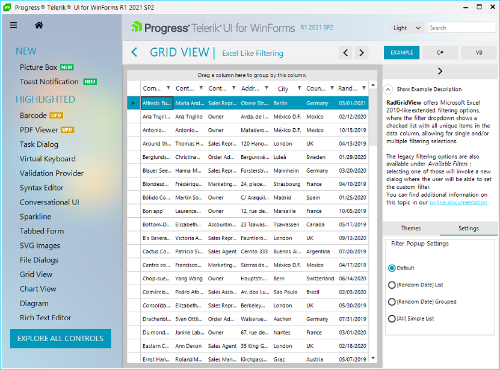

# Plan a Test

We will write tests for "Examples Demo Application" which featuress variaty of Telerik UI for WinForms controls and themes, making it a perfect candidate to demonstrate TestComplete automation. 

"Examples Demo Application" will be installed on your machine after installing Telerik UI for WinForms.msi. 

We will test Excel-like filtering functionality of the **RadGridView** control.

Excel-like filtering Demo Application example demonstrates filtering functionality accessed via the filtering row. It is a built-in way to mimic the standard excel filtering functionality and offers a dialog, which contains a list with distinct column values, from which the end user can chose.
The test should check whether the excel-like filtering function works correctly when we check/uncheck specific countries in the “Country” column.

In our tests we will perform a filtering operation, followed by adding special comparison commands to validate **RadGridView** data and Visual Rows displayed after filtering. Additionally, after performing the filtering operation, we will compare the **RadGridView** region with an expected image. The comparison results will be posted to the test log, so we will see whether the verification processed passed successfully.

In order to navigate to "Excel-like filtering" example we can use Demo Application Search functionality and go right to the example. However, we will take another approach and navigate to the example manually in order to demonstrate additional test scenarios while using TestComplete.

## Test Steps

1\. Launch Telerik Demo Application

2\. Navigating to All Controls screen

3\. Order controls list alphabetically

4\. Select RadGridView control

5\. Navigate through the RadGridView examples by scrolling the Panorama Tiles 

6\. Open “Excel Like Filtering” example

7\. Perform Excel-like filtering operation 

8\. Validate that filtering works correctly 

## Record a test or create it manually

Now that we have a test plan the next step is to decide whether to **Record** the test or create it **Manually**.

In the next articles you will see how to create a project and perform the Excel-like filtering test scenario, choosing the approach that best suites you:

* [Record a test]()

* [Create a test manually]()
