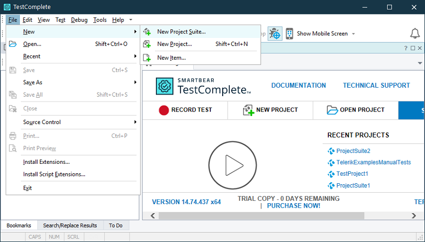
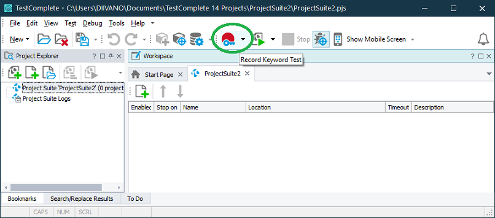
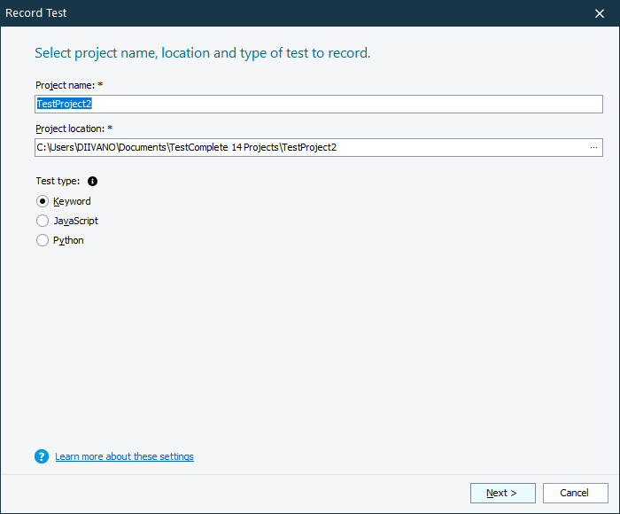

# Create a project

1\. Recording a test is intuitive and straight forward. We should start by creating a New Project Suite in Test Complete.

2\. Click the **Record Keyword Test** button in order to add a recording test.

3\. Select Test type: **Keyword**.

4\. In this step you will have to enter the application file destination. In case you have **Telerik UI for WinForms** suite installed, your path will look like this:

C:\Program Files (x86)\Progress\Telerik UI for WinForms [version]\Examples\QuickStart\Bin\TelerikExamples.exe

5\. Clicking **Record** button will immediately run your application and create a test automatically where it will save all of your actions and checks until you click **Stop**. 
In [Record test steps]() article we will perform our test steps and explain how to **Add Check** depending on the data, property value or image that we want to validate.
