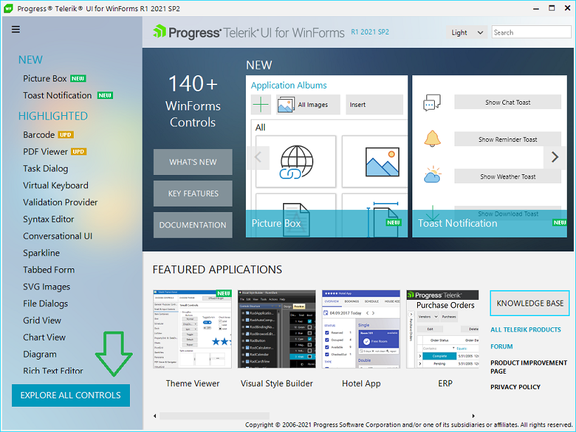
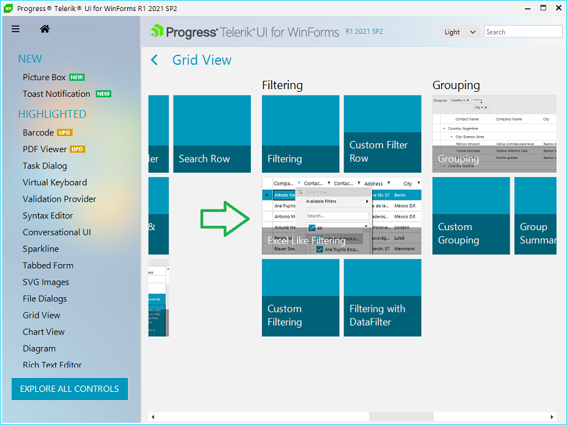
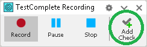
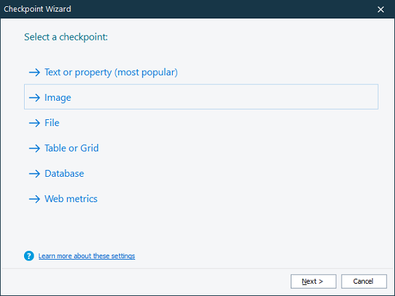
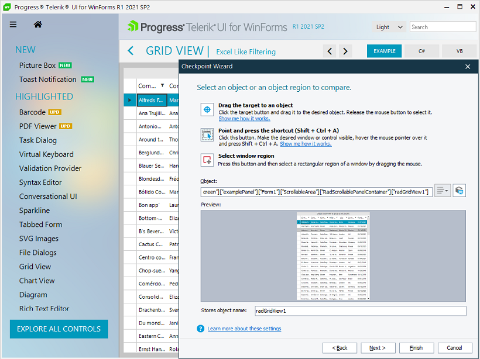

# Record Test Steps

After clicking **Record** button, our Demo Application will launch and based on our sample test plan, you can perform the following actions:

1\.	Click **EXPLORE ALL CONTROLS** Demo Application button.

2\. Order the controls list alphabetically by pressing the **Alphabetical** toggle button.

3\. Click **Grid View** from the controls list in order to open **RadGridView** examples.

4\. Scroll to the right and click **Excel Like Filtering** example tile.

5\. Click the filter button in **Country** column, uncheck all countries and check only the first three (Argentina, Austria, Belgium) and click **OK** button.

6\. Click **Add Check** button in TestComplete in order to open the Checkpoint Wizard. In this wizard you can select a different checkpoint depending on your needs. 

7\.	Select **Image** and you will be navigated to a Checkpoint Wizard. Click the target button and drag it to a desired object in the tested application, in this case the RadGridView.

8\.	After clicking **Finish** button the current **RadGridView** region will be stored as an image that will be used for comparison every time when the test runs.

9\.	Click **Add Check** button again but this time select **Table or Grid** option in the Checkpoint Wizard. Drag the target button over the **RadGridView** once again in order for TestComplete to scan the **RadGridView** data table and store all of its information in order to verify that data is as expected next time when you run the test.

10\. Click TestComplete **Stop** button in order to stop your recording and create your test.

Running your test will perform all of the steps described so far. After performing the filtering operation, it will validate if **RadGridView** region is the same as the expected image and also it will check if the Table information is correct.

You can learn more about test recording in following the following article by **SmartBear Software** - [Testing Desktop Applications - Tutorial](https://support.smartbear.com/testcomplete/docs/tutorials/getting-started/first-test/desktop/index.html).