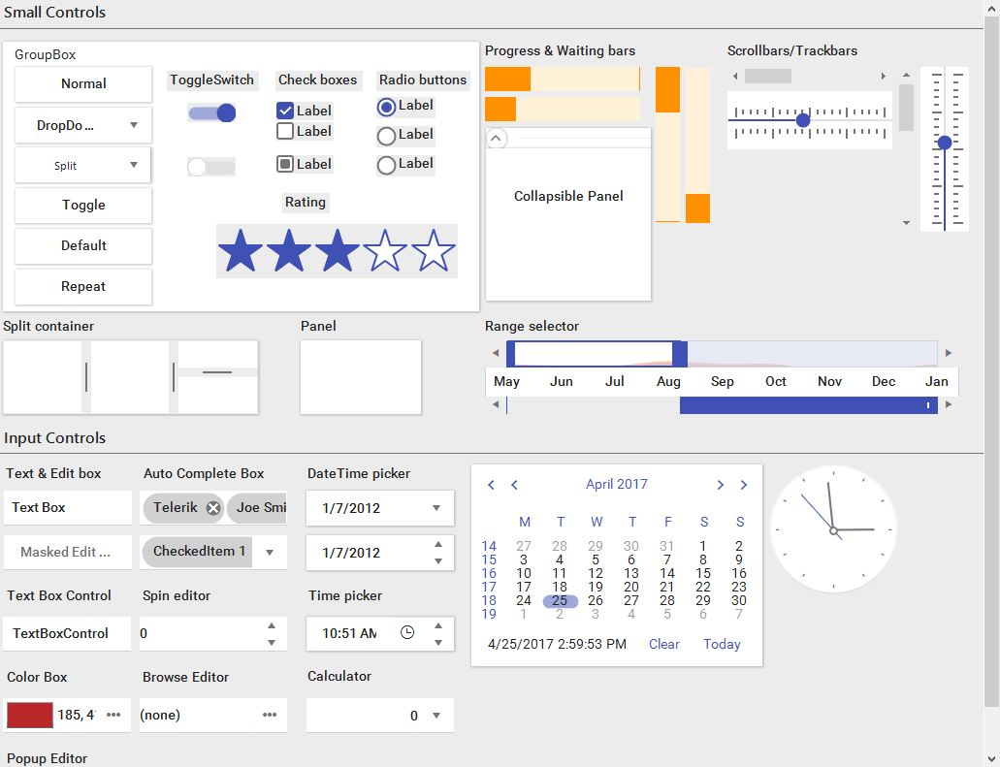
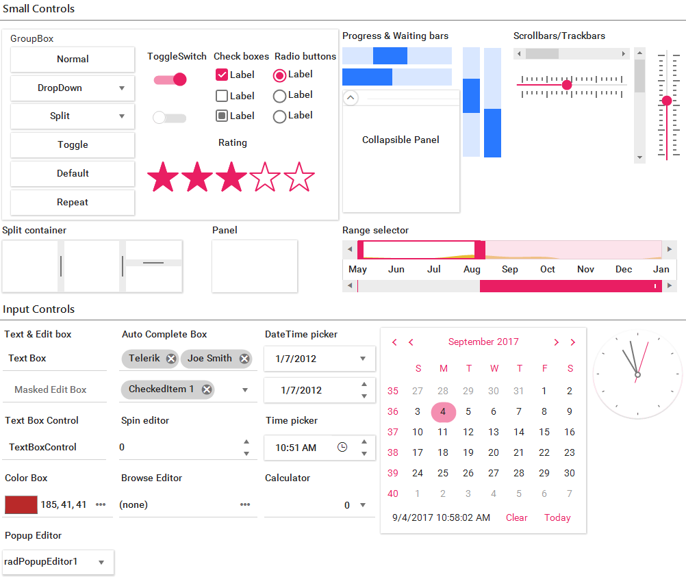
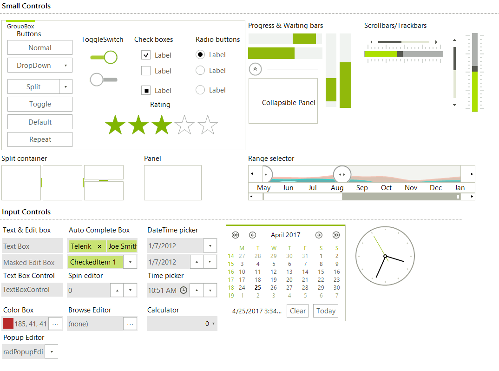

# Touch Enabled Themes

Telerik UI for Winforms suite contains two themes that are optimized for a touch devices:

* __TelerikMetroTouch:__ the design is similar to the TelerikMetro theme however the controls sizes are increased.

* __MaterialTheme:__ touch optimized theme which provides additional features such as custom fonts, built-in animations and shadows. We also have three other themes that are using the material theme as foundation but have different colors:
    * __MaterialBlueGray__
    * __MaterialPink__
    * __MaterialTeal__

>note The touch themes are changing the layout of the existing controls and dialogs. This is why you need to restart your application if you want to switch from touch to a regular theme.

The below images are showing the how the themes are looking with some of our controls.

>caption Figure 1: The Material theme

    

>caption Figure 2: The MaterialPink theme

>caption Figure 3: The MaterialBlueGray theme

>caption Figure 4: The MaterialTeal theme

>caption Figure 5: The TelerikMetroTouch theme

    

# See Also

* [Using a Default Theme for the Entire Application]()

* [Using custom themes]()

* [Visual Style Builder]()

