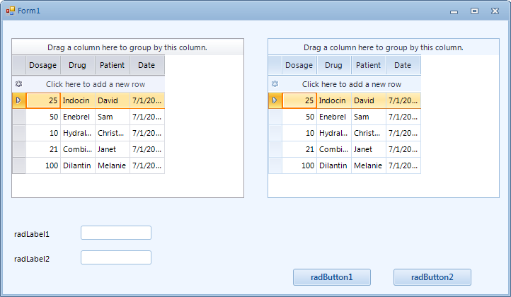

# Using a default theme for the entire application


When your application has many and different controls, you may find it inconvenient to go through all the controls in order to set their __ThemeName__ property. For such cases set the static __ThemeResolutionService.ApplicationThemeName__ property to a theme name:

#### Setting a theme for the entire application

{{source=..\SamplesCS\Themes\UsingADefaultThemeForEntireApplication.cs region=setAThemeForEntireApplication}} 
{{source=..\SamplesVB\Themes\UsingADefaultThemeForEntireApplication.vb region=setAThemeForEntireApplication}} 

````C#
ThemeResolutionService.ApplicationThemeName = "Office2007Black";

````
````VB.NET
ThemeResolutionService.ApplicationThemeName = "Office2007Black"

````

{{endregion}} 

>important You still have to drop the theme component on the form (e.g. *Office2007Black* in the code samples above) or create an instance of the desired theme programmatically.
>

All your controls will use that specified theme which has precedence over the theme set locally to the control using __ThemeName__ property.
        

## Enable/Disable the globally set theme for a specific control

This section describes how you can change the theme for the entire application and leave the default one (or use another) for one or several controls. This can be achieved by using the __EnableApplicationThemeName__ property.
        

This property indicates how the theme will be set to the control. If it is set to true (the default value) the control will have the theme that is globally set (with the __ApplicationThemeName__ property). If it is set to false, the theme, set with the __ThemeName__ property will be respected. For example you can set the theme for the entire application except for one RadGridView control as follows:

{{source=..\SamplesCS\Themes\UsingADefaultThemeForEntireApplication.cs region=setThemeForSpesificControl}} 
{{source=..\SamplesVB\Themes\UsingADefaultThemeForEntireApplication.vb region=setThemeForSpesificControl}} 

````C#
ThemeResolutionService.ApplicationThemeName = "Office2010Blue";
radGridView1.ElementTree.EnableApplicationThemeName = false;
radGridView1.ThemeName = "Office2010Silver";

````
````VB.NET
ThemeResolutionService.ApplicationThemeName = "Office2010Blue"
RadGridView1.ElementTree.EnableApplicationThemeName = False
RadGridView1.ThemeName = "Office2010Silver"

````

{{endregion}} 

>caption Figure 1: The theme of the grid is different than the application theme.



You can watch the video [Telerik UI for WinForms Theme](http://www.telerik.com/videos/winforms/theme-for-telerik-ui-for-winforms) regarding the usage of theme components and __ApplicationThemeName__ property.