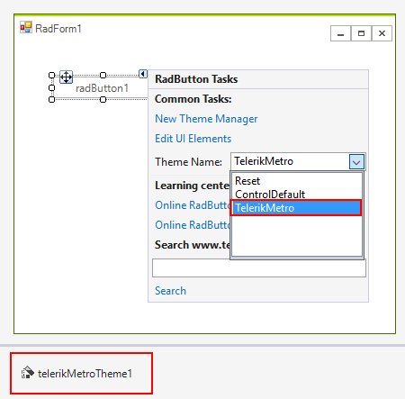

# Using default themes 

| RELATED VIDEOS |  |
| ------ | ------ |
|[Applying themes to RadControls for WinForms at the control and form level.](http://tv.telerik.com/watch/winforms/themes/radcontrols-winforms-theme)||

## 

All themes that come with Telerik WinForms controls since version Q2 2008 are available as standalone components, apart from the control's assemblies. This improvement has been added in order to simplify the way themes are added to the application and to improve the application’s loading time.

If you have installed the suite from the provided installation files, you will see the themes loaded in the Visual Studio toolbox. If you do not see the themes in the toolbox, you will have to [add them manually to the toolbox.]()

In order to use the Theme components, just drag and drop them from the VS Toolbox to the form. This will add a reference to the corresponding theme assembly in the project and will enable the theme in the ThemeName drop-down of all Telerik controls on the form. All you have to do afterwards is to set the needed theme from the ThemeName drop-down or programmatically.



## Setting a default theme for a whole application programatically

Before using the following code snippets, please make sure that you have added the desired theme DLL file to your project references.

#### Setting a default theme for the entire application

{{source=..\SamplesCS\Themes\UsingDefaultThemes.cs region=usingDefaultThemes}} 
{{source=..\SamplesVB\Themes\UsingDefaultThemes.vb region=usingDefaultThemes}} 

````C#
protected override void OnLoad(EventArgs e)
{
    base.OnLoad(e);
    Office2007SilverTheme theme = new Office2007SilverTheme();
    ThemeResolutionService.ApplicationThemeName = "Office2007Silver";
}

````
````VB.NET
Protected Overrides Sub OnLoad(e As EventArgs)
    MyBase.OnLoad(e)
    Dim theme As New Office2007SilverTheme()
    ThemeResolutionService.ApplicationThemeName = "Office2007Silver"
End Sub

````

{{endregion}}
