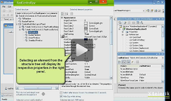
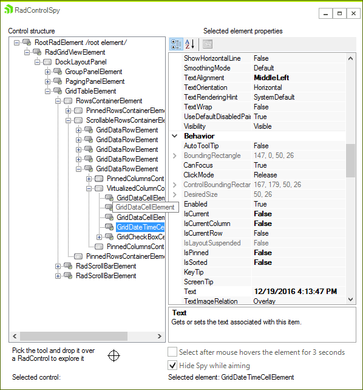

# ControlSpy

| RELATED VIDEOS |  |
| ------ | ------:|
|[Introduction to RadControlSpyForm](http://www.telerik.com/videos/winforms/introduction-to-radcontrolspyform)||

## 

The ControlSpy is a tool that lets you examine the detailed internal structure of any RadControl. It is not a stand-alone tool. Rather, the Control Spy is supplied as part of a library that you compile into your application. After adding this library, you can start the ControlSpy and use it to examine and alter properties of any RadControl which is currently running.

>caption Figure 1: RadControlSpyForm

