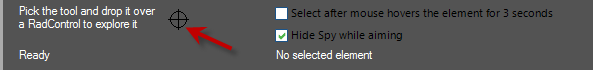

# Inspecting Properties

To inspect the properties of any Telerik RadControl, drag the cross-hair tool from the Control Spy to a form containing the control that you wish to inspect.

By default, the Control Spy will vanish while you are dragging the cross-hair tool. When you drop the cross-hair on a control, the Control Spy will reappear, displaying all of the properties of the selected control. You can navigate through all of the individual elements of the selected control by using the __Control structure__ treeview in the Control Spy. When you select an element in the Control Spy, the __Selected element properties__ window will show the properties of the element. 

Properties can be changed in real time and to control element appearance and behavior. You can interactively change any of the properties of any element in the selected control. Changes you make through the __Selected element properties__ window in the Control Spy will be immediately reflected in the actual control.

>note Changes you make through the Control Spy will only affect the current running instance of the application. They are not persisted to the application or the application's theme.
>

