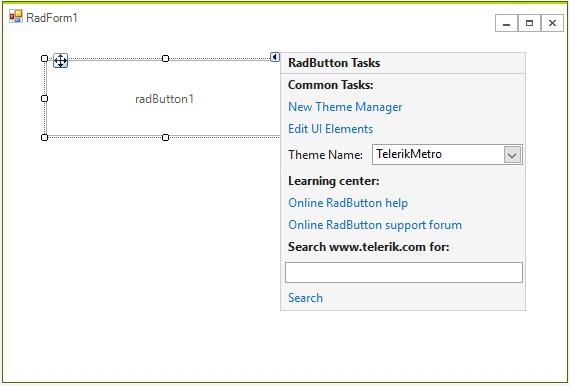
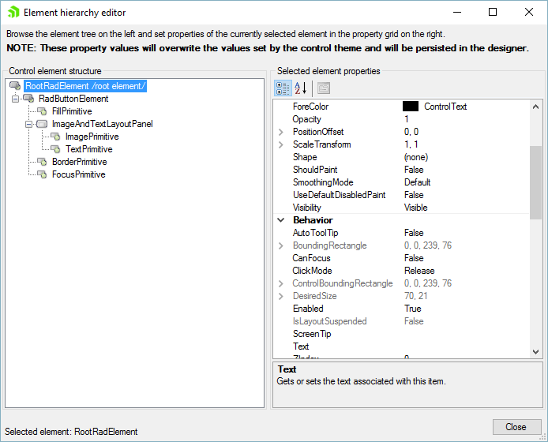
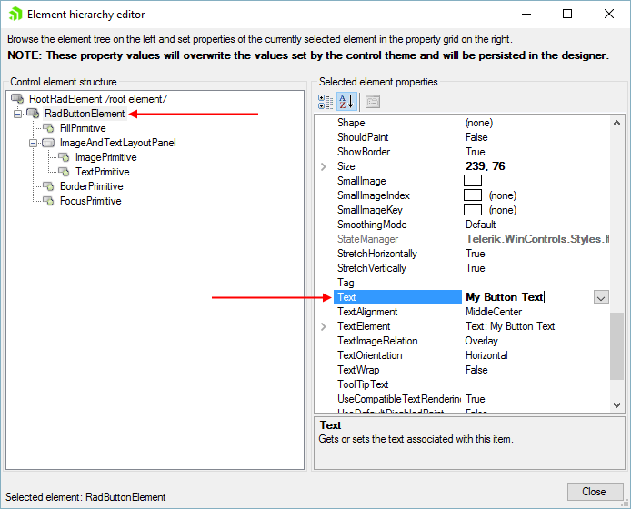

# Element Hierarchy Editor

When dealing with complex control types that have multiple nested elements, such as a RadRibbonBar control, you want the ability to set properties at multiple levels of the class hierarchy. For example, in the case of a RadRibbonBar you can set properties of the RadRibbonBarElement or you can set the properties of one of its RadTabStripElement elements or possibly one of its RadDropDownButtonElement elements.

Since all controls inherit from one or more base classes it is also helpful to be able to easily see the classes in the control hierarchy so you can set the properties on the appropriate class. When designing a RadButton control you can set base class properties or any properties of classes that RadButton derives from. The RadButton Visibility property can be set at the base class level (RootRadElement) while the RadButton Text property can be set at the RadButtonElement class level.

Element Hierarchy Editor allows you to work with complex control types and to navigate the class and element hierarchy.

## Opening the Element Hierarchy Editor

Click a RadControl, open the Smart Tag menu and select Edit UI elements. This action will display the Element Hierarchy Editor.

To use the Element Hierarchy Editor, select items from the element tree on the left. Corresponding properties for the selected item will appear in the properties grid on the right.

## Changing Property Values

Properties can be viewed or changed through the Element Hierarchy Editor. You can change one or more properties by editing the value of the selected element’s property in the property grid on the right. After all changes are made through the Element Hierarchy Editor and the dialog is closed, the changes are persisted to the appropriate property settings in the designer. These property values will also overwrite the values set by the control theme.

In the figure below the RadButtonElement Text property is set to "My Button Text".

To demonstrate setting multiple properties of multiple elements and persisting them to the designer, you could select the RadButtonElement in the element tree on the left and set the Text of a RadButton to "My Button Text". Then the FillPrimitive element is selected in the element tree and the BackColor properties are set to various shades of red.

## Editing UI Elements for Complex Control Hierarchies

When you open the Element Hierarchy Editor from a nested element of a control (such as a RadRibbonBar RadTabStripElement), the corresponding element in the element tree on the left is automatically selected. The tree displays only the selected element and descendants. You will also be able to navigate the element tree for the control and view and set its properties.  In the figure below, a tab of a RadRibbonBar is selected and the Element Hierarchy Editor is invoked from the tab Smart Tag.
        
