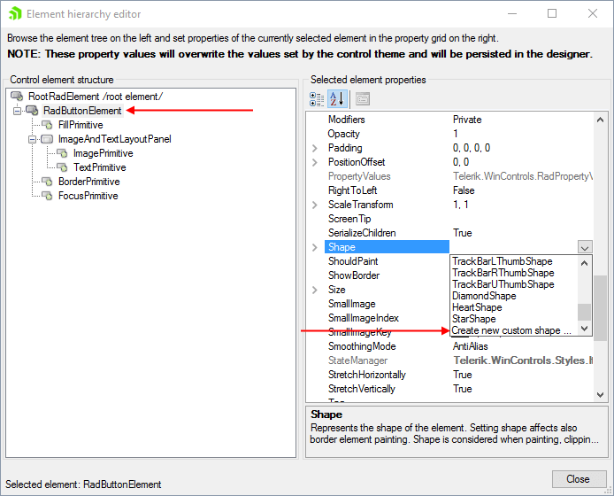
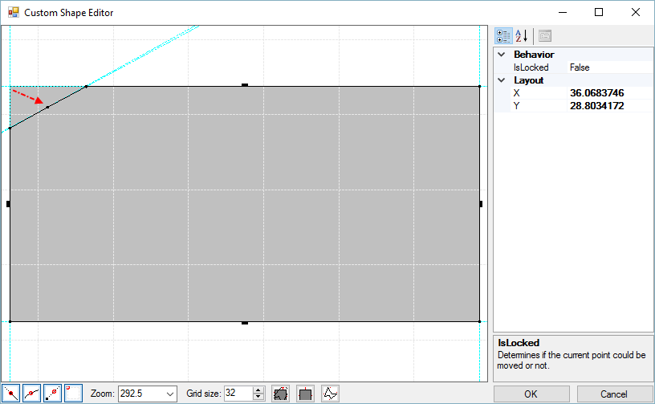
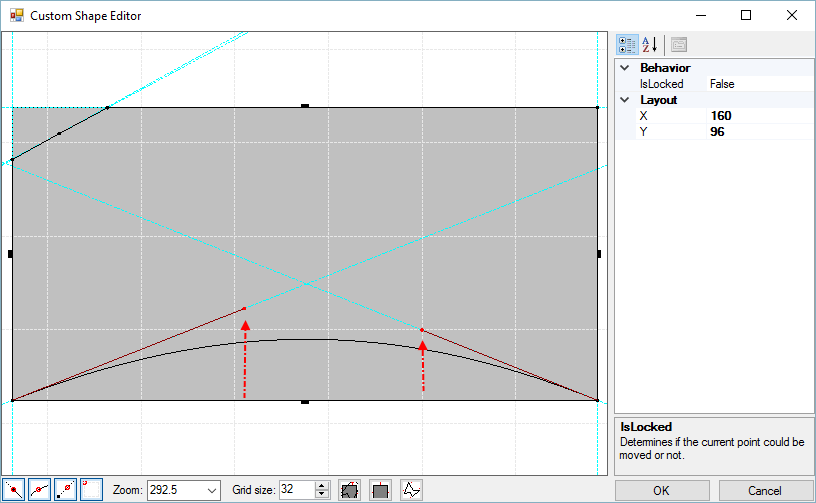
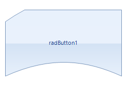

# Getting Started

This tutorial demonstrates modifying the shape of a __RadButton__.

1. Select a __RadButton__ control.

1. Open the __RadButton Smart Tag__ and select __Edit UI Elements__ which will open the Element Hierarchy Editor.

1. Click on the RadButtonElement.

1. Navigate to the __Shape__ property, and then select __Create new custom shape...__ from the drop down list. This step will launch the __Custom Shape Editor__ dialog. 
    

1. Right-click the upper line and select __Insert Point__.

1.  Right-click the left line and select __Insert Point__.

1. Move the upper left corner in to form a new shape (see screen shot below).

    

1. Right-click the bottom line and select __Convert__ from the context menu.  This step converts the line to a [Bezier curve]().

1.  Drag the two control points up slightly.

    >

1.  Click __OK__ to close the __Custom Shape Editor__ dialog.

1.  Click __Close__ to close the Element Hierarchy Editor.

1.  The new shape will be applied to the button.

    

# See Also

* [Shape Editor User Interface]()
