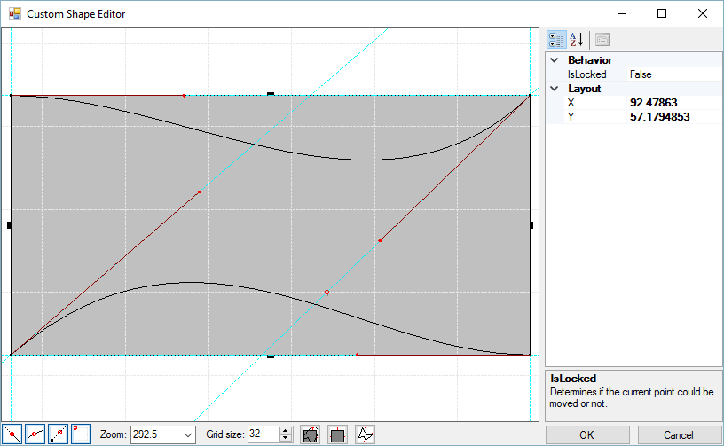
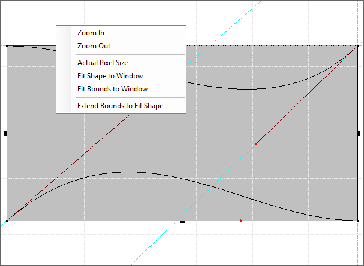
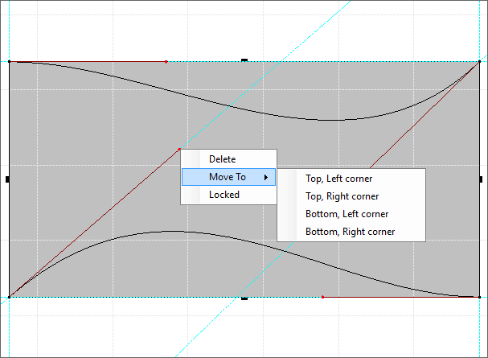
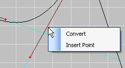
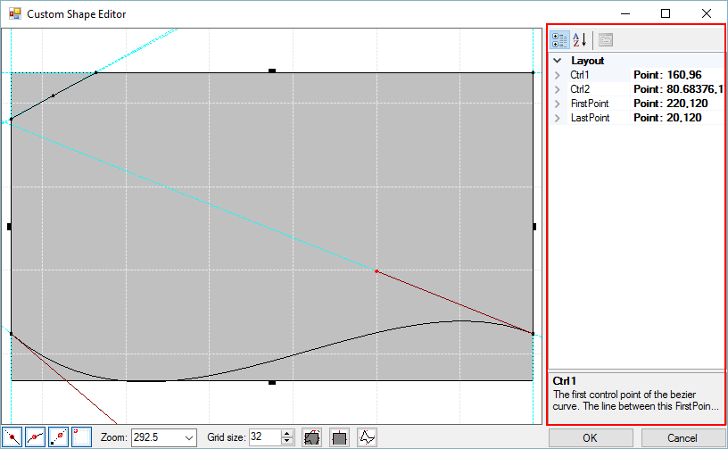
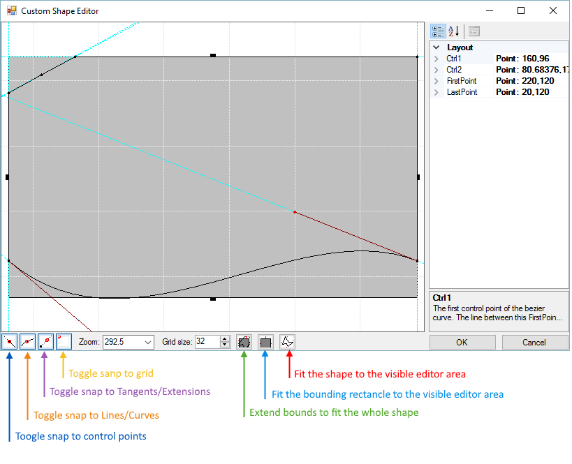

# Shape Editor User Interface

The __Custom Shape Editor__ consists of a grid area where the shape is drawn, a Property Pane for fine  tuning exact coordinates and other properties, and a tool bar below the grid area. The toolbar area has several tools "Snap to..." tools that make it easier to get the points in the shape to conform to features in the shape such as the grid, other points and lines.  The Zoom tool lets you type in a size percentage or select from the list. The Grid Size tool lets you control the level of granularity for the grid that overlays the shape in the editor. The last set of tools on the bottom right of the toolbar automatically size the shape or the bounds of editing area.

>caption Figure 1: The Custom Shape Editor

## Context Menus

Context menus for the drawing area (when no points are selected), includes abilities to Zoom in and out, size the image to the Actual Pixel Size (100% in the zoom tool), Fit Shape to Window, Fit Bounds to Window and to Extend Bounds to Fit Shape.

>caption Figure 2: Drawing area context menu.

If you right-click a control point the context menu changes to allow point deletion, moving the point to a predefined destination or to lock the point into place.

>caption Figure 3: Point context menu.

If you right-click a line the context menu allows you to Convert the line to a Bezier curve (or back from a Bezier to a straight line), or to Insert a point on the line. 

>caption Figure 4: Line context menu.

# Property Grid

The property grid allows you to edit the properties of the selected element. You can select points or lined in the shape editor.

>caption Figure 5: Property grid.

# Task Pane

The task pane allows you to perform various actions. The bellow image shows the its functionality.

>caption Figure 6: The Task pane.

# See Also

* [Getting Started]()
 