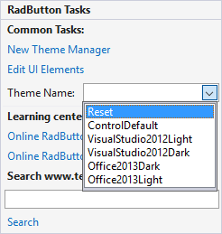

# Applying a Theme to a Control

To apply a custom theme from __[RadThemeManager]()__ to a RadControl, first select the control on the form. From the drop-down list in the control __ThemeName__ property, select the theme. The list of themes supplied by __RadThemeManager__ will be merged with the list of predefined themes supplied for the control.

>important If your theme is saved as a package you can use the approach described [here]().

# See Also
* [Adding RadThemeManager to a Form]()

* [Add Remove Theme Files]()

* [Load Themes from a Resource]()

* [Load Themes from an External File]()

